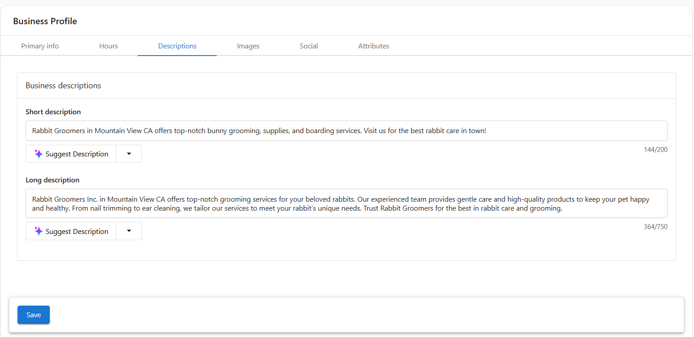

# Business Profile Overview

## What is my Business Profile inside Business App?
The **Business Profile** section in Business App allows you to manage your core business information in one central place. This includes your name, location, website, branding, services, social profiles, and operational details.

This profile ensures that your business information is accurate and consistent across listings, reports, lead capture tools, and across all features of Business App.

## Why is my Business Profile important?
Keeping your Business Profile complete and up to date helps your business:
- Appear accurately in local search and online listings
- Build trust with customers through consistent branding and clear service offerings
- Power tools like lead capture tools, automations, and inbox messaging with the correct business details

## Table of Contents
- [Primary Info](#primary-info)
- [Hours](#hours)
- [Descriptions](#descriptions)
- [Images](#images)
- [Social](#social)
- [Attributes](#attributes)
- [Frequently Asked Questions (FAQs)](#frequently-asked-questions-faqs)

## Primary Info
In the **Primary Info** tab, you can update:

- **Business name** and **common name**
- **Website URL**
- **Primary business category** and additional categories
- **Physical address** with map marker
- **Phone number** (must be formatted internationally)
- **Service area business** toggle

These details power your listings.

## Hours
In the **Hours** tab, you can update:

- **Hours of operation**
- Special hours (like holidays)

## Descriptions
In the **Descriptions** tab, you can add:

- **Short description** (up to 200 characters)  
  Appears in previews and listings  
- **Long description** (up to 750 characters)  
  Describes your business in more detail  

You can also use the `Suggest Description` button to generate content with the help of AI.

## Images
Use the **Images** tab to visually represent your brand:

- **Main logo**
- **Secondary logo** (optional)
- **Cover photo**
- **Gallery images** used in listings and customer views

Click `Edit` or `Choose images` to upload or update files. These images help create a trustworthy and professional online presence.

## Social
In the **Social** tab, you can add links to your active business pages:

- Facebook  
- LinkedIn  
- Twitter  
- Instagram  
- YouTube  
- Pinterest  
- Foursquare  

You can also enter your **Blog or RSS feed URL** to integrate recent content where supported.

## Attributes
The **Attributes** tab contains detailed operational and service-related information:

- **Business open/closed status**
- **Booking link** for appointment scheduling
- **Online store only** toggle
- **Payment methods** your business accepts
- **Services offered** (e.g., Rabbit Grooming, Supplies)
- **Brands carried** (e.g., Nike Rabbit, Adidas Rabbit)

These fields improve your discoverability and customer experience in local directories and Business App reports.

## Frequently Asked Questions (FAQs)

**Why should I complete my Business Profile?**  
A complete profile improves visibility, enables automation, and powers accurate reporting across Business App features.

**What happens if I leave a field blank?**  
Missing information may reduce your visibility in listings and create gaps in reporting or customer-facing tools.

**Can I update my Business Profile at any time?**  
Yes. You can return to this section anytime to make updates as your business evolves.

**Do images or logos appear publicly?**  
Yes. Images may appear in your public listings, reports, and other external-facing tools depending on what's supported.

**How often should I review this section?**  
We recommend reviewing your Business Profile at least quarterly, or whenever key business information changes.

---

Let me know if you want to start on `app_settings.md` next or need help finalizing screenshots or alt text!
