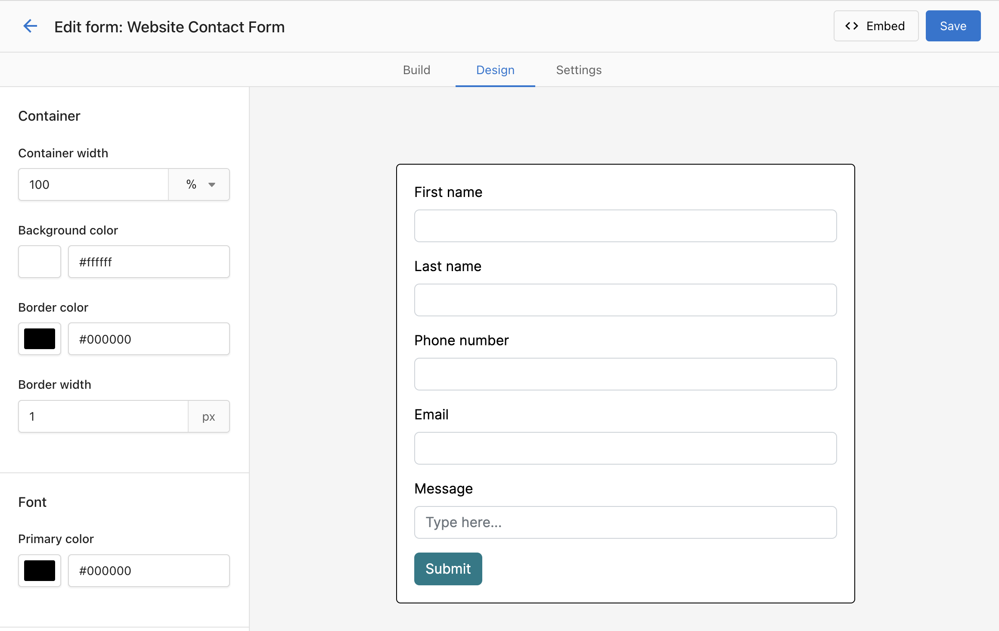

# Web Forms

A custom form can be created in Business App and installed on a website landing page or ‘contact us’ page with a simple embed code. When it is filled out, it will create a contact in the CRM, and create a conversation in Inbox where it can then be responded to. Using Automations, the contact can receive an automatic reply after filling out the form, can be added to an email or SMS nurturing campaign, and more!

## How to Use Form Builder

1. Navigate to CRM > Forms.

   

   Add all the key fields you’d like to capture. Remember that for every field that is added to a form, the conversion rate decreases. (A study by Crazy Egg found that forms with 5 fields or fewer have a conversion rate of 50%, while those with 10 fields or more have a conversion rate of just 20%.)

   There are a few different settings you can have on each form field:

   **For all field types:**
    - You can set a default value, which will be submitted when the user submits an empty field.
    - You can mark the field as required, and the user can’t submit the form without filling in the required field.
    - You can make the field hidden, so users won’t see the field and can’t edit it when they fill out the form.
    - You can also populate the specific form field dynamically, which will take the query parameter from the URL to fill in the field.
        - For example, if you have a form that’s put on this link: https://www.example.com/form?campaign=spring-promotion
        - If you put “campaign” on this setting, it will pre-fill the form field with “spring-promotion” when the user submits the form.

   **For the string field:**
    - You can switch it to an open text field, drop-down, or provide a radio button option

2. Customize the styling to match your website.

   You may want to set the form width to 100%, and then manage the width using the website builder component.

   In the “Design” tab, you can style the form’s container, font, and button.

   

3. Set up reCAPTCHA in the form to prevent Spam.

   In the form builder, under Settings, you will find a section called reCAPTCHA settings, and it will be set up automatically after you generate the site key and secret key. The generation process takes several minutes.

   

4. Copy the embed code for the form, and place it on your website landing page or contact page.

   If using WordPress with Divi, you can add a “Code” block and paste the embed code.

   

5. Test your form, to confirm that a contact is captured in the CRM.

### Frequently Asked Questions

:::info
**My form isn’t always capturing UTM fields, why might that be?**

For the form to capture UTM, they must be still present in the browser address bar. If a user clicks away from your landing page, to visit a second page on your website, and you don’t have a UTM preservation tool active, the UTM can be lost and won’t be captured if they fill out a form. One tactic to prevent this is removing all links from your landing page, to ensure leads fill out the form on the landing page and nowhere else.
:::
