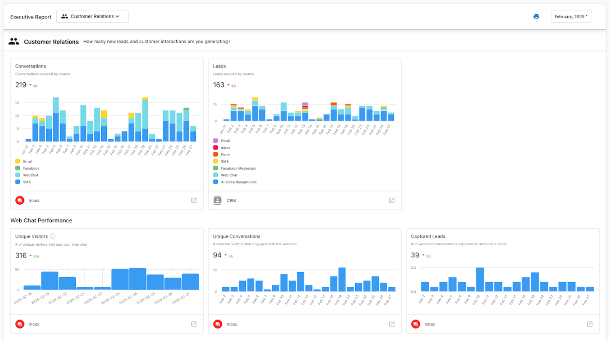

# Executive Report Lead Analytics

## What are Lead Analytics Inside the Executive Report?

The Executive Report includes a section called **Customer Relations**, where you can view analytics on leads captured into your CRM—organized by source. This gives you a clear understanding of how different tools are helping you attract and convert leads.

You’ll see a breakdown of leads generated from sources like:
- AI-powered web chat
- Forms on your website
- AI receptionist
- Other CRM-integrated capture tools

This insight helps you understand which tools are contributing to your business growth and whether your lead capture strategies are effective.

## How to Use Lead Source Analytics

1. **Enable a lead capture tool** in your Business App (e.g., web chat or contact form)
2. **Capture at least one lead** through that source
3. Go to the `CRM` tab in Business App to confirm the lead was added
   - You should see a new contact with a source like `Web Chat`, `Form`, or similar
4. Wait for your next Executive Report (weekly or monthly) to see this data reflected in the **Customer Relations** section

Lead source data is based on contacts created during the reporting period. The report will only show data if leads have been captured and assigned a valid source.

## What’s Included

- Total leads captured during the reporting period
- Lead breakdown by source
- Effectiveness of AI-powered tools like web chat
- Visual cards that summarize CRM performance at a glance

## Frequently Asked Questions (FAQs)

**Why don’t I see any metrics in the Customer Relations section yet?**  
The Executive Report shows data from the previous period (weekly or monthly). If you just activated a lead capture tool, wait for the next report cycle. You can confirm lead capture by checking the `CRM` tab in your Business App.

**What lead sources are included in this section?**  
Leads will appear in your report if their source is set to:
- Web Chat  
- Form  
- AI Receptionist  
- Other integrated sources  

Manual entries from `Bulk Import` or `CRM UI` are **not** included unless their source is manually updated.

**Can I include manually added leads in these metrics?**  
Yes. To include manual entries from `Bulk Import` or `CRM UI`, update the `Lead Source` field in the CRM to reflect an organic source (e.g., `Form`, `Web Chat`), instead of `Bulk Import` or `CRM UI`.

**How often is lead source data updated?**  
Lead data is captured in real-time in your CRM but only appears in your Executive Report after the next reporting cycle (weekly or monthly).

**Where do I find these analytics in the report?**  
Open your Executive Report in Business App and in the top navigation bar dropdown, select **Customer Relations**. This section includes cards summarizing your CRM activity and lead sources.

