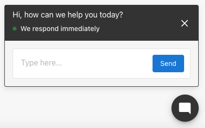
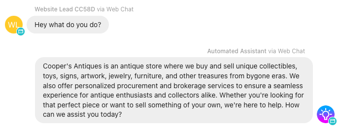
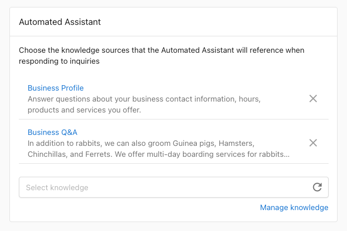
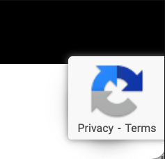

# AI-assisted Web Chat Widget

With AI-assisted web chat, your business can capture more leads from your website. Your AI assistant will chat live with website visitors, answer questions capture their contact information so you can follow up later via SMS or email, and turn them into a customer.

## How AI Web Chat works

Once installed on your business website, the chat widget will appear to website visitors and encourage them to chat with your AI assistant with the goal of capturing a lead for your business.



Conversations will appear in Inbox in Business App, where someone on your team can respond to the lead via SMS, and convert them into a customer.


## AI Assistant behaviour & goals

By default, the AI assistant "just works" by responding to any messages from website visitors immediately, while bring a good representative of your business. It has these primary goals:

1. **Answer any questions about the business**: The AI assistant will respond to questions if it confidently can find the answer in the knowledge it has been trained on (See knowledge training instructions below.) By default, the AI assistant knows basic information about your business from the business profile. It can also be given any additional text knowledge, like answers to FAQs, pricing, products, services, shipping info, or anything in text format. The assistant will not answer questions it does not know the answer to, but instead let the visitor know someone from your business will get back to them as soon as possible.

2. **Capturing the lead's contact info**: The AI assistant will respond to a website visitor with the goal to understand their needs, and attempt to get their name and contact info (mobile number, with a fallback to email address) so the conversation can be continued even if the lead leaves the website. Once contact information has been collected, Business App will alert the business that they have a new lead via na email notification.

3. **Respond in the language the person is using**. The AI assistant can reply in over 40 languages, including English, French, Spanish and many more, to serve all kinds of customers in your service area.

## What can I customize?

* **Color**: It’s possible to customize the color of the chat widget, to match your website. Set a primary color of the widget, as well as the secondary color of the Send button and text bubbles, so the widget can match your brand.
* **Web Chat greeting**: The message that appears at the top of the web chat widget that website visitors first see, to encourage them to interact with the chat widget.
* **AI knowledge**: Give your web chat AI assistant additional context and knowledge about the business it’s representing. Learn how to set this up below.

## Give your AI assistant business profile knowledge

The AI assistant can be given knowledge about a business from the business profile, to be able to answer questions about what the business does, where it's located, its hours, and how to contact them. This is enabled by default, but can be removed as a knowledge source if desired.

These fields are shared with the AI from the account's business profile:

* Business Name
* Address and/or Service Areas
* Website
* Booking URL
* Phone Number
* Categories
* Hours
* Services Offered
* Short Description
* Long Description
* Social Media URLs



## Give your AI assistant knowledge from any text source

* Navigate to Business App > Settings > Inbox Settings > Web Chat Settings > AI Assistant.
* Click on any title to see the knowledge that the AI has access to.
* Click Manage Knowledge to go to the centralized area in Business App where new knowledge can be added.
* You can write or paste and text information into a new knowledge source, and then select it to make it accessible to your AI assistant.



:::tip
If your business uses a booking link to let customer book appointments themselves, add the following sentence to the custom knowledge and the AI will encourage visitors to visit the booking link.

"Clients can see availability, pricing and services on our booking link: [linkhere.com]"

**Can the AI assistant scrape websites?**

Not yet, but this is in progress. You'll see this in a future update.

**Can I upload files like PDF or DOC?**

Not yet, only raw text can be saved. Copy and paste important text from your PDF or DOC into the text entry field to make it available to the AI.
:::


## How will I be notified about a new lead?

When your AI assistant is successful in capturing a name and contact info, a few things will happen automatically:

1. A new contact is added to your CRM Contacts, with the captured info: First name, last name, phone number, and email address.
   * If a lead updates their contact info in the AI-assisted web chat (like for example, if they make a mistake), the latest contact info will be updated on the contact automatically.
2. A "New lead" email notification is sent to users on your account. Make sure you have notifications enabled for new leads.


## How to install the Inbox Pro Web Chat widget on your website

To install your web chat widget on your website: Go to Settings > Inbox Settings > Web Chat Configuration – and set up your web chat widget. After setting it up, it can be installed using one of the following methods:

### WordPress

OPTION 1: To install on a WordPress site using a plugin

1. Download the web chat widget installation plugin from Settings > Inbox Settings > Web Chat Configuration > Installation
2. Navigate to your WordPress backend admin, usually at your-website.com/wp-admin
3. Go to Plugins > Add new plugin
4. Upload the zip file containing the plugin you just downloaded.
5. Activate the plugin. Your web chat widget should now appear on every page of your website.

OPTION 2: To install using widget code on a WordPress site with Divi theme:

1. Copy your web chat installation code into your clipboard.
2. Navigate to your WordPress backend admin, usually at your-website.com/wp-admin
3. Go to Divi > Theme Options > Integrations
4. Paste the code into the section titled “Add code to the < head > of your blog.”
5. Save changes. Your web chat widget should now be live on your website, on all pages.


### Shopify

* Copy the web chat widget Javascript code from Business App > Settings > Inbox Settings > Web Chat Configuration
* Locate your Online Store page on Shopify
* Click the menu and navigate to “Edit code”
* Find your “theme.liquid” code file.
* Locate the closing `</head>` tag and paste the code above it. Don’t forget to save your code!
* Congratulations, your Web Chat widget has been installed on your website. Now you can test it.

### Other Websites

To install on another website

You'll want to place your web chat widget install code into the header of your site, typically right before the closing < /head >.

## Common issues

:::note

**I don’t see the web chat on my site, even though it’s installed in the right place**

If the Web Chat code is installed on your website and enabled in Inbox Settings, and you cannot see it on your website, the most likely next cause is cache or plugin issues. You can try additional steps on your website to clear cache or any blocking plugins to get the web chat to appear.

**Caching issues**

Most websites use multiple types of caches that help the site to load faster. You’ll want to reset the caches, to get your latest website changes to appear.

1. Browser cache – to tell your browser to load the website without using local device cache
   * Shift+command+R (Mac)
   * Ctrl + F5 (PC)
2. Website hosting cache – clear the cache that the Website product manages, by clicking the ‘Flush Cache’ button on the Website overview page.
3. Divi CSS cache – Disable the Static CSS File Generation cache in your Divi Theme options > Builder > Advanced
4. Other Cache plugins – Ensure there are no other cache plugins activated on your website; if so, disable them.

**Google reCAPTCHA badge is in the way**



When reCAPTCHA is being used on a website form, this badge will appear in the bottom right of a webpage – which could be in the way of the web chat widget.

You can hide the badge completely on your website with some custom CSS; just make sure to follow Google’s required alternative ways to inform the user that reCAPTCHA is being used. Read more: https://developers.google.com/recaptcha/docs/faq#id-like-to-hide-the-recaptcha-badge.-what-is-allowed

To hide the reCAPTCHA badge, go to your website CSS editor,

1. Log in to your WordPress dashboard
2. Go to Appearance » Customizer
3. Click Additional CSS
4. Add the snippet below:
```
.grecaptcha-badge {
    visibility: hidden!important;
}
```
5. Save and preview your website
:::