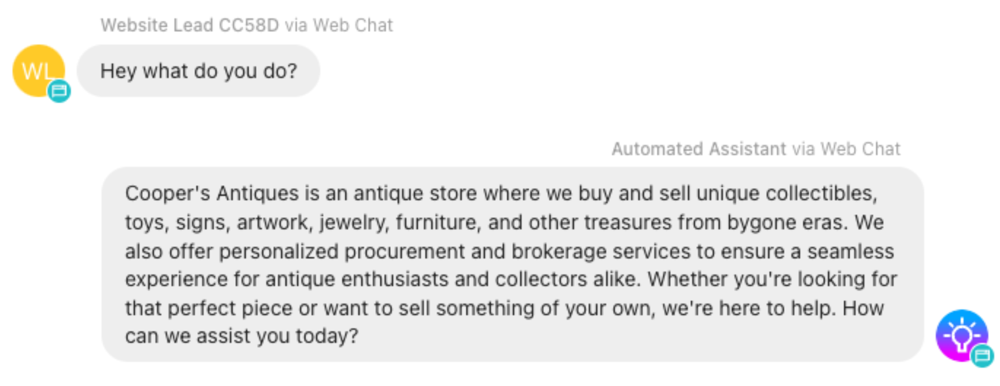
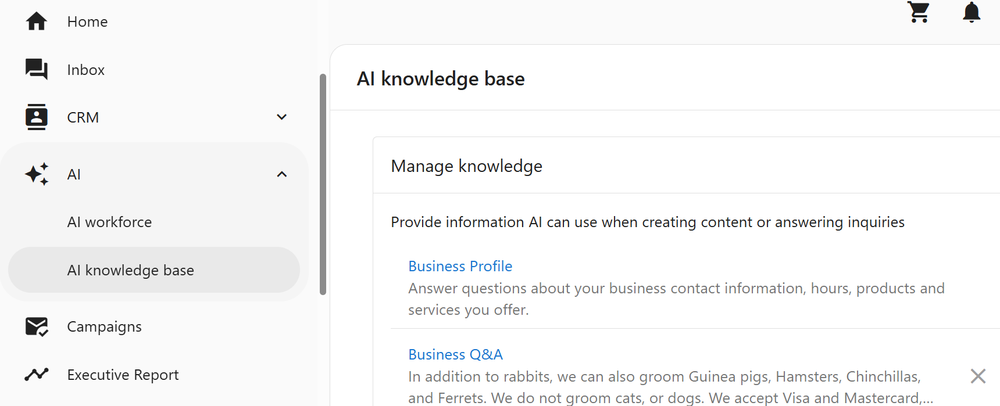
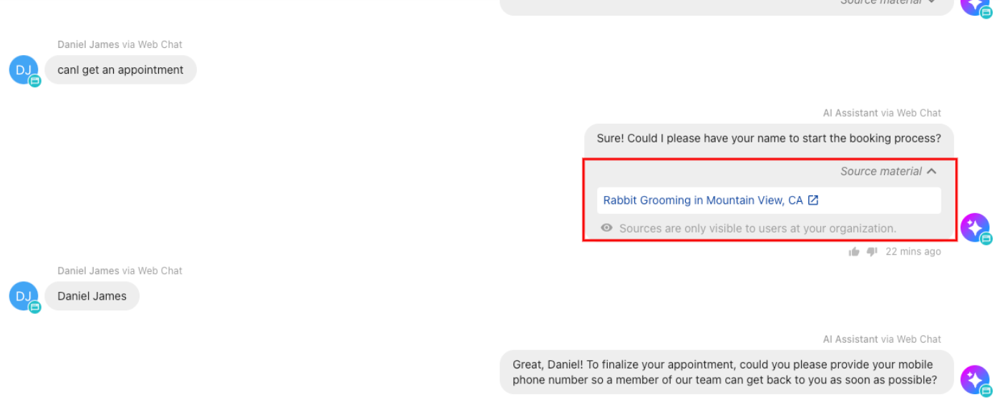

# AI-Powered Web Chat Widget Overview

## What is it?

The AI-assisted Web Chat Widget, included with Inbox Pro, allows businesses to engage website visitors 24/7 through an AI assistant. This widget answers questions, gathers contact information, and delivers new leads into your CRM, ensuring continuous engagement with potential customers.

*The AI-assist Web Chat Widget comes pre-bundled into Inbox Pro (along with SMS messaging) or can be purchased as a standalone product.*

## Why is this feature important?

Businesses often miss opportunities when they cannot respond to website visitors promptly. The AI assistant serves as a reliable first responder, capturing leads and providing immediate answers, thereby increasing the chances of conversion.

## Table of Contents

- [What's Included](#whats-included)
- [How to Install the Web Chat Widget](#how-to-install-the-web-chat-widget)
- [AI Assistant Behavior & Goals](#ai-assistant-behavior--goals)
- [How to Train the AI on Your Business](#how-to-train-the-ai-on-your-business)
- [Customization Options](#customization-options)
- [Troubleshooting](#common-issues--troubleshooting)
- [Frequently Asked Questions (FAQs)](#frequently-asked-questions-faqs)

## What’s Included

The AI-powered Web Chat Widget includes the following capabilities:

- **AI Assistant for Lead Engagement**  
  Greets visitors on your website and respond instantly using conversational AI trained on your business profile and website content.

- **Automatic Lead Capture**  
  Collects visitor name, email, and mobile number (when provided), and adds them to your Contacts and Inbox for easy follow-up.

- **24/7 Response Coverage**  
  Engages visitors at any time of day without requiring live agents or staff availability.

- **Multilingual Support**  
  Detects and replies in the visitor’s language, supporting over 40 languages including English, Spanish, French, and German.

- **Message History in Inbox**  
  All conversations with the AI assistant are saved in Inbox, allowing your team to review transcripts and continue the conversation manually if needed.

- **Customizable Appearance and Prompts**  
  Set your own greeting, adjust tone and behavior, and select which contact fields to collect (e.g., name, email, phone).

- **Unlimited AI Responses**  
  No message caps or per-interaction limits — the assistant responds to as many inquiries as your visitors initiate.

## How to Install the Web Chat Widget

To install the AI-assisted Web Chat Widget on your website (after Inbox Pro is enabled):

1. **Access Web Chat Configuration**:
   - Navigate to `Administration > Inbox Settings > Web Chat Configuration` in Business App.

2. **Configure the Widget**:
   - Customize the widget's appearance and behavior as desired.

3. **Install the Widget**:
   - Copy the provided installation code.
   - Paste it into the `<head>` section of your website's HTML, typically just before the closing `</head>` tag.

For platform-specific instructions:

**WordPress Web Chat Installation Instructions**:

OPTION 1: To install on a WordPress site using a plugin

1. Download the web chat widget installation plugin from Settings > Inbox Settings > Web Chat Configuration > Installation
2. Navigate to your WordPress backend admin, usually at your-website.com/wp-admin
3. Go to Plugins > Add new plugin
4. Upload the zip file containing the plugin you just downloaded.
5. Activate the plugin. Your web chat widget should now appear on every page of your website.

OPTION 2: To install using widget code on a WordPress site with Divi theme:

1. Copy your web chat installation code into your clipboard.
2. Navigate to your WordPress backend admin, usually at your-website.com/wp-admin
3. Go to Divi > Theme Options > Integrations
4. Paste the code into the section titled “Add code to the < head > of your blog.”
5. Save changes. Your web chat widget should now be live on your website, on all pages.

    

**Shopify Web Chat Installation Instructions**:
  - Copy the installation code.
  - In Shopify, go to `Online Store > Themes > Actions > Edit Code`.
  - Open the `theme.liquid` file.
  - Paste the code just before the closing `</head>` tag.
  - Save the changes.

## Basic Troubleshooting

If the web chat widget does not appear on your site after installation:

**Cache Issues**: Clear your browser and site cache to ensure the latest version is loaded.
- Browser cache – to tell your browser to load the website without using local device cache.
  - Shift+command+R (Mac)
  - Ctrl + F5 (PC)

- Website hosting cache – clear the cache that the Website product manages, by clicking the Flush Cache button on the Website overview page

- Divi CSS cache – Disable the Static CSS File Generation cache in your Divi Theme options > Builder > Advance

- Other Cache plugins – Ensure there are no other cache plugins activated on your website; if so, disable them.

**Plugin Conflicts**: Disable other plugins temporarily to identify any conflicts.

**Correct Placement**: Verify that the installation code is correctly placed within the `<head>` section of your website's HTML.

## AI Assistant Behavior & Goals

The AI Assistant operates with the following primary objectives:

1. **Answer Business-Related Questions**: Utilizing knowledge from the business profile and additional provided information, the assistant responds confidently to inquiries about services, pricing, and more. If uncertain, it informs the visitor that someone will follow up.

2. **Capture Lead Contact Information**: Engages visitors to understand their needs and collects their name and contact details (preferably mobile number, alternatively email) to facilitate continued communication.

3. **Multilingual Support**: Automatically detects and responds in the visitor's language, supporting over 40 languages, including English, French, and Spanish.

## How to Train the AI on Your Business

You can train the AI assistant to accurately represent your business by giving it access to your business profile and any additional custom content you choose to provide.

### Business Profile Knowledge (Enabled by Default)

The AI assistant uses information from the business profile to answer common questions such as what you do, where you're located, hours of operation, and how to get in touch. This is enabled by default, but you can remove it as a knowledge source if needed.

The following fields from the business profile are shared with the AI:

- Business Name  
- Address and/or Service Areas  
- Website  
- Booking URL  
- Phone Number  
- Categories  
- Hours  
- Services Offered  
- Short Description  
- Long Description  
- Social Media URLs  

### How to Add Your Website as Source Knowledge for Your AI

You can have the AI scrape your website which helps it respond to detailed inquiries about your business. 

<iframe width="100%" height="400" 
src="https://www.youtube.com/embed/eMTaoKXymXQ?start=8" 
title="AI Web Chat Overview" 
frameborder="0" 
allow="accelerometer; autoplay; clipboard-write; encrypted-media; gyroscope; picture-in-picture" 
allowfullscreen>
</iframe>

1. Go to `AI > AI knowledge base > Manage knowledge` in Business App.  
3. Click `Add knowledge` the choose `Website`
4. Follow the setup instructions to train the AI on your website. Make sure you select all the pages you would like to train your AI on, and save.

### How to Add Custom Knowledge to Your AI

You can expand the assistant’s capabilities by adding your own knowledge content from any text-based source.

1. Go to `AI > AI knowledge base > Manage knowledge` in Business App.  
2. Click on any knowledge source title to preview what content is currently accessible to the AI.  
3. Click `Manage Knowledge` to open the centralized knowledge area.  
4. Add new content by writing or pasting text into a new knowledge source.  
5. Select the checkbox next to each source you want the AI to use.

This lets you teach the AI to respond using business-specific details such as product explanations, policies, or unique services beyond what's stored in the profile.

## How will I be notified about a new lead?

When your AI assistant is successful in capturing a name and contact info, a few things will happen automatically:

1. A new contact is added to your CRM Contacts, with the captured info: First name, last name, phone number, and email address.
   * If a lead updates their contact info in the AI-assisted web chat (like for example, if they make a mistake), the latest contact info will be updated on the contact automatically.
2. A "New lead" email notification is sent to users on your account. Make sure you have notifications enabled for new leads.

## Customization Options

You can tailor the web chat widget to align with your branding and operational needs:

- **Color Scheme**: Adjust the primary and secondary colors to match your website's design.
- **Web Chat Greeting**: Customize the initial message to encourage visitor interaction.
- **AI Knowledge Base**: Enhance the assistant's responses by adding specific business information, such as FAQs, pricing, and services.
- **Profile Information**: Add a name and profile photo to personalize the assistant.
- **Welcome Greeting**: Set a header message to invite engagement.
- **Initial AI Message**: Configure a custom greeting that appears shortly after the chat is opened.
- **Phone Configuration**: Define how received calls and SMS messages should be handled.

Access these settings via `Business App > Administration > Inbox Settings > Configure Web Chat`.

## Frequently Asked Questions (FAQs)

**Can the AI assistant scrape websites for information?**  
Yes, the AI can be trained on website content to enhance its knowledge base.

**Can I upload files like PDFs or DOCs for the AI to learn from?**  
Currently, only raw text can be added to the AI's knowledge base.

**Why is the AI responding with incorrect or incomplete information?**
The information the AI responds to inquiries with the source information it has - only. The great thing about the web chat tool is that it will show you directly inside the Inbox chat record where they got the source information from - like a quick audit - so you can make the change on your website or inside your AI knowledge base. The most common culprit is old or incorrect information found on the website.

**How long does training the AI take?**  
Training duration varies based on website size but typically takes between 1-5 minutes.

**Is there a limit to the number of AI responses?**  
No, unlimited AI responses are included with Inbox Pro.

**How do I install the web chat widget?**  
Copy and paste the installation code into the `<head>` section of your website's HTML. Detailed instructions are provided above.

**What languages does the AI support?**  
The AI assistant can respond in over 40 languages, including English, Spanish, French, German, Italian, Turkish, Polish, Ukrainian, Russian, Japanese, and Chinese.

**Why won't the chat widget let me type certain letters or the "Space" key when trying to type?**  
Some plugins can interfere with the ability to type in the widget because they “hijack” that key for their own functions.

For example, website admins will have trouble typing messages into the web chat widget when the WordPress jetpack plugin is enabled, because it hijacks some of the keys to open and close their own chat functions. Disabling the JetPack plugin will restore the function of these keys.

Smooth scrolling website features can also interfere with the ability of your website visitors to type the ‘space’ key with the web chat widget. If you have the Divi theme on a WordPress website, you can disable smooth scrolling by going to Divi > Theme Options and disabling the Smooth Scrolling functions.

**How do I remove the Google reCaptcha badge that's blocking my chat widget?**  
When reCAPTCHA is being used on a website form, this badge will appear in the bottom right of a webpage – which could be in the way of the web chat widget.
You can hide the badge completely on your website with some custom CSS; just make sure to follow Google’s required alternative ways to inform the user that reCAPTCHA is being used. 

Read more: https://developers.google.com/recaptcha/docs/faq#id-like-to-hide-the-recaptcha-badge.-what-is-allowed

To hide the reCAPTCHA badge, go to your website CSS editor:

- Log in to your WordPress dashboard
- Go to Appearance » Customizer
- Click Additional CSS
- Add the snippet:
.grecaptcha-badge {
visibility: hidden!important;
}
- Save and preview your website.