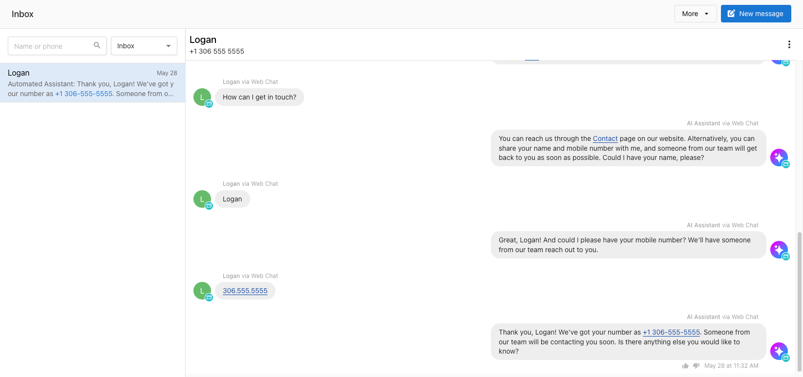

# Inbox

## Overview

Inbox is a communication tool that centralizes customer messages from email, Facebook, Instagram, and AI-powered web chat into one dashboard. It enables teams to view and respond to conversations collaboratively, without needing to switch between platforms. 

If enabled, AI-powered web chat responds to and captures leads instantly, helping you stay responsive 24/7. Inbox unites all conversations—including those from your connected Google Business Profile and SMS messages — into one shared view. Inbox reduces the need to manage multiple apps or disconnected systems.

## Why is this feature important?

Small businesses often lose time and opportunities by managing messages across disconnected platforms. Without visibility into all conversations, responses are delayed and teams may duplicate efforts. Inbox consolidates these conversations into a shared workspace, helping businesses stay organized, improve response times, and create a more consistent customer experience.

## Table of Contents

- [What's Included](#whats-included)
- [Inbox Pro Features](#inbox-pro-features)
- [Feature Availability](#feature-availability)
- [How to Set Up Inbox](#how-to-set-up-inbox)
- [Frequently Asked Questions (FAQs)](#frequently-asked-questions-faqs)

## What’s Included

Inbox includes the following capabilities out-of-the-box:

- **Email**  
  Send and receive email with leads and customers from a shared business email address.

- **Facebook Messenger Integration**  
  Connect a Facebook Business Page to view and reply to Messenger conversations directly in Inbox.

- **Instagram Integration**  
  Connect an Instagram Business account to manage direct messages from Instagram.

- **Google Business Profile Messaging**  
  Route messages received from your Google Business Profile into Inbox for team visibility and quick response.

- **Website Form Lead Capture**  
  Use a website contact form to capture lead details and begin conversations by email.

- **Multi-Location Inbox**  
  View and manage conversations across multiple locations (if access is granted).

- **Team Shared Inbox**  
  Collaborate with other team members by viewing and responding to shared messages.

These features are included in all accounts and do not require an upgrade.

## Inbox Pro Features

Inbox Pro adds advanced communication tools:

- **AI Web Chat Lead Capture**  
  Add a chat widget to your website with an AI assistant that greets visitors, answers questions, and collects contact details. AI supports over 40 languages, including English, Spanish, French, and German. AI responses can also be viewed in the Inbox thread, enabling human follow-up.

- **SMS Messaging**  
  Businesses in the United States and Canada receive a local SMS number that allows one-on-one texting. A2P 10DLC registration is included to ensure messages are delivered reliably on US carriers. Unlimited SMS messaging is included.

Inbox Pro is required to access these features.

## Feature Availability

| Feature                            | United States | Canada        | Other Regions     |
|------------------------------------|----------------|---------------|-------------------|
| SMS Messaging                      | ✓ (Pro only)   | ✓ (Pro only)  | Not available     |
| AI Web Chat                        | ✓ (Pro only)   | ✓ (Pro only)  | ✓ (Pro only)      |
| Facebook Messenger                 | ✓              | ✓             | ✓                 |
| Instagram Messenger                | ✓              | ✓             | ✓                 |
| Google Business Profile Messaging  | ✓              | ✓             | ✓                 |
| Email                              | ✓              | ✓             | ✓                 |
| Website Forms                      | ✓              | ✓             | ✓                 |

## How to Set Up Inbox in Business App

Inbox is available to all users of Business App. Get started by connecting your Facebook and Instagram, installing your AI-powered web chat widget, and registering your SMS number.

- [**Set up Instagram in Inbox**](./inbox_setup_instagram.md) 
  Link your accounts so you can view and reply to direct messages directly from Inbox.

- [**Install the AI-powered web chat widget**](./inbox_ai_web_chat_overview.md) 
  Add the chat widget to your website to engage visitors, answer questions automatically, and collect lead details using the AI assistant.

- [**Add a lead contact form to your website**](../inbox/setup-web-form)  
  Capture leads from your website using a simple contact form. Submissions are sent to your Inbox for easy follow-up.

- [**Register your SMS number (Inbox Pro only)**](../inbox/setup-sms)  
  Businesses in the US and Canada can register for a dedicated SMS number to send and receive text messages through Inbox.

- [**Set up email forwarding (optional)**](../inbox/setup-email-forwarding)  
  Use your existing business email address to forward incoming mail into Inbox and reply from a shared address.

## How to connect your business messaging networks to Inbox

1. Go to Business App > Administration > Inbox Settings
2. Connect any business accounts for Google Business Profile, Facebook, and Instagram by going through the workflows to connect
3. Make sure to turn on messaging once an account has been connected.
   These integrations are shared across multiple features in Business App, so if you’ve already connected any previously, you’ll see them connected here, but you may need to reconnect to grant additional messaging permissions.

### Frequently Asked Questions (FAQs)

**Can Inbox integrate with other CRMs or messaging systems?**  
Yes. Businesses can centralize their contact data using available integrations with Zapier, QuickBooks, and more. Automations can also be created to trigger messaging events.

**What automations are available for Inbox?**  
Automations include triggers such as `Message Received` and actions like `Send Email` or `Send SMS.` These allow users to build custom workflows and responses.

**Is there a per-use cost for the AI web chat?**  
No. Unlimited AI responses are included with Inbox Pro. There are no per-message or per-interaction fees.

**What languages does the AI assistant support?**  
The assistant can respond in over 40 languages, including English, Spanish, French, German, Italian, Turkish, Polish, Ukrainian, Russian, Japanese, and Chinese.

**If we install the Inbox Pro chat on our website, will it be only AI answering customers or will real agents talk to customers?**  
The web chat is 100% AI-managed lead capture. Small businesses are busy, and can't always reply instantly – that's why the AI is pre-programmed to capture website visitor's name and number, and then notify the business they have a new lead. The AI will continue the conversation until you can reply via SMS, and move the conversation off the website and onto the customer's phone.

**How much does the chatbot know about the business? Can it answer questions?**  
The AI can access "knowledge" from the business profile, so it can answer questions about services, location and contact info, and hours. It can also be trained on your website. You can also add additional text Q&A 'knowledge' to the AI knowledge so it can answer frequently asked questions from any text.