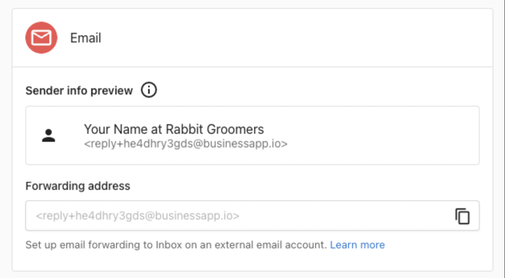

# Send and Receive Emails in Inbox

## What is email in Inbox?

Send and receive emails with leads and customers via Inbox from a shared email address. When you get a new lead from web chat or a form, and that lead provides an email address as a way to contact them, anyone on the team can reply via email to that customer from your centralized Inbox, without needing to open a separate email thread.

## Why is email communication in Inbox important?

When teams can’t easily see who replied to a customer—or whether anyone did—it creates confusion and delays. Using Inbox for email centralizes all communication into one shared space. Every team member can view and respond to messages from the same email thread without switching platforms. This ensures nothing is missed and keeps customer conversations organized in one place alongside other conversations through SMS and web chat.

## Features of Email Communication in Inbox

1. Available to all users of Inbox, both Inbox Standard and Inbox Pro.
2. Send emails to contacts using the business's assigned email address.
3. Receive email replies back into a team-shared Inbox, where anyone on the team can continue the conversation.
4. Setup email forwarding for clients to receive emails sent to the business-owned email address in Inbox

## How to send a new message

* To send an email to a new or existing contact, click the ‘new message’ button in Inbox and enter the email address of the person you'd like to send a message to.
* When the customer replies to a sent email, their reply-to is automatically set to the business's assigned Inbox email address, and replies will appear in Inbox in the same conversation.

## How to forward emails into Inbox from other email addresses

By setting up email forwarding, you can receive emails from leads and customers sent to an email address the business owns into the centralized Inbox, so the team can collaborate on replying.

For example, you might use a general business email address for customer inquiries, like team@yourcompany.com. With forwarding, any time someone sends an email to that address, it will also appear in Inbox.

### How to set up forwarding from Gmail

1. In Gmail.com, go to Settings > See all settings.
2. Select Forwarding and POP/IMAP tab
3. Click Add a forwarding address and paste in your unique email address from Inbox Settings, click Next, sign in again if required, and confirm.
4. In Inbox, you will receive a confirmation message. Click the link to confirm the request to forward the email.
5. After confirming, you will need to return to the Gmail Forwarding settings one more time, to ENABLE forwarding, then save your changes. You can also optionally use filtering to forward only some of the messages.

### How to set up forwarding from Outlook

1. In Outlook.com, select Settings.
2. Select Mail > Forwarding.
3. To turn on forwarding, select Enable forwarding, enter the forwarding email address, and select Save.

### Frequently Asked Questions (FAQs)

:::note

**Can I use a branded email address for sending and replying to emails to clients?**

Not currently. All emails are sent from an assigned unique email address, that has the following format reply+xxxxxxxxxxx@businessapp.io.

**Can each user get their own email address?**
Not currently. The business uses one shared email address and Inbox. But when a message is sent, the name of the user that sent the email is visible as the Sender details and within the Signature.

**I see an area in Business App settings called “email configuration” – is this where I manage my email for Inbox?**

No, not currently. The email configuration area in Business App settings is for managing email that’s sent from Campaigns Pro and Reputation Management Premium. In the future, email configuration will be unified.
:::
