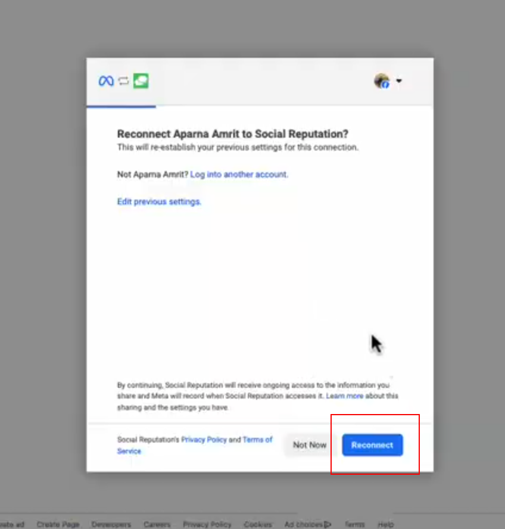
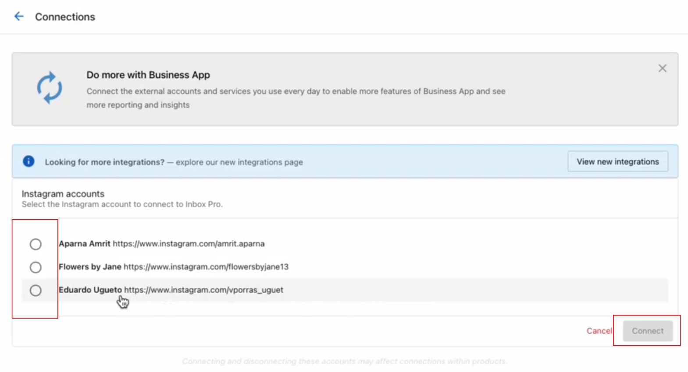

## Connecting Instragram to Inbox

### How to Connect Instagram to Inbox

Connecting Instagram to Inbox requires a few extra steps. 
### Step 1  
From the Inbox Settings page, click **Sign in with Instagram**.

### Step 2  
Sign in to Facebook, or if you are already signed in, click **Reconnect**.  
*(Make sure to give access to **All Pages** when connecting Facebook!)*

### Step 3  
All professional accounts that are connected to the Facebook account will show here.  
Select the desired account, and click **Connect**.

### Step 4  
Back in the Inbox settings page, click **Turn on Messaging**.

<iframe src="https://www.loom.com/embed/0ef0b3ef782442c0be3ff9a3836d11da?t=14" 
frameborder="0" 
webkitallowfullscreen 
mozallowfullscreen 
allowfullscreen 
width="100%" 
height="400">
</iframe>