# Zapier

Business App CRM can be connected to many 3rd party systems using Zapier.

## How Does it Work?

1. Selecting the Trigger

In this step, you can select the trigger that initiates an action in your workflow. As an example when a New Payment in Quickbooks Online can be used as a trigger. However, you can choose from various other triggers available in Zapier.

2. Choosing the App

After selecting the trigger, you’ll need to choose the app that will carry out your desired action. In this scenario, that app would be Business App. This means that whenever a New Payment is received in Quickbooks online, an automation would be executed in the Business App CRM. As part of Business App in Zapier, various actions are possible.

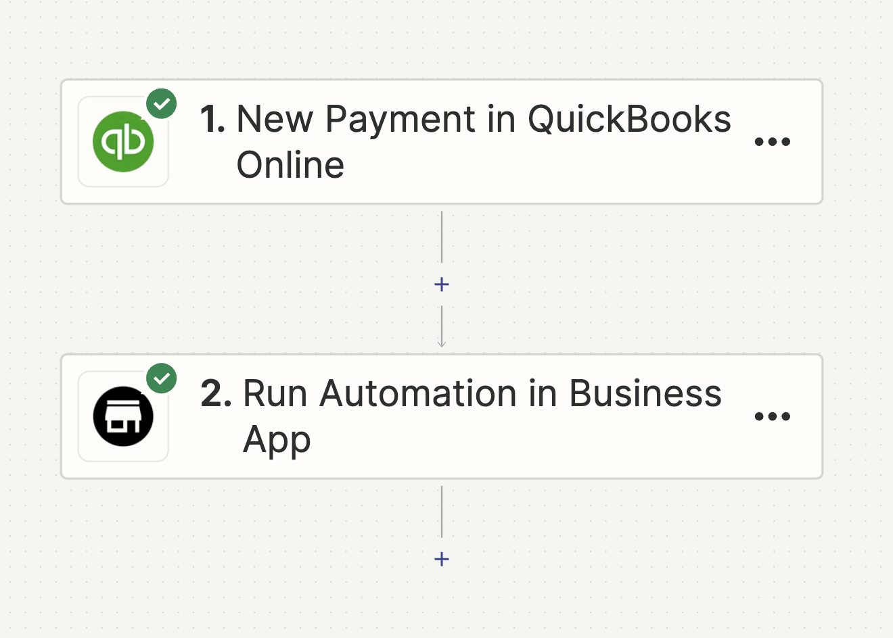

3. Choosing the Action

In this step, you’ll set the action to be performed when the trigger event happens. For this scenario, the action is to Run Automation in the Business App CRM.

Remember, you can change the action anytime by clicking on the dropdown menu and choosing a different option. After selecting the action, click “Continue” to proceed to the next step.

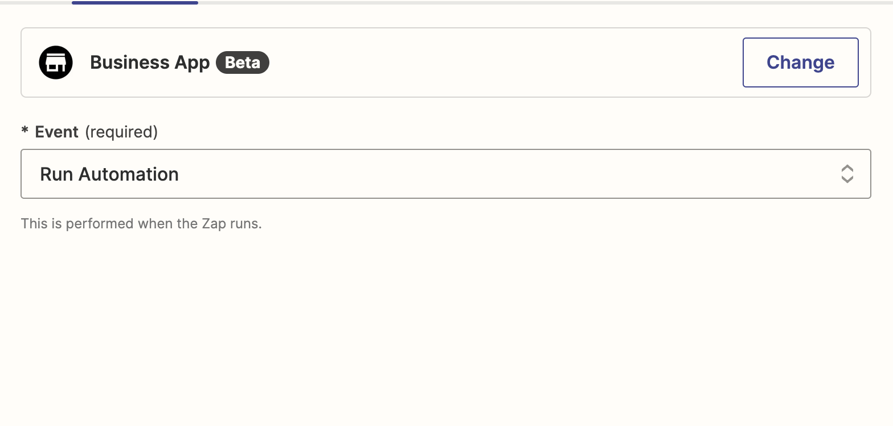

4. Signing In

In this step, you’ll connect your Business App account. Click on “Sign in” to be redirected to the login page. Here, you’ll enter your Account ID and grant the necessary permissions. After this, you’ll be automatically redirected back to Zapier.

Note: You only need to complete this process once. In the future, you’ll be automatically signed into your account when using the Business App Action.

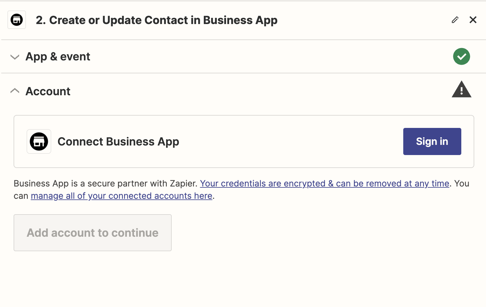

5. Entering the Organization ID

In this step, you will need to enter the Organization ID, which is a mandatory field. This ID is automatically populated based on the Account ID you used when signing in.

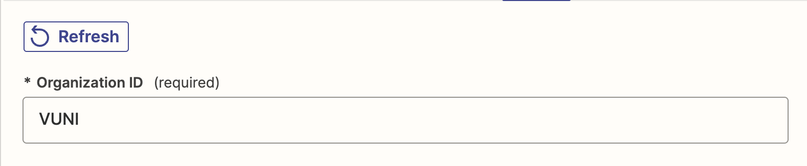

6. Trigger

In the ‘Trigger’ field, select the type of Automation that you would want to run in Business App CRM.

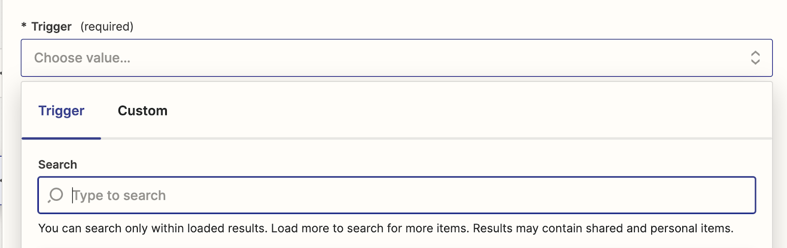

You will be able to search and select the Trigger type from the Dropdown provided. There are five options available

* Triggered via API
* Triggered manually for an Account
* Triggered via API for an Account
* Triggered manually for an Order
* Triggered via API for an Order

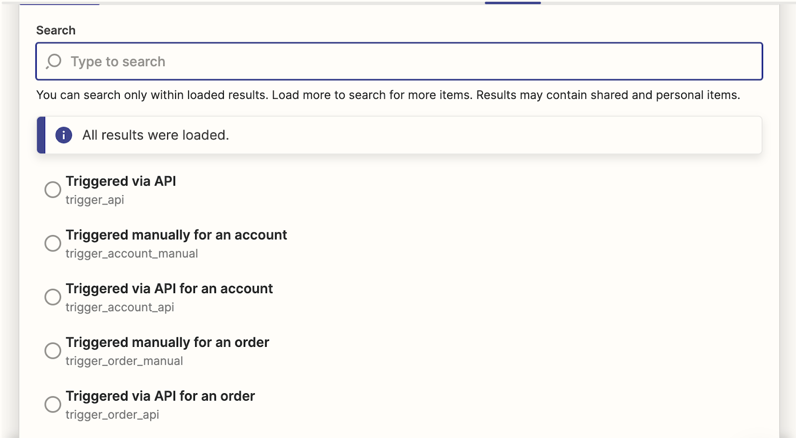

Once you have chosen the Trigger type, please enter the Account ID or Order ID based on the Type of Trigger Chosen.

For Automations Triggered manually for an Account or Triggered via API for an Account enter the Account ID.

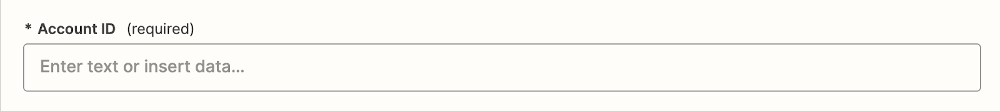

For Automations Triggered manually for an Order or Triggered via API for an Order enter the Order ID.

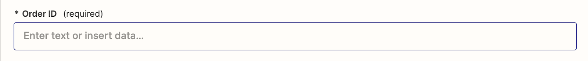

7. Automation ID

In the 'Automation ID' field, enter the ID of the automation you want Zapier to run when a trigger occurs in an external system, such as Quickbooks

The 'Automation ID' field is a searchable dropdown that lets you find the Automation ID by searching with either the ID or the Automation name.

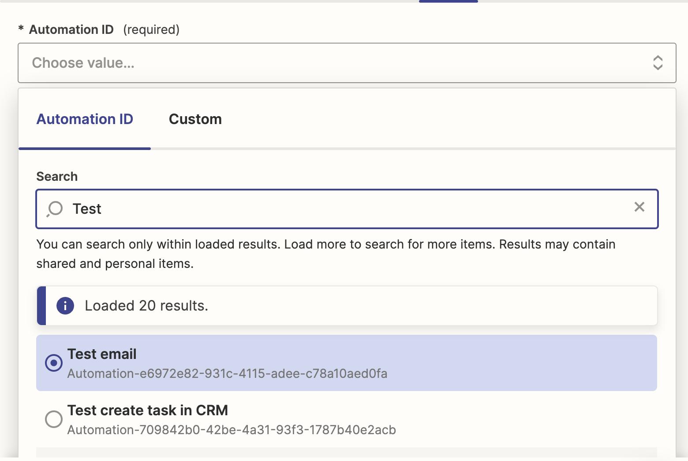

Note: The automation must be turned on for it to be triggered via Zapier.

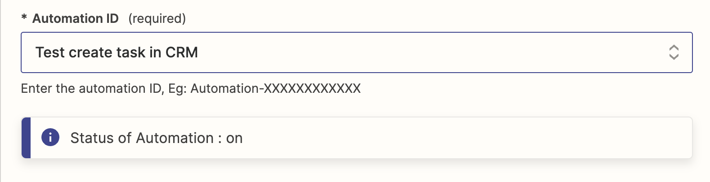

8. Testing the Step

Before publishing the Zap, be sure to test the step in Zapier. This can help identify any missing fields or incorrect data.

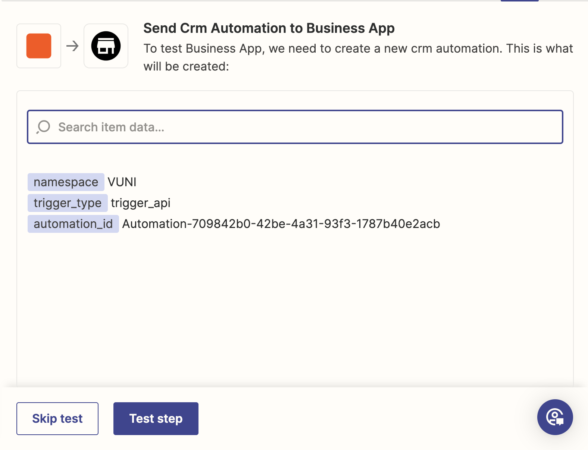

After testing, a 'Run Automation Successful' message confirms that the Zap is working as expected and ready to be published