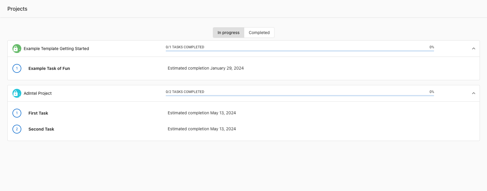
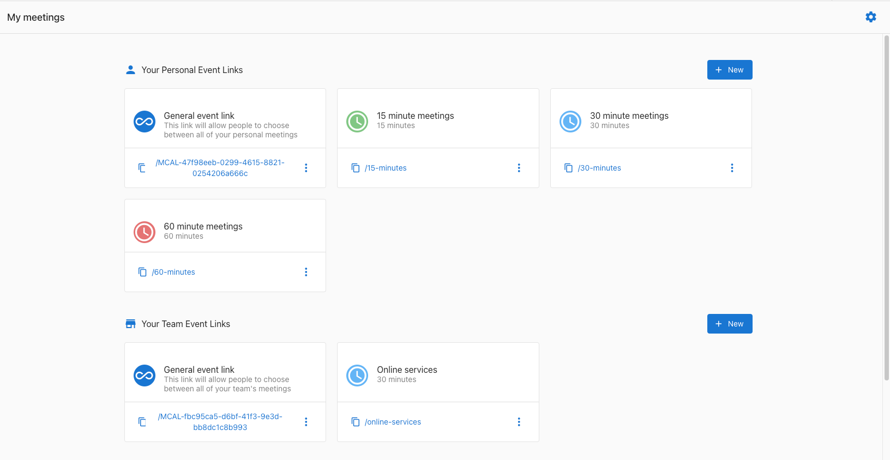
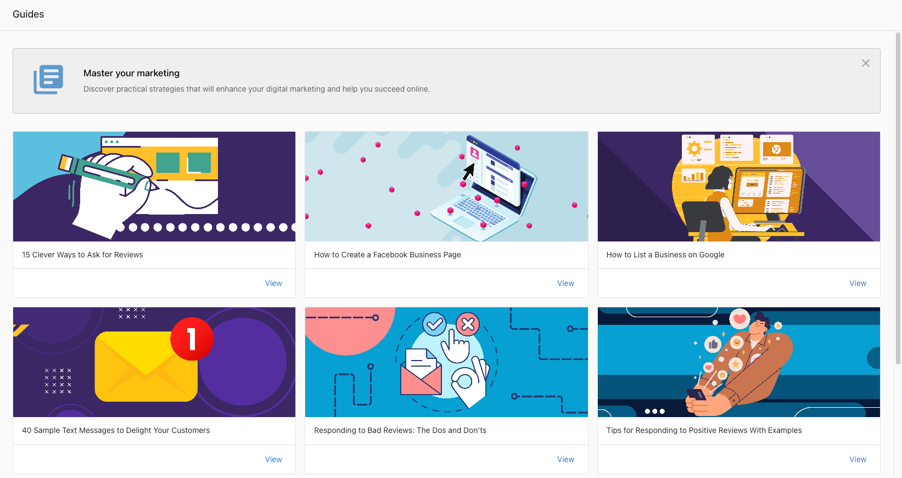
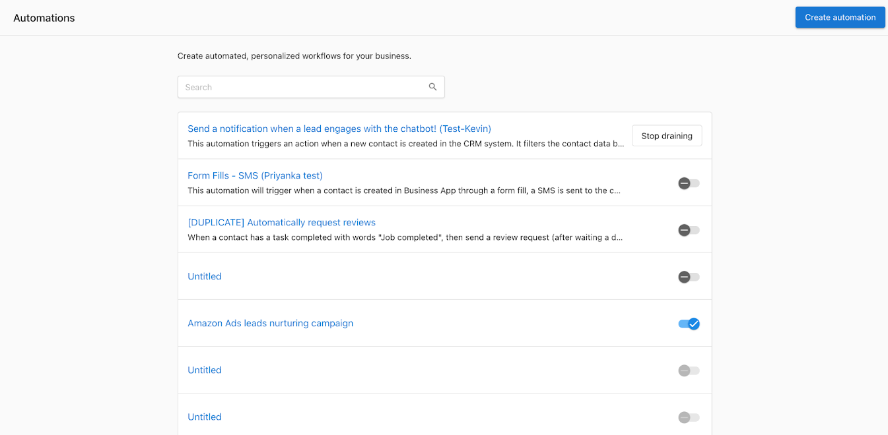
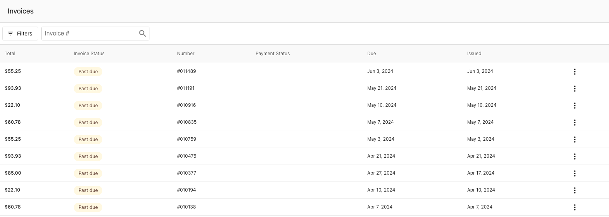

# Overview

The **My Business** section offers a comprehensive suite of tools designed to streamline operations efficiently.

## How does the My Business page work?

Log into Business App and click on the desired navigation. Each navigation is described below:

1. **Business Profile**: The Business Profile page is an important component of your business's digital presence. It allows you to update all of your relevant business information such as hours, location, and phone number, and keep that information in sync across the platform, and the web.

NOTE: The Business Profile stays in sync across products. The Business Profile is also accessible from other products if they are active on the account, and editing the profile in one place will update it everywhere.

2. **Projects**: The Projects page conveniently displays both ongoing and finished tasks for efficient tracking and management within Business App.

3. **My Meetings**: The Meeting Scheduler is a free addition to Business App. You can set up booking links, sync meetings with Google Calendar, set your availability, and more. It allows you to find times that work for you and your customers.

4. **Guides**: From the Guides tab, you can explore several guides that walk through areas to focus on, how to sell, and how to manage your online presence.

5. **Files**: The files tab allows any shared files on the business account to be viewed with details as posted and modified. For example, case studies, walkthroughs, brochures, etc.

6. **Automations**: The Automations tabs allows you to create automated, personalized workflows to improve your business workflows.

7. **Orders**: You can view orders in Business App which can help cut down on extra back-and-forth communication. The orders table allows Business App users to see what they've ordered, what they're spending, and any other associated information. This is especially useful for bookkeeping and transparency. From Orders, you can:

   * Review contract start and expiration dates.
   * Review the price and items tied to the order.
   * Download a CSV of order details.

8. **Invoices**: The Invoices tab in Business App gives you the ability to view, download, and pay invoices. By clicking on any invoice, you will be able to see details, enter your credit card, and make a payment. By clicking the ⋮ in line with the invoice, you can also view receipts or download the invoice. 

 