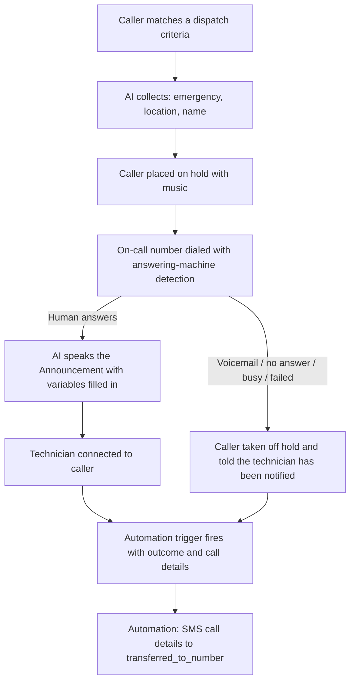

# On-Call Dispatch, Call-Transferred Trigger, and Vibe August Refresh - Plan

## Goal Capsule

- **Objective:** A Business App user can set up the On-call dispatch capability end-to-end — including the automation that texts call details to the on-call technician — from the help docs alone, and no Vibe doc contradicts the shipped August release behavior.
- **Means:** Three docs workstreams in `docusaurus/docs/business-app/`: a dedicated dispatch article, trigger + recipe documentation, and a Vibe section refresh (KTD1–KTD8).
- **Authority hierarchy:** Source-code findings (exact UI strings, field names, call flow) > the Vibe release-notes artifact > the Aug 21 product brief. Repo content rules (gray-label, evergreen, source-based only) override any source's phrasing.
- **Stop conditions:** If a fact needed for an article has no source (e.g., new per-action credit costs), omit it rather than invent it. If a release-status doubt surfaces on an item beyond the two the user already confirmed, stop and ask. Never commit a file that fails pre-push validation.

---

## Product Contract

### Summary

Document the released On-call dispatch capability of the AI Voice Receptionist as a dedicated article, document the "An AI-handled call is transferred" automation trigger with its dynamic fields plus an SMS-to-technician recipe, and refresh the Vibe docs section so it matches the August 2026 release (four new pages, one new connector page, and a stale-content sweep).

### Problem Frame

The August product cycle shipped three user-visible changes with incomplete or contradicted docs. The dispatch capability exists only as a five-line subsection in the Voice Receptionist article, with no field-level setup guidance and no documentation anywhere of the trigger's dynamic fields — users cannot build the SMS follow-up shown in the product brief. The Vibe section still describes the pre-release product: it asserts apps are client-side rendered, documents a create flow and project-settings layout that no longer exist, and omits the SSR/SEO capabilities, templates home, and reviews connector entirely.

### Key Decisions

- KD1. **The dispatch capability and the call-transferred trigger are both fully released; document both completely.** (session-settled: user-directed — chosen over holding trigger docs on its `published_state: draft` catalog flag: user confirmed both are live.) Governs R1–R8.
- KD2. **The "Vibe August 2026 Release" artifact is authoritative for release status; everything above its "Coming soon" section is documentable.** (session-settled: user-directed — chosen over the brief's IN PROGRESS markers for AEO/SEO and Templates.) Governs R9–R14.
- KD3. **The dispatch capability gets a dedicated article; the existing Voice Receptionist subsection becomes a summary that links to it.** (session-settled: user-approved — chosen over growing the Voice Receptionist page, which is already 486 lines.) Governs R1, R2.
- KD4. **Articles ship text-complete with no new screenshots; needed captures are listed as follow-up work.** (session-settled: user-approved — chosen over blocking on user-supplied images.) Governs R1, R7, R9–R12.
- KD5. **Scope is these three workstreams only** — not a full ingestion of the Aug 21 product brief's other items. Governs Scope Boundaries.

### Requirements

**On-call dispatch capability**

- R1. A dedicated article documents the On-call dispatch capability: what it does, who it's for, the configuration fields with exact UI labels (repeatable **Phone number** + **Criteria** rows via "+ Add an on-call number", shared optional **Announcement**), the announcement template variables `{CallerName}`, `{Emergency}`, `{ServiceLocation}` with the default announcement text, the full call flow (intake → hold → ring → announce → connect), and the no-answer fallback (one attempt; caller is told the technician has been notified — no retry cascade).
- R2. The existing `#### Dispatch calls to on-call staff` subsection in the Voice Receptionist article is reduced to a short summary plus a link to the new article, keeping its `{#...}` anchor so existing deep links survive.
- R3. The article explains multi-number routing: one row per on-call number, each with its own free-text criteria describing when to dispatch to it.
- R4. The article cross-links the trigger reference and the SMS recipe so readers can complete the "notify the technician" story.

**Automation trigger and recipe**

- R5. The Conversations AI trigger reference row uses the trigger's actual UI name, "An AI-handled call is transferred", and its description notes it fires for any AI-handled transfer with a filterable outcome (Answered, Voicemail, No answer, Busy, Failed, Unknown).
- R6. The trigger's dynamic fields are documented in a table: `transferred_to_number`, `caller_number`, `outcome`, `caller_name`, `reason_for_call`, `service_location`, `contact_id`, `crm_contact_created`, `namespace` — with plain-language descriptions and a note that the intake fields (caller name, reason, location) are present only for dispatched calls.
- R7. A new use-case recipe article shows the trigger + SMS action that texts the on-call technician the call details, using the `{.WorkflowStep.trigger.<field>}` tokens (message body per the product brief's example), following the existing recipe-article pattern.
- R8. The recipe explains outcome filtering: when to notify on every transfer vs. only on voicemail / no-answer / busy outcomes.

**Vibe refresh**

- R9. A new SEO & indexing guide covers: apps are served as fully rendered HTML that search engines and AI assistants can read; every published app includes `robots.txt`, `sitemap.xml`, and `llms.txt`, each individually overridable; the SEO settings section in project settings; and asking Vibe to upgrade an existing project to the current runtime. The `index.md` FAQ asserting client-side rendering is rewritten to match and point here.
- R10. A new project settings guide maps the settings sections (General, Knowledge, Connectors, SEO, Code), and every stale "click **Configure** on the project card → **Shared connectors**" instruction across the Vibe section is replaced with current navigation plus a link to this guide.
- R11. A new projects home guide covers the "What should we build today?" home (Templates and My Projects tabs), the searchable template gallery, the template detail view (imagery, description, required connectors, create-project action), and project tags and search; the getting-started create-flow steps are rewritten to match.
- R12. A new Reviews connector page follows the connector-page template, and connector inventory counts/lists are corrected everywhere they appear (including web chat where omitted).
- R13. The CRM connector page presents read *and* write (create/update contacts, pipelines, activities, custom objects), adds write prompt examples, and documents forms-to-CRM field mapping as body content.
- R14. Existing partial docs are updated: message queue gains per-sender permissions (queued requests run with the sender's own permissions), sessions/Ask-mode gains a section on how Vibe retains context across a long session, and device preview covers phone/tablet/desktop sizes plus the pop-out window.

**Cross-cutting**

- R15. Evergreen and link hygiene: the "New" badge on the Vibe card in `business-app/index.mdx` is removed, and the pre-existing broken relative links in the Vibe section are fixed.
- R16. All new and edited content follows the repo content rules: gray-label (no Vendasta, no Partner Center), evergreen (no comparative or historical framing), present tense second person, and source-based only.

### Success Criteria

- No Vibe doc asserts or implies client-side-only rendering, the old create flow, or the old settings layout.
- A reader can configure dispatch and build the technician SMS automation without any information beyond the docs.
- Pre-push validation passes on every changed file.

### Scope Boundaries

- Out: all other Aug 21 product brief items; internal docs (docs.vendasta-internal.com); editing the release-notes artifact itself; Vibe "Coming soon" roadmap items (default templates, Vendasta Cloud, dependency management).
- Out: re-baselining the `credits.md` per-action cost table — the release notes say consumption dropped but provide no current numbers, and inventing them violates the source-based rule. The existing table stays untouched.

#### Deferred to Follow-Up Work

- Screenshot capture and replacement: dispatch capability form; dispatch automation canvas; Vibe settings sections; Vibe home/template gallery; reviews connector; replacements for removed stale settings screenshots (see KTD6 list per unit).
- Credits table re-baseline once current per-action costs are available.

### Sources

- Product brief: Confluence PSR page 4504125544, "Product Brief - August 21, 2026" (AI Dispatcher section, trigger token examples).
- Release notes: claude.ai artifact "Vibe August 2026 Release" (8cfbbaee-a8d8-4095-8331-759d45b5c78b).
- Capability definition: ai-assistants-config `internal/global/capabilities/OnCallDispatch.prod.yaml`, `internal/global/prompts/OnCallDispatch.prod.md`.
- Form UI strings: galaxy `libs/ai-assistant/src/components/capabilities/ai-capability-form/custom-forms/on-call-dispatch-capability-form/`, i18n key `AI_ASSISTANT.SETTINGS.ONCALL_DISPATCH`.
- Call flow: voice repo `server/handlers/twilio/dispatch_webhooks.go`, `server/handlers/twilio/dispatch_transport.go`.
- Trigger definition: automata `cloud_functions/_taskdefinitionswithoutacloudfunction/taskdefinitions/TaskDefinition-call-transferred.yaml`; galaxy `libs/automata/src/lib/automation-editor/component-loader/trigger-definitions.ts`.

---

## Planning Contract

### Key Technical Decisions

- KTD1. **New flat article `ai/ai-workforce/on-call-dispatch.md`** (not a folder, not under `ai-capabilities/`), `sidebar_position: 3`, images later from `../img/`. Instantiates KD3; matches the ai-workforce flat-file pattern, and `ai-capabilities/` precedent is capabilities needing external credentials, which dispatch is not. Title matches the in-product capability name "On-call dispatch"; the brief's "AI Dispatcher" appears in keywords/description for search.
- KTD2. **The dynamic-field catalog lives in the recipe article** as a `Field | Description | Example` table (mirroring the `using-complex-capabilities.md` table shape), not in `automation-triggers.md`. The trigger reference keeps its two-column table pattern; no per-trigger field tables exist there today and the recipe is where readers need the tokens. `dynamic-content-in-automations.mdx` stays generic and gains only a cross-link.
- KTD3. **One canonical settings guide, thin local references.** The ~18 files carrying the stale "Configure → Shared connectors" instructions keep only their local toggle step and link to the new project settings guide for navigation, so path descriptions can't drift again.
- KTD4. **New Vibe guides follow the newer article template** ("What is… / Why is it important / What's included / How to use / FAQ") used by `message-queue.md`, not the older free-form guide shapes.
- KTD5. **Evergreen handling of improvements:** document current behavior only. "Reduced token consumption" and "smarter context" have no documentable current-state numbers, so they produce either a neutral current-state sentence (context retention) or no change (credit costs).
- KTD6. **Build-safe image policy** (instantiates KD4): reference no image file that does not exist. Where rewritten text contradicts an existing screenshot (old settings layout, old create flow), remove that image reference from the prose; leave non-contradicting screenshots in place. Removed/needed captures land in the Deferred list.
- KTD7. **Sidebar positions:** `on-call-dispatch.md` 3 (ai-workforce); recipe 3 (use-cases — free slot); `seo-and-indexing.md` 9, `project-settings.md` 10, `projects-home.md` 11 (guides); `reviews.md` 7 (connectors). Give `sessions-and-ask-mode.md` its missing `sidebar_position` while editing it.
- KTD8. **Trigger row rename** uses the UI display name "An AI-handled call is transferred" (the current row's "A call is dispatched to on-call staff" doesn't match the product) and the description clarifies it covers both standard transfers and dispatches, with intake fields only on dispatches.

### High-Level Technical Design

The dispatch call flow both the article (U1) and recipe (U3) must describe consistently:

Cross-article link topology: `on-call-dispatch.md` ↔ `ai-voice-receptionist.md` (summary→article, article→prerequisites), `on-call-dispatch.md` → `automation-triggers.md#conversations-ai` and → the recipe; recipe → `dynamic-content-in-automations.mdx` and → `on-call-dispatch.md`.

---

## Implementation Units

| U-ID | Unit | Key files | Depends on |
|---|---|---|---|
| U1 | On-call dispatch article | `ai/ai-workforce/on-call-dispatch.md`, `ai/ai-workforce/ai-voice-receptionist.md` | — |
| U2 | Trigger reference update | `automations/automation-triggers.md` | — |
| U3 | Dispatch SMS recipe | `automations/use-cases/dispatch-on-call-sms.md` | U1, U2 |
| U4 | Vibe SEO & indexing guide | `ai/vibe/guides/seo-and-indexing.md`, `ai/vibe/index.md` | — |
| U5 | Vibe project settings guide + sweep | `ai/vibe/guides/project-settings.md`, ~18 stale files | — |
| U6 | Vibe projects home guide | `ai/vibe/guides/projects-home.md`, `ai/vibe/getting-started.md` | U5 |
| U7 | Reviews connector + inventory | `ai/vibe/connectors/reviews.md`, `ai/vibe/connectors/index.md`, `ai/vibe/index.md` | — |
| U8 | CRM read/write update | `ai/vibe/connectors/crm.md`, `ai/vibe/connectors/forms.mdx`, `ai/vibe/guides/prompting-library.md` | — |
| U9 | Partial-doc updates + link hygiene | `ai/vibe/guides/message-queue.md`, `ai/vibe/guides/sessions-and-ask-mode.md`, link fixes, `index.mdx` | U5 |

All paths below are relative to `docusaurus/docs/business-app/`.

### U1. On-call dispatch article

- **Goal:** A complete, source-accurate setup article for the On-call dispatch capability.
- **Requirements:** R1, R2, R3, R4 (per KD1, KD3).
- **Files:** create `ai/ai-workforce/on-call-dispatch.md`; modify `ai/ai-workforce/ai-voice-receptionist.md`.
- **Approach:**
  1. New `.md` article per the generate-help-article skeleton (frontmatter with title/sidebar_label/description/tags/keywords, "In this guide" intro, What/Why/What's included/How to set up/FAQ). `sidebar_position: 3`.
  2. Setup section documents the exact form: "+ Add an on-call number" rows with **Phone number** (international `+` or 7–15 digit format) and **Criteria** (free text, when to dispatch to this number), plus the shared optional **Announcement** with variables `{CallerName}`, `{Emergency}`, `{ServiceLocation}` and the default announcement text used when blank.
  3. Call flow section follows the HTD diagram, including the fallback message to the caller when no technician answers live, and that the AI never asks for a callback number (captured automatically) and never reveals the on-call number to the caller.
  4. "Automate what happens next" section links R5's trigger entry and U3's recipe.
  5. In `ai-voice-receptionist.md`, reduce `#### Dispatch calls to on-call staff` to 2–3 sentences + link, preserving the existing heading anchor.
- **Patterns to follow:** capability H4 micro-pattern and titled admonitions in `ai-voice-receptionist.md`; `{#anchor}` convention; H2/H3 depth for the new standalone article; FAQ 6–10 entries grouped under H3s.
- **Test scenarios:**
  - Every UI label and template variable in the article string-matches the source findings ({Emergency}, not {Reason}).
  - The trimmed Voice Receptionist section's anchor `{#dispatch-calls-to-on-call-staff}` (or its existing equivalent) still resolves.
  - No image references (no screenshots exist yet — KTD6).
  - Grep of the new file for banned terms (Vendasta, Partner Center, previously/formerly/new) returns nothing.
- **Verification:** article renders with valid frontmatter; all cross-links resolve; pre-push validation passes.

### U2. Trigger reference update

- **Goal:** The Conversations AI trigger reference matches the shipped trigger.
- **Requirements:** R5 (per KD1, KTD8).
- **Files:** modify `automations/automation-triggers.md`.
- **Approach:** Replace the existing dispatch row's trigger name with "An AI-handled call is transferred"; description states it fires when the AI Voice Receptionist transfers or dispatches a call, with a Transfer outcome filter (Answered, Voicemail, No answer, Busy, Failed, Unknown). Keep the two-column table shape. Add a link from the row's description context to the U3 recipe if the surrounding prose allows one naturally.
- **Test scenarios:**
  - Row text matches the UI display name exactly.
  - Table still parses (column count intact).
- **Verification:** pre-push validation passes; anchor `#conversations-ai` unchanged (the Voice Receptionist article links to it).

### U3. Dispatch SMS recipe

- **Goal:** A use-case recipe for texting call details to the on-call technician.
- **Requirements:** R6, R7, R8 (per KD1, KTD2).
- **Files:** create `automations/use-cases/dispatch-on-call-sms.md`.
- **Approach:**
  1. Follow the `action-messaging.md` recipe pattern: scenario hook, "When to use this", then the numbered **Trigger:** / **Action:** / **Message:** example. `sidebar_position: 3`.
  2. Trigger step: "An AI-handled call is transferred", with outcome-filter guidance (R8: always notify vs. only voicemail/no-answer/busy).
  3. Message step uses the brief's SMS body with `{.WorkflowStep.trigger.outcome}`, `caller_name`, `reason_for_call`, `service_location`, `caller_number`, sent to `{.WorkflowStep.trigger.transferred_to_number}`.
  4. "Available fields" table (Field | Description | Example) covering all nine dynamic fields, noting intake fields appear only for dispatched calls; tell readers the **Insert dynamic content** picker is the supported way to add them, per the existing dynamic-content doc's framing, and cross-link it.
- **Patterns to follow:** `automations/use-cases/action-messaging.md`; token presentation style from `automations/dynamic-content-in-automations.mdx`.
- **Test scenarios:**
  - Every token in the article matches a field id from the trigger definition exactly (snake_case, no typos).
  - No canvas screenshot referenced (none exists yet — KTD6); layout still reads complete without it.
  - Recipe links to `on-call-dispatch.md` and `dynamic-content-in-automations.mdx` resolve.
- **Verification:** pre-push validation passes; `use-cases/_category_.json` untouched and article appears in the sidebar at position 3.

### U4. Vibe SEO & indexing guide

- **Goal:** SSR, crawler files, SEO settings, and project upgrade are documented; the contradicting FAQ is gone.
- **Requirements:** R9 (per KD2).
- **Files:** create `ai/vibe/guides/seo-and-indexing.md`; modify `ai/vibe/index.md`; check `ai/vibe/guides/troubleshooting.md`.
- **Approach:**
  1. New guide (KTD4 template, `sidebar_position: 9`): apps served as fully rendered HTML readable by search engines and AI assistants; `robots.txt`, `sitemap.xml`, `llms.txt` generated on every publish, each overridable; the SEO section in project settings (link U5's guide); "Upgrade an existing project" section — ask Vibe to upgrade and it converts pages, styling, and behavior.
  2. Rewrite the `ai/vibe/index.md` FAQ (currently "static client-side apps… meta tags aren't added automatically") to current behavior + link; add an SEO bullet to Key Features and a Next Steps link.
  3. Re-check `troubleshooting.md`'s "rebuild this as a proper React app" advice; adjust only if it contradicts the rewrite.
- **Test scenarios:**
  - No remaining text in `vibe/` matches "client-side" / "single-page application" claims about published apps (grep).
  - Guide never uses comparative language ("now", "no longer", "previously").
  - All three filenames appear in backticks with correct spelling (`llms.txt`).
- **Verification:** pre-push validation passes; index.md FAQ links resolve.

### U5. Vibe project settings guide + stale-navigation sweep

- **Goal:** One canonical description of project settings; no doc describes the old layout.
- **Requirements:** R10 (per KD2, KTD3).
- **Files:** create `ai/vibe/guides/project-settings.md`; modify the stale-reference set: `ai/vibe/connectors/index.md`, `ai/vibe/connectors/forms.mdx`, `ai/vibe/connectors/analytics.md`, `ai/vibe/connectors/crm.md`, `ai/vibe/connectors/webchat.md`, `ai/vibe/connectors/single-sign-on.md`, `ai/vibe/guides/business-knowledge.md`, `ai/vibe/guides/image-generation.md`, `ai/vibe/guides/prompting-library.md`, `ai/vibe/ideas.md`, `ai/vibe/use-cases/index.md`, `ai/vibe/use-cases/landing-page.mdx`, `ai/vibe/use-cases/analytics-dashboard.mdx`, `ai/vibe/use-cases/campaign-landing-page.md`, `ai/vibe/use-cases/custom-multi-location-dashboard.md`, `ai/vibe/use-cases/roofing-estimator.mdx`.
- **Approach:**
  1. New guide (`sidebar_position: 10`): the settings sections General, Knowledge, Connectors, SEO, Code; business-profile grounding lives under Knowledge; connectors are enabled under Connectors; SEO holds indexing controls (link U4).
  2. Sweep each stale file: replace "click **Configure** on the project card… **Shared connectors**" prose with current navigation phrased once ("open your project's settings and select **Connectors**") plus a link to the new guide; keep each page's local toggle step.
  3. Per KTD6, remove image references whose screenshots show the old settings layout (`img/project-settings.png`, `shared-connectors.png`, `project-card.png`, `vibe-connectors.png`, `vibe-configure-project.png` call sites); record them in the plan's Deferred list for recapture.
- **Test scenarios:**
  - Grep `vibe/` for "Shared connectors" and "Configure** on the project card" returns nothing.
  - Every swept file still passes link validation (no orphaned image refs).
  - The guide names exactly the five sections, nothing invented beyond the two sources.
- **Verification:** pre-push validation passes across all swept files.

### U6. Vibe projects home guide

- **Goal:** The current home, template catalog, tags, and search are documented; getting-started matches.
- **Requirements:** R11 (per KD2).
- **Files:** create `ai/vibe/guides/projects-home.md`; modify `ai/vibe/getting-started.md`, `ai/vibe/ideas.md`, `ai/vibe/use-cases/index.md`.
- **Dependencies:** U5 (settings navigation language it links to).
- **Approach:**
  1. New guide (`sidebar_position: 11`): the "What should we build today?" composer with build-mode selection and voice input; Templates and My Projects tabs; searchable template gallery (cover imagery, plain-language descriptions, browse-all); template detail view (image carousel, description, publish date, required connectors, one action to create an independent project); project tags and search.
  2. Rewrite `getting-started.md` create-flow steps (currently project list → "+ Create a new app" → name/description dialog) around the current home; remove the stale `project-list.png` / `create-project.png` references per KTD6.
  3. Cross-link from `ideas.md` (templates as a starting point) and `use-cases/index.md`.
- **Test scenarios:**
  - Getting-started no longer mentions the "+ Create a new app" dialog flow.
  - Guide documents only artifact/brief-sourced UI (no invented labels for search or tags UI beyond the sources).
- **Verification:** pre-push validation passes; new guide in sidebar under Guides.

### U7. Reviews connector + connector inventory

- **Goal:** The reviews connector has a page; connector counts and lists are accurate everywhere.
- **Requirements:** R12 (per KD2).
- **Files:** create `ai/vibe/connectors/reviews.md`; modify `ai/vibe/connectors/index.md`, `ai/vibe/index.md`, `ai/vibe/guides/prompting-library.md`, `ai/vibe/ideas.md`.
- **Approach:**
  1. New connector page (`sidebar_position: 7`) following the fixed connector shape (intro, what it layers on, enabling, when to use it, prompt examples, limitations, next steps): showcase real customer reviews on a generated site.
  2. Fix `ai/vibe/connectors/index.md` "There are six connectors today" plus its list and Next Steps (add Reviews; add Supabase where omitted); fix `ai/vibe/index.md` Key Features connector paragraph (currently names only Forms, Analytics, SSO — add CRM, Web chat, Reviews, Supabase); add a "Connecting to Reviews" prompt section to `ai/vibe/guides/prompting-library.md`; add a reviews-widget idea to `ai/vibe/ideas.md`.
- **Test scenarios:**
  - No remaining hard-coded connector count disagrees with the list next to it (prefer removing counts).
  - Connector page limitations section only states sourced facts; nothing invented about moderation/filtering.
- **Verification:** pre-push validation passes; connectors category shows the new page last.

### U8. CRM connector read/write update

- **Goal:** The CRM connector reads as two-way with concrete write examples and forms mapping.
- **Requirements:** R13 (per KD2).
- **Files:** modify `ai/vibe/connectors/crm.md`, `ai/vibe/connectors/forms.mdx`, `ai/vibe/guides/prompting-library.md`.
- **Approach:**
  1. Reframe the `crm.md` lead sentence from read-access to read-and-write; add a "Writing back to CRM" section with prompt examples (create/update a contact, log an activity, move a pipeline stage); verify whether the trusted-tester admonition at the top is still accurate — if the release notes' shipped status covers it, remove the admonition, otherwise leave and flag.
  2. Promote the forms→CRM-field-mapping FAQ in `forms.mdx` into body content and cross-link both pages.
  3. Add write-flavored recipes to the prompting library's CRM section.
- **Test scenarios:**
  - `crm.md` no longer frames the connector as "access to" only.
  - Write examples only use object types named in the sources (contacts, pipelines, activities, custom objects).
- **Verification:** pre-push validation passes.

### U9. Partial-doc updates and link hygiene

- **Goal:** Message queue, sessions, and device preview reflect the release; known broken links and the evergreen badge are fixed.
- **Requirements:** R14, R15 (per KD2).
- **Files:** modify `ai/vibe/guides/message-queue.md`, `ai/vibe/guides/sessions-and-ask-mode.md`, `ai/vibe/index.md`, `ai/vibe/getting-started.md`, `ai/vibe/guides/troubleshooting.md` (link fixes as found), `ai/vibe/connectors/forms.mdx`, `ai/vibe/connectors/analytics.md`, `ai/vibe/connectors/single-sign-on.md`, `ai/vibe/guides/business-knowledge.md`, `ai/vibe/guides/visual-editor.md`, `ai/vibe/guides/image-generation.md`, `ai/vibe/guides/clone-from-url.md`, `ai/vibe/guides/prompting-library.md`, `index.mdx` (the Business App landing page).
- **Dependencies:** U5 (avoid double-editing swept files; land after the sweep).
- **Approach:**
  1. `message-queue.md`: add a "Who can queue and send" note — each queued request runs with the sender's own permissions — plus one FAQ entry.
  2. `sessions-and-ask-mode.md`: add a section on context retention in long sessions (decisions from earlier in the conversation inform later changes), softening the "create a new session to avoid cross-contamination" framing only as far as the sources support; add the missing `sidebar_position` (KTD7).
  3. Device preview: update `index.md` (phone, tablet, desktop widths; pop-out to a full window) and add it to the getting-started toolbar list.
  4. Link fixes: `../prompting-library.md` → `../guides/prompting-library.md` in the three connector pages; `./connectors/…` → `../connectors/…` across the guides listed; remove the "New" badge from the Vibe card in `index.mdx` (the Business App landing page).
- **Test scenarios:**
  - Link checker (pre-push validation) reports zero broken internal links in `vibe/`.
  - `business-app/index.mdx` contains no "New" badge markup.
  - Device-preview text names all three sizes and the pop-out.
- **Verification:** pre-push validation passes repo-wide on changed files.

---

## Verification Contract

| Gate | Command / method | Applies to |
|---|---|---|
| Pre-push validation | invoke the repo's `pre-push-validation` skill (frontmatter, unclosed tags, links, images, category JSON) | every changed file, every unit |
| Style review | invoke the repo's `style-review` skill (gray-label, evergreen, formatting) | all new articles (U1, U3, U4, U5, U6, U7) |
| Banned-term grep | `grep -riE "vendasta|partner center|previously|formerly|used to|before this update" <changed files>` returns nothing | all units |
| Source fidelity | UI strings, variables, and field ids string-match the Sources section findings | U1, U2, U3 |
| Stale-claim grep | no `vibe/` file matches client-side-rendering claims or "Shared connectors" navigation | U4, U5 |

The Docusaurus build is exercised by CI on push; pre-push validation is the local proxy and is mandatory before every commit.

## Definition of Done

- All nine units land; every changed file passes pre-push validation and the style-review pass reports no blockers.
- No doc in the repo contradicts the shipped dispatch, trigger, or Vibe behavior described in Sources.
- The Deferred list (screenshots, credits re-baseline) is intact in this plan — not silently dropped, not partially implemented.
- No leftover editing artifacts: no image references to removed screenshots, no TODO/placeholder text in shipped articles.
