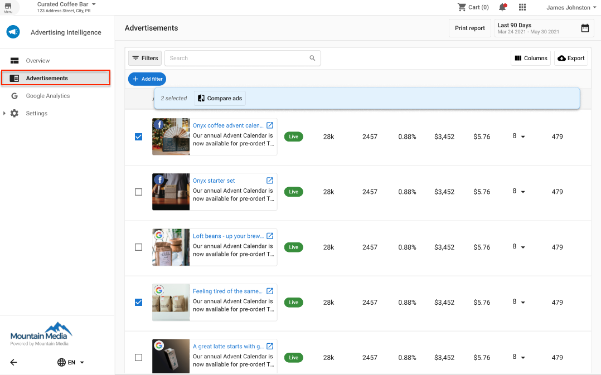
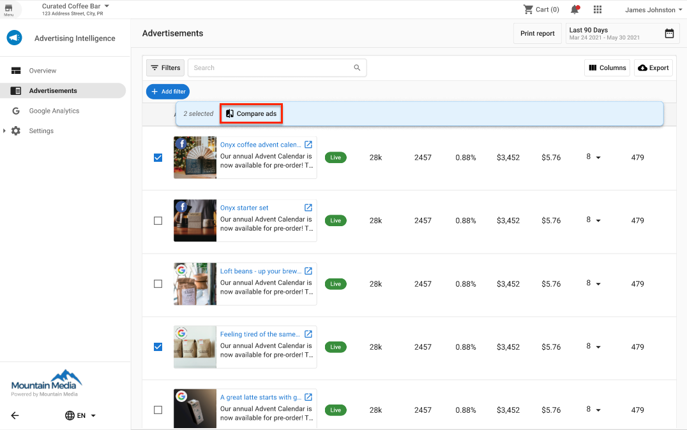
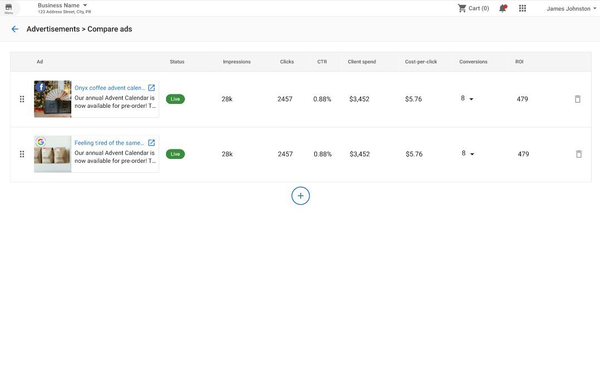

Compare and analyze ad campaigns across multiple networks to manage campaigns effectively. The **Advertisements** tab in Advertising Intelligence provides a unified view where you can assess performance metrics and creatives across all networks.

### **Where to find the Advertisement view**

**Step 1: Access the Advertisement view** - In Advertising Intelligence, select the **Advertisements** tab from the navigation menu. This displays all your advertisements on a single page, including creatives (if available via API) and their performance metrics.

**Step 2: Compare ads** - Select the ads you want to compare and press **Compare Ads**. This filters your selection so you can examine what's performing well and what isn't.

