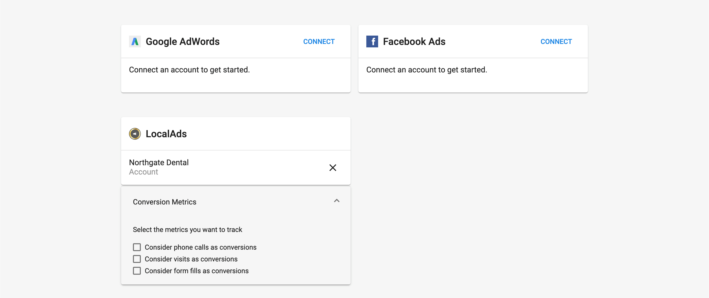
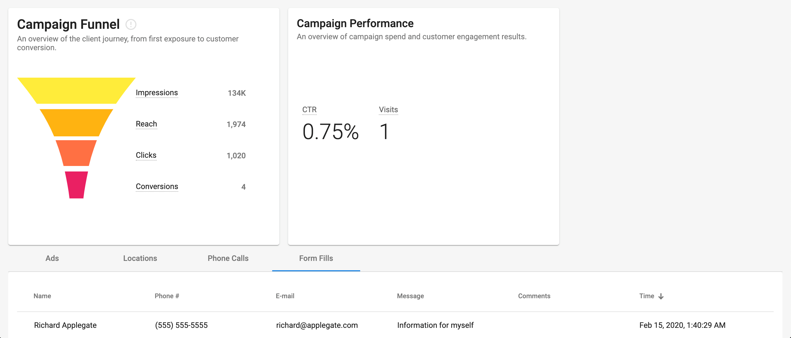

Customize conversion setting attributions and view form fill details for LocalAds campaigns within Advertising Intelligence.

## What is the benefit of customizing conversion setting attributes?

Customize conversion attributions to align with your reporting goals. Decide whether phone calls, store visits, and form fills count toward total conversions.

View form fill details to identify and contact leads. See who completed the form, their contact information, and any comments they included.

## How does customizing conversion setting attributes work?

### Customize conversion attributions

**Step 1: Access conversion settings** - Connect the LocalAds campaign in Advertising Intelligence. A drop-down box appears on the **Settings** page with options to select or deselect conversion attributions.

**Step 2: Select conversion types** - Choose whether to track phone calls, visits, and form fills and count them as conversions. By default, all three are selected and tracked. Only phone calls longer than 30 seconds are counted as conversions.

### View form fills

**Step 1: Open a LocalAds campaign** - Click on an individual LocalAds campaign.

**Step 2: Access form fills** - In the table at the bottom of the page, click the **Form Fills** tab. This displays the name of who filled out the form, along with their phone number, email, message, any comments they left, and the date and time.

## What is LocalAds?

LocalAds provides location-based display advertising with targeting capabilities. You can combine LocalAds campaigns with other platforms such as search, social, and video.

LocalAds tracks both offline and online behaviors to serve relevant ads. When a customer enters an identified blueprint location, the system captures the device ID of their mobile phone and tracks the consumer throughout their digital and physical customer journey.