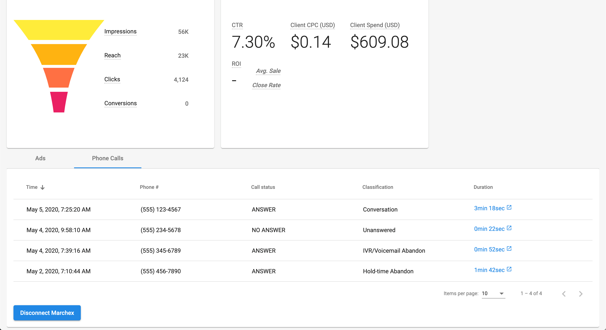
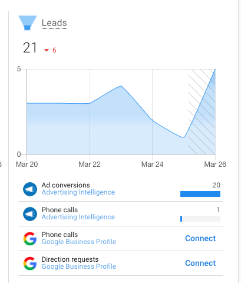
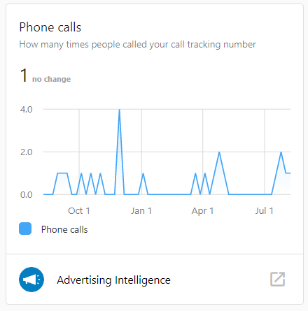

Users with managed advertising campaigns can use Advertising Intelligence to see Marchex call tracking metrics and download their call recordings.

### What is the benefit of Marchex Call Tracking?

See how many phone calls came in as a direct result of your ad campaigns, as well as some basic metrics around each call. These phone calls show how successful a campaign is at driving call conversions, and determine how many of your daily calls are a result of your digital advertising efforts.

Listening to call recordings tells you whether or not your digital ads are generating high-quality leads. Use call recordings to identify common questions consumers have after seeing your ad, how many phone calls are serious inquiries, and how many actually result in a purchase.

### How does Marchex Call Tracking work? 

If you're running ad campaigns through a managed service, the Digital Ads team can connect a Marchex phone number to Advertising Intelligence. Currently, this is only available for single phone numbers, not entire accounts. Once the phone number has been connected, the call data can be seen in Advertising Intelligence.

Within Advertising Intelligence, click on any campaign that has a phone number connected, and go to the Phone Calls tab. Here, you see the date/time, phone number, call status, call classification, and call duration. Under the call duration, click the highlighted link to listen to and download each call recording.

### Marchex Phone Call Data in the Executive Report

Ad campaigns with this add-on will have their 'phone call leads' tracked as a separate 'Lead source.' These metrics will be displayed within our reports, the Business App, and roll up into the Executive Report.

With this advanced Lead classification, we are ensuring data consistency within Business App, the Executive Report, and Advertising Intelligence.

### Additional context

Advertising Intelligence is a white-label PPC reporting product that brings your digital ads data under one roof for easy comparison. It provides the metrics that matter, helps pinpoint what's driving revenue, and offers insights to inform future campaigns.