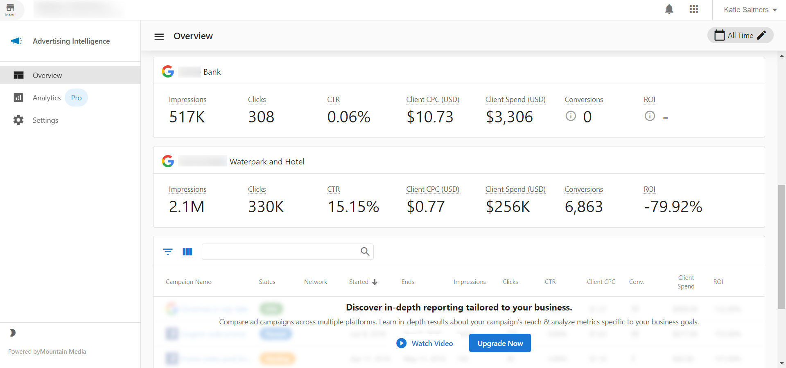
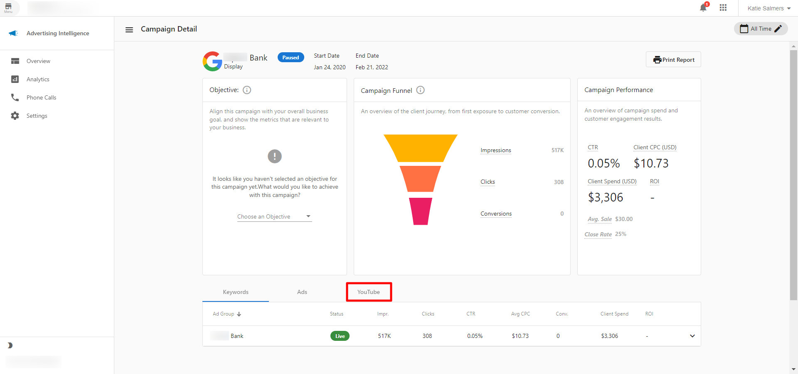

YouTube advertising reporting metrics are visible in Advertising Intelligence when you have a Google Ads account connected. See how much you pay for each full view of your video and where viewers drop off.

## What is the benefit of YouTube reporting

With YouTube Ads reporting, see which videos are being watched and for how long, and where viewers stop watching. These insights appear alongside the rest of your PPC reporting in Advertising Intelligence.

## How does YouTube reporting work

If you have Advertising Intelligence alone (without the Advanced Reporting add-on), you can see your YouTube campaign in the `Overview` tab of the product dashboard. You can see Impressions, Clicks, CTR, Client CPC, Client Spend, Conversions, and ROI.  

If you have the Advanced Reporting add-on, you can see more data. Within Advertising Intelligence, click into any campaign and navigate to the `YouTube` tab. Your video metrics display here if there are any to show. You must have your Google Ads account connected for this to work.  

In the YouTube tab, you can view the number of views, clicks, impressions, client spend, client cost-per-view, and the video view rates at 25%, 50%, 75%, and 100% for each individual video.
