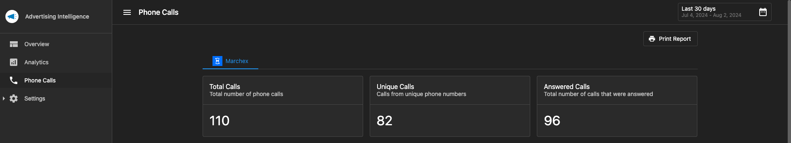

Yes! In the **Settings > Connections** tab of Advertising Intelligence, you can connect your call tracking account. Phone call tracking data includes total calls, unique callers, answered calls, time, phone number, call status, call classification, duration, and recording.

### Supported call tracking providers

You can connect Advertising Intelligence to:

- [Marchex](../analytics/marchex-call-tracking.mdx)
- [CallRail](../settings/callrail.mdx)
- [Telmetrics](../settings/telmetrics-call-tracking-integration.mdx)

### Where to view call tracking data

To view your call tracking data, navigate to the **Phone Calls** tab in Advertising Intelligence.