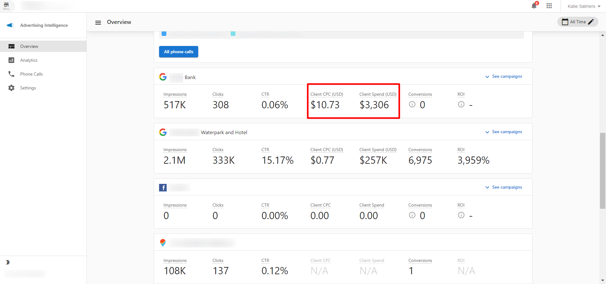

The currency displayed in **Advertising Intelligence** is based on the currency configured on your connected advertising account. This ensures consistency between your ad platform and the dashboard.

### How currency is determined

The currency shown in **Advertising Intelligence** matches the currency set up on your connected **Facebook** or **Google Ads** account. For example, if your Facebook ad account is configured in USD, then USD will be displayed throughout **Advertising Intelligence** for metrics like **Client CPC** and **Client Spend**.

### Where currency appears

Currency is displayed in the **Advertising Intelligence** dashboard for all monetary values, including:

- **Client CPC** (Cost Per Click)
- **Client Spend** (total advertising spend)
- Other cost-related metrics

