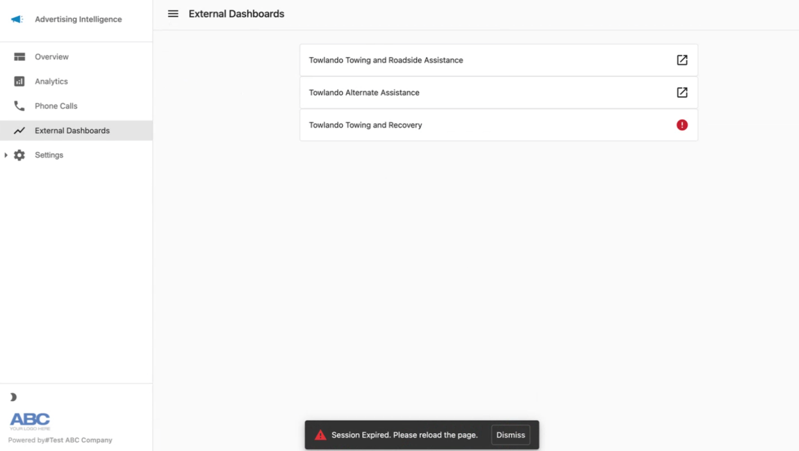

# Access MatchCraft AdVantage Merchant Center via SSO

Use single sign-on to access the MatchCraft AdVantage Merchant Center through the following steps:

1. In Advertising Intelligence, when Ad Campaigns are managed by a connected provider, you may see an additional side menu called "External Dashboard."
2. Click that menu to open a list of campaigns.
3. Select individual Ad campaigns to redirect to the MatchCraft Merchant Center.

