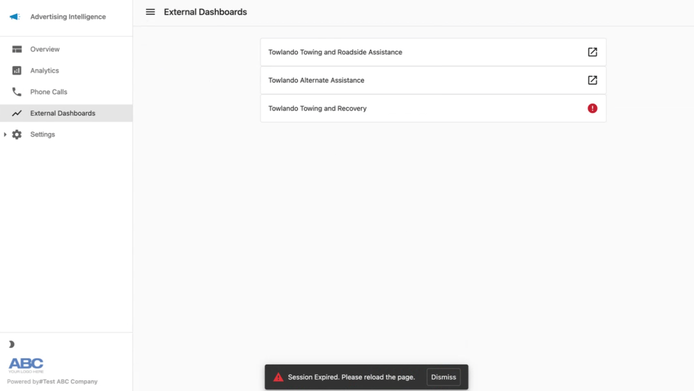

Use single sign-on to access AdVantage Merchant Center through the following steps:

1. In Advertising Intelligence, when ad campaigns are managed by a connected provider, you may see an additional side menu called `External Dashboard`.
2. Click that menu to open a list of campaigns.
3. Select individual ad campaigns to open Merchant Center.

