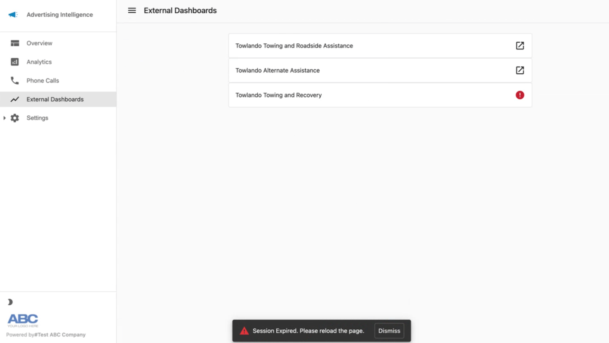

Use single sign-on to access the MatchCraft AdVantage Merchant Center through the following steps:

1. In Advertising Intelligence, you may see an additional side menu called `External Dashboards`. It appears only for ad campaigns that have a MatchCraft dashboard.
2. Click that menu to open a list of campaigns.
3. Select an ad campaign to open its dashboard in the MatchCraft Merchant Center.

