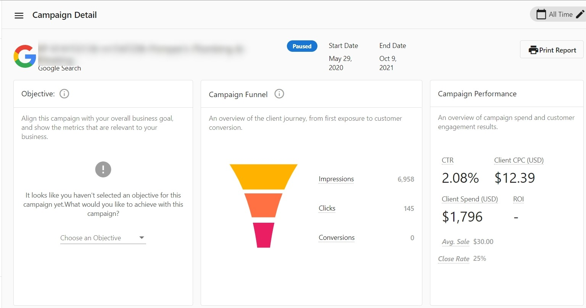

Users of Advertising Intelligence with the Advanced Reporting add-on can view detailed metrics of their individual advertising campaigns.

Advanced Reporting displays detailed metrics such as engagement and conversions for each ad campaign. Use this information to gain insight into how your campaigns are performing and learn more about your audience, your product or service sales, and your campaign's reach. With this data, make more informed decisions when building your campaigns and improve your results for future campaigns.

### **How does it work?**

1. Go to **Advertising Intelligence > Overview**.
2. With either a Google Ads or Facebook Ads account connected, see your active campaigns listed below the summary of all metrics. Click the campaign you want to view detailed campaign statistics for.
3. This takes you to the campaign details page where you can view your **Campaign Objective** and a **Campaign Funnel** highlighting the user journey from first exposure to the ad to customer conversion. You'll also see detailed metrics of your **Campaign Performance** reporting on your campaign investment and customer engagement results.
4. If you haven't set an objective yet, click **Set Campaign Objective** to select your main goal for the campaign. For Facebook Ad accounts, the objective set up during campaign creation is imported. For Google Ad accounts, the objective can't be imported and you can set the appropriate objectives in the product. You can also use this button to edit your **Campaign Objective** to prioritize the metrics that align with your current business goal. Any updates made here don't affect your external Ads account information.
5. Below the Campaign Metrics, view the Ads Table showing statistics for each specific Ad Creative within that campaign. This feature works for both Google Ads and Facebook Ads.

If your customers don't have Advanced Reporting activated, they can purchase this add-on by selecting the **Purchase Advanced Reporting** button in the Advertising Intelligence dashboard. This add-on can also be purchased at the Partner level in Partner Center by going to the account in question, and then selecting "Activate Products".

*This feature is available to all users of Advertising Intelligence with the Advanced Reporting add-on.*