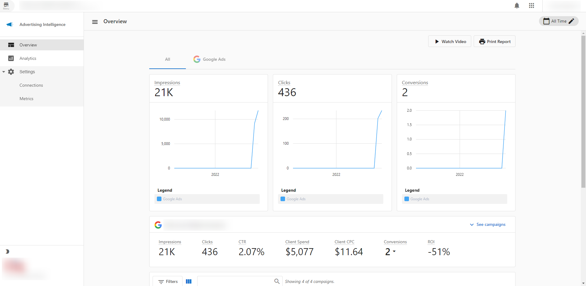
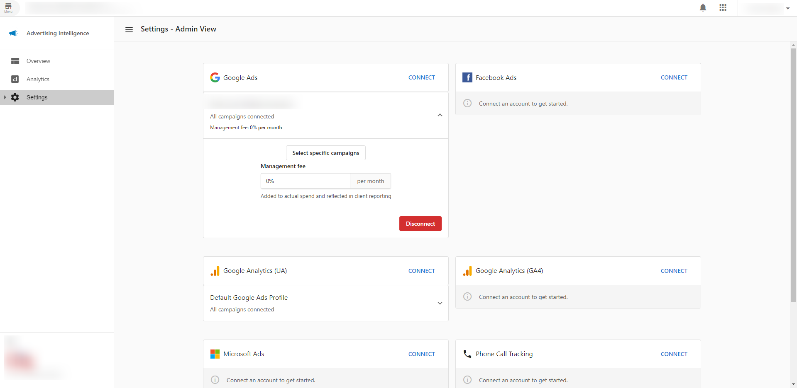

Advertising Intelligence provides live reporting and analysis for your client's digital ad campaigns. Get big-picture campaign analysis to understand your client's ad performance and grow their ROI.

### To access Advertising Intelligence

- Navigate to **Partner Center** > **Accounts** > **Accounts** > select the account you want. In the **Products** section, select **Advertising Intelligence**.  
- Go to the **Settings** page
- Select the connected campaign to enter your mark-up fees. 

### Who is Advertising Intelligence for?

**DIY users:** Small businesses that run digital ad campaigns themselves. Make sense of your ad data and pinpoint your unique ROI. 

**DIFM & DIWM users:** Agencies that run digital ad campaigns on behalf of their clients. Save time and provide real ROI to justify ad spend and secure campaign renewals.

### What does Advertising Intelligence do?

Advertising Intelligence connects with Google, Facebook, LocalAds, and Microsoft ad reporting and analysis. Get real advertising ROI for your clients.

**High-level stats: Google / Facebook / LocalAds / Microsoft Ads**

- Clicks
- Impressions
- Conversions
- Client Spend
- Average Client Cost-Per-Click
- Click through Rate

**ROI calculator**

- Calculate precise ROI for your campaigns using *Average Sale* and *Close Rate* data collected from each unique user, plus Conversions and Spend from Google / Facebook / LocalAds / Microsoft Ads.

**Detailed campaign table**

- Import individual Google / Facebook / Microsoft / LocalAds campaigns and compare ROI, Client Spend, Conversions, Clicks, Impressions, CTR, Average CPC, and Start/End Dates.

**Integration with the Executive Report**

- View reporting for advertising, along with your other products, right in **Business App**. You and your clients can see what's happening across all digital marketing channels in one place.

**Management mark-up fees (For Partners)**

- Add your monthly management fee to your client's ad spend. These markup fees are added to all cost-related metrics (e.g. Average CPC, ROI, Total Spend, etc.) and reflected in your clients' reporting. 

