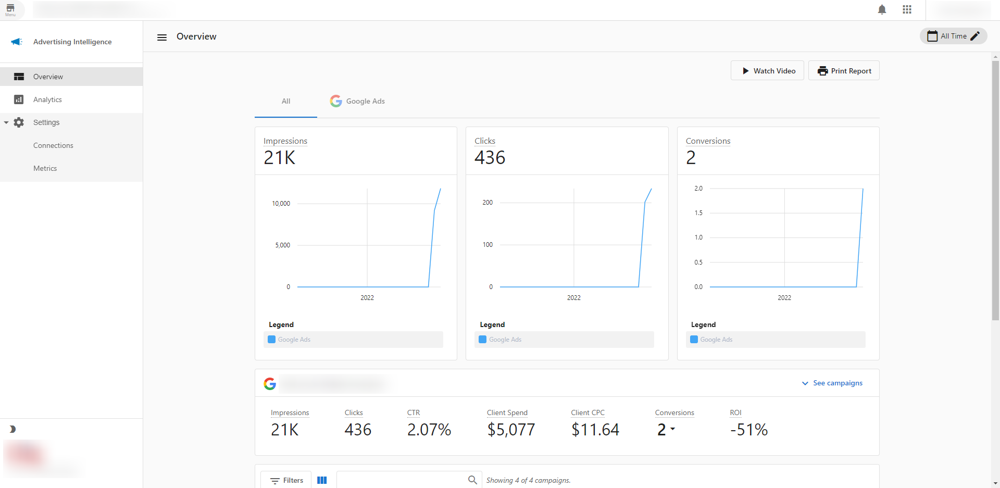

Advertising Intelligence provides live reporting and analysis for your digital ad campaigns. Get big-picture campaign analysis to understand ad performance and grow ROI.

## Why use Advertising Intelligence?

- Consolidate reporting from Google, Facebook, LocalAds, and Microsoft Ads in one place
- Calculate precise ROI using Average Sale and Close Rate data
- Compare individual campaigns side-by-side
- Integrate with the Executive Report for unified marketing insights

## What's included

- **[Accepting Facebook Requests](accepting-facebook-requests.mdx)**: Accept requests for digital advertising campaigns
- **[Access MatchCraft AdVantage](access-matchcraft-advantage-merchant-center.mdx)**: Access Merchant Center via SSO
- **[Customizable Settings and Key Metrics](advertising-intelligence-overview.mdx)**: Configure settings and view key metrics
- **[Cheat Sheet](cheat-sheet-for-advertising-intelligence.mdx)**: Quick reference guide for Advertising Intelligence
- **[Executive Report Integration](reporting-in-the-executive-report.mdx)**: View advertising data in the Executive Report
- **[Advanced Campaign Reporting](advanced-reporting-of-individual-campaign-metrics.mdx)**: Detailed reporting for individual campaigns

## Get started

1. Navigate to `Advertising Intelligence` in Business App.
2. Go to the `Settings` page to connect your ad platforms.
3. View your dashboard to see consolidated reporting across all platforms.

## What does Advertising Intelligence do?

Advertising Intelligence connects with Google, Facebook, LocalAds, and Microsoft ad reporting and analysis. Get real advertising ROI for your campaigns.

### High-level stats

Track key metrics across Google, Facebook, LocalAds, and Microsoft Ads:

- `Clicks`
- `Impressions`
- `Conversions`
- `Client Spend`
- `Average Client Cost-Per-Click`
- `Click through Rate`

### ROI calculator

Calculate precise ROI for your campaigns using *Average Sale* and *Close Rate* data collected from each unique user, plus Conversions and Spend from Google / Facebook / LocalAds / Microsoft Ads.

### Detailed campaign table

Import individual Google / Facebook / Microsoft / LocalAds campaigns and compare `ROI`, `Client Spend`, `Conversions`, `Clicks`, `Impressions`, `CTR`, `Average CPC`, and `Start/End Dates`.

### Integration with the Executive Report

View reporting for advertising, along with your other products, right in Business App. See what's happening across all your digital marketing channels in one place.

## Plan comparison

| Feature | Advertising Intelligence | Advanced Reporting |
| --- | --- | --- |
| Connect Facebook Ads and Google Ads | ✓ | ✓ |
| Easy-to-read dashboard | ✓ | ✓ |
| Key campaign metrics | ✓ | ✓ |
| Individual campaign details | | ✓ |
| Custom date range analysis | | ✓ |
| Campaign funnel and objective reporting | | ✓ |
| Keyword and ad analysis | | ✓ |

## Frequently Asked Questions (FAQs)

What advertising platforms are supported?

Advertising Intelligence supports Google Ads, Facebook Ads, LocalAds, and Microsoft (Bing) Ads. Additional platforms like LinkedIn, TikTok, and Amazon can be connected in Settings.

How do I calculate ROI?

Enter your Average Sale value and Close Rate in the ROI calculator. The system combines this with Conversions and Spend data from connected platforms to calculate your ROI.

How do I view advertising data in the Executive Report?

Once connected, advertising data automatically appears in the Executive Report alongside your other marketing metrics.

