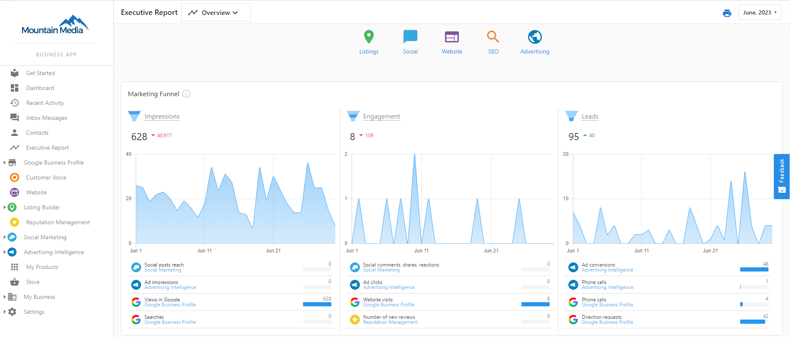
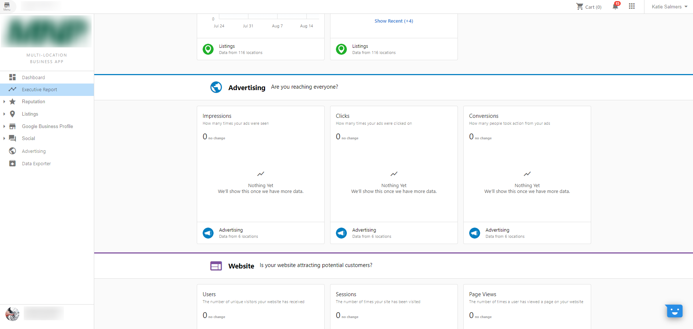

Information on your connected digital advertising campaigns populates in the Executive Report. Impressions, Clicks, Conversions, and Phone Calls (if applicable) display in the Advertising Intelligence section of the report. Click into Advertising Intelligence right from the report to learn more about the information displayed.

**Impressions** - the number of times people have seen your ads.

**Clicks** - the number of times people have clicked on your ads.

**Conversions** - the number of actions people took on your ads, such as product purchases, newsletter sign-ups, calls to your business, or app downloads.

**Phone Calls** - the number of times people called your call tracking number. (If Call Tracking add-on purchased for the advertising campaign in question.) For more information, [please click here](../faqs/connect-call-tracking)

### **Executive Report**

### **Executive Report (Multi-Location)**

