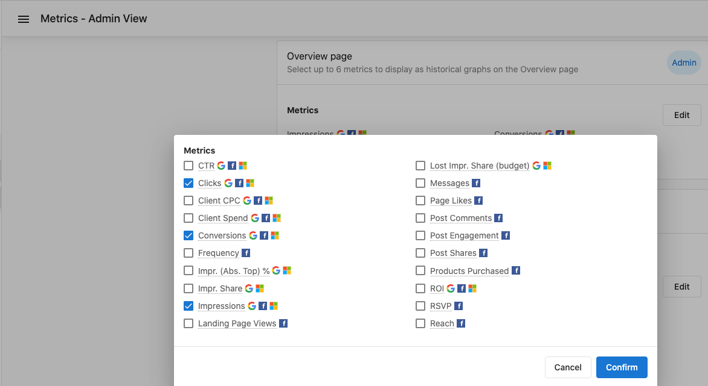
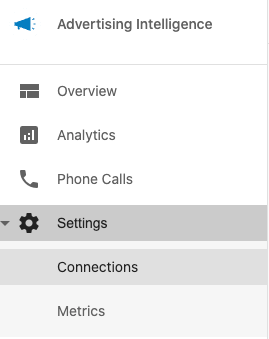
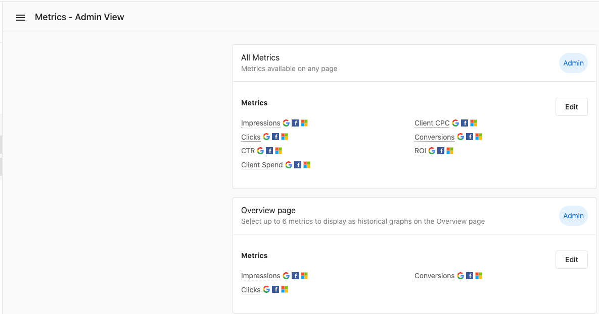
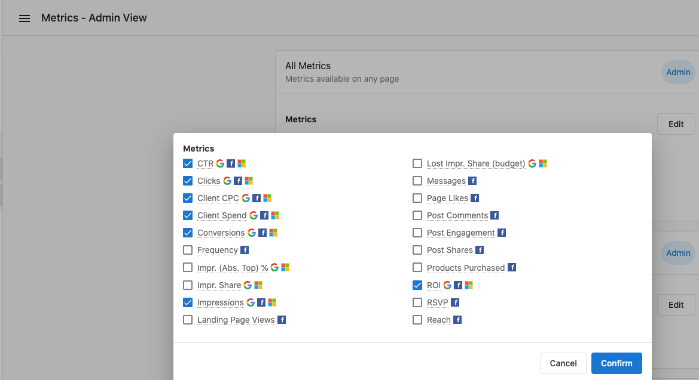
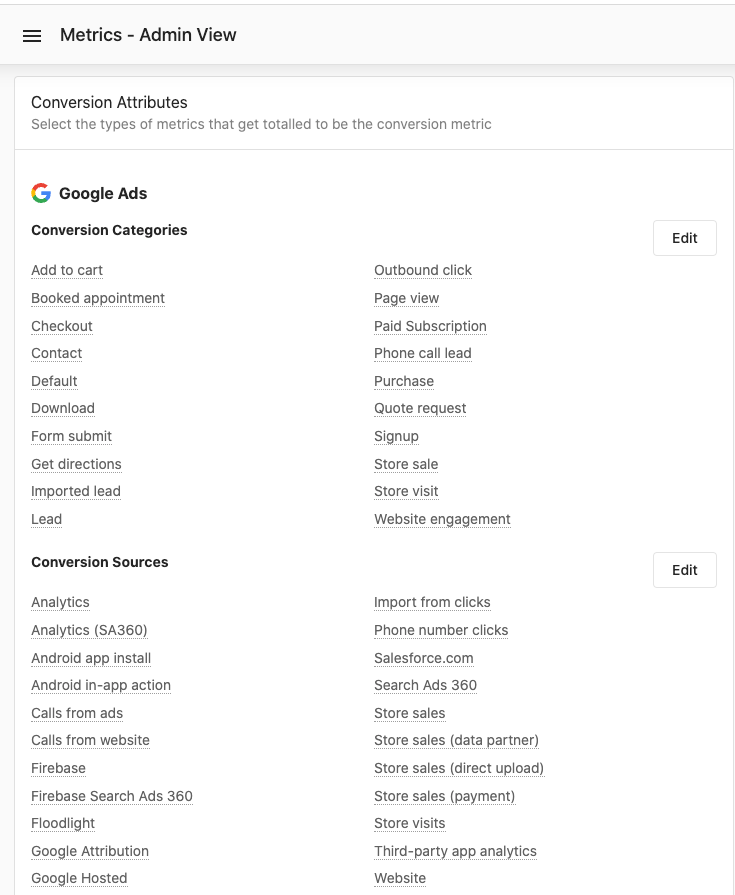
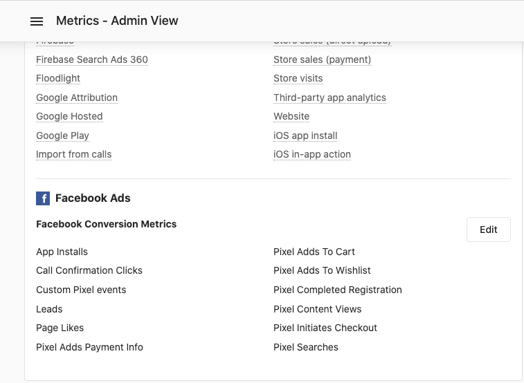

# Customizable Settings and Key Metrics in Overview

## Overview Settings

The Overview section in Advertising Intelligence offers customizable settings to enhance your experience when viewing campaign performance. These settings let administrators configure what data displays in the Overview section.

### Accessing the Settings

To access these settings:

1. Click the settings icon in the top-right corner of the Overview section.

2. A menu appears with various options to configure your view.

### Available Metrics

In the Overview section, access various metrics by clicking the metrics menu.

### Admin View and Metric Configuration

Administrators can view and configure additional metrics:

The metrics edit form lets administrators customize which metrics are displayed:

## Key Performance Metrics

### Conversion Metrics

Conversion metrics are vital for tracking campaign performance and ROI. These metrics show how effectively your ads are generating desired customer actions.

Additional conversion metrics provide deeper insights into campaign performance:

## Customizing Your Metrics View

Customize your metrics view to focus on the data most relevant to your needs. This customization helps streamline analysis and reporting processes.

## Best Practices for Metric Analysis

1. **Regular Monitoring**: Check your metrics regularly to spot trends and make timely adjustments to campaigns.

2. **Compare Time Periods**: Always compare current performance against previous periods to identify improvements or declines.

3. **Focus on KPIs**: Identify the key performance indicators most relevant to your goals and prioritize monitoring these metrics.

4. **Conversion Tracking**: Ensure proper conversion tracking setup to get accurate data on campaign effectiveness.

5. **Context Matters**: Interpret metrics within the context of your specific industry, campaign objectives, and audience behavior.

## Additional Resources

For more information about Advertising Intelligence and its features, explore the relevant sections in the sidebar.