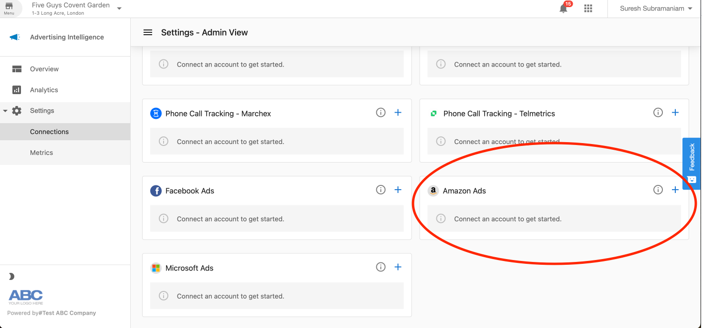
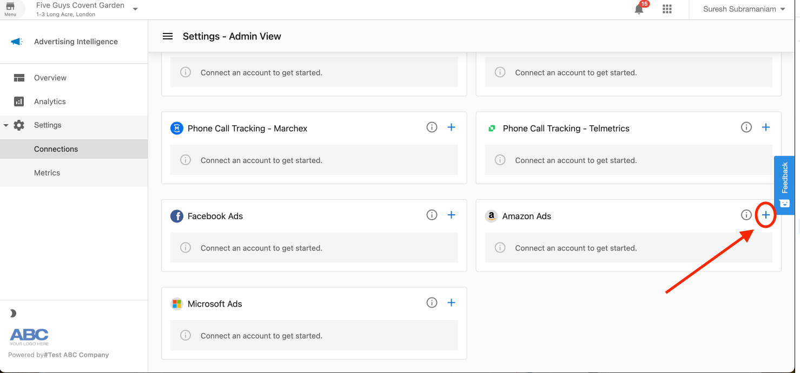
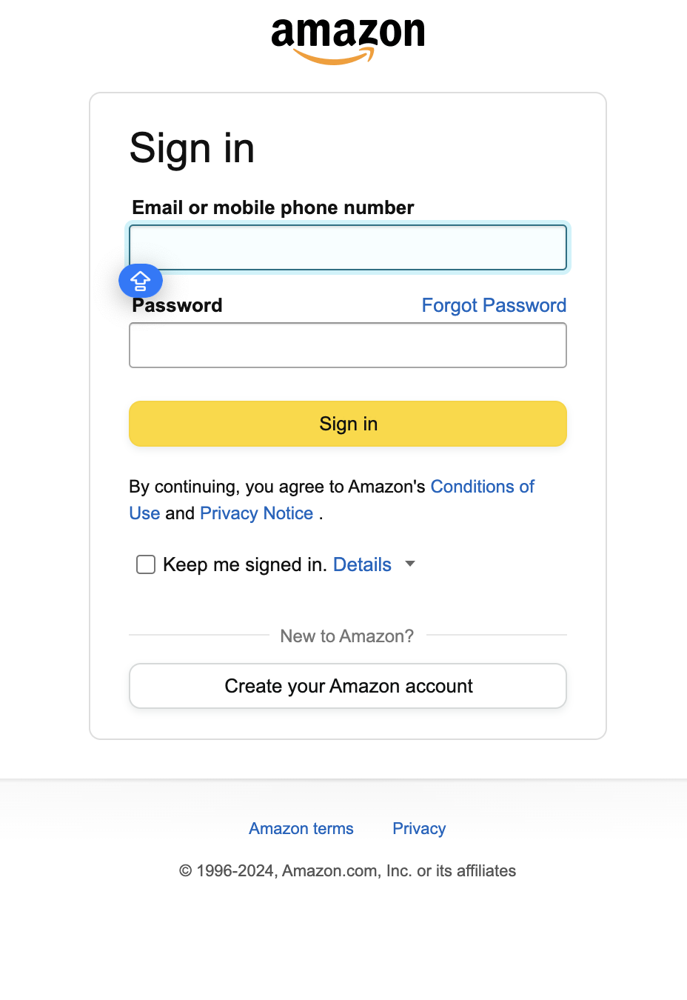
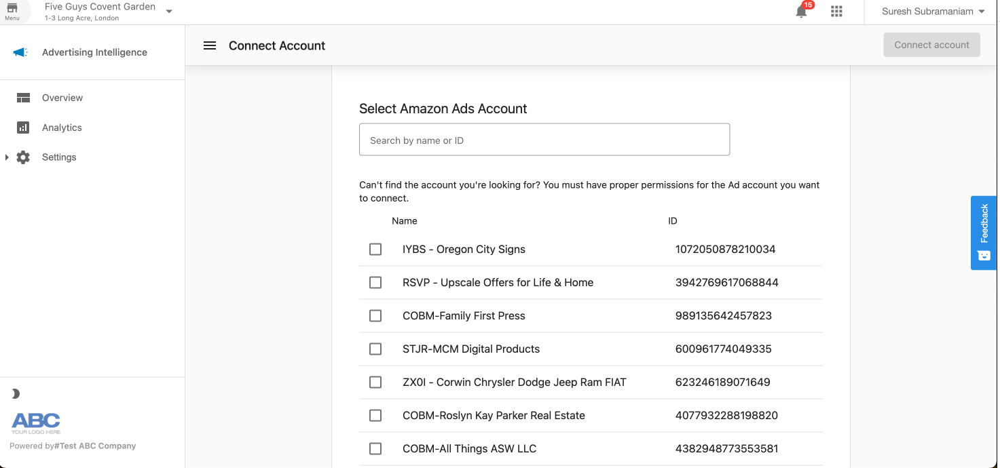
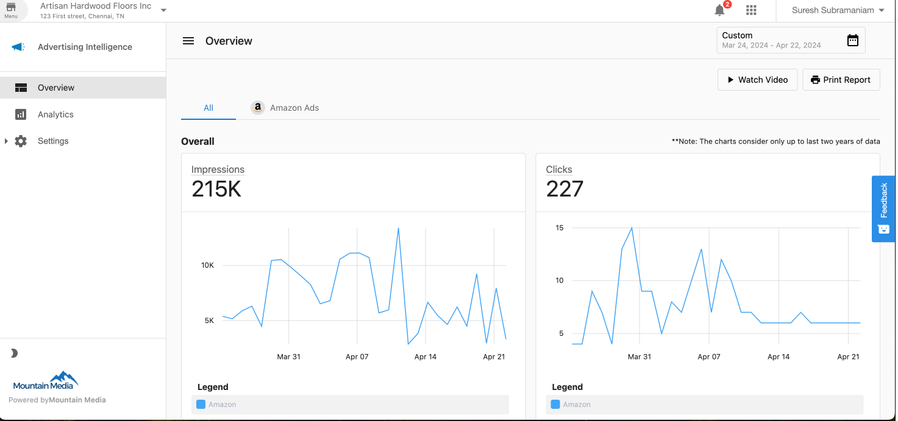

## Amazon Ads Connector

Use Amazon Ads data to make data-driven decisions in your advertising strategy. Data updates automatically daily, similar to other data sources. Use the Amazon Ads Connector to track campaign-level performance, daily trends, and other metrics.

## Requirements

To use the Amazon Ads Connector, you need:

1. An Amazon Ad account to connect.
2. A merchant account with a Product Fulfillment that includes Advertising Intelligence.

## Connecting Amazon Ads

### Step 1: Select the Amazon Ads Connector

Go to **Advertising Intelligence** > **Settings**. Select the **Connect a New Ad Account** button:

The ad sources menu appears, showing connector tile options for all available ad platforms:

Select the **Amazon Ads** tile.

### Step 2: Sign into Amazon Ads Account

A window appears where you enter your Amazon Ads username and password:

After entering your credentials, a confirmation message appears requesting permission for Advertising Intelligence to access your account data. Select **Allow**.

### Step 3: Choose the profiles to connect

Once authenticated, select which Amazon Ads profiles to connect:

Select the profile(s) you want to connect, then click **Connect Selected Profiles**.

### Step 4: Verify connection and finish setup

A confirmation screen shows the profiles you've connected:

Click **Continue** to finish the connection process.

### Success

A success notification appears, and you'll see your newly connected profiles listed in the **Connections** section:

After connecting successfully, Advertising Intelligence begins syncing your Amazon Ads data.

:::info Initial sync
This initial sync may take 24–48 hours to complete, after which data updates daily.
:::

## Viewing Amazon Ads Data

After connecting your account, view and analyze your Amazon Ads performance data within the Advertising Intelligence reporting interface. Go to **Reports** to access dashboards designed for Amazon Ads metrics.

4. For persistent issues, contact your support team for assistance