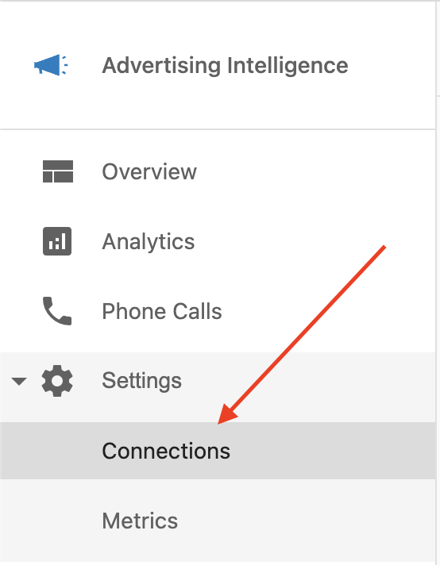
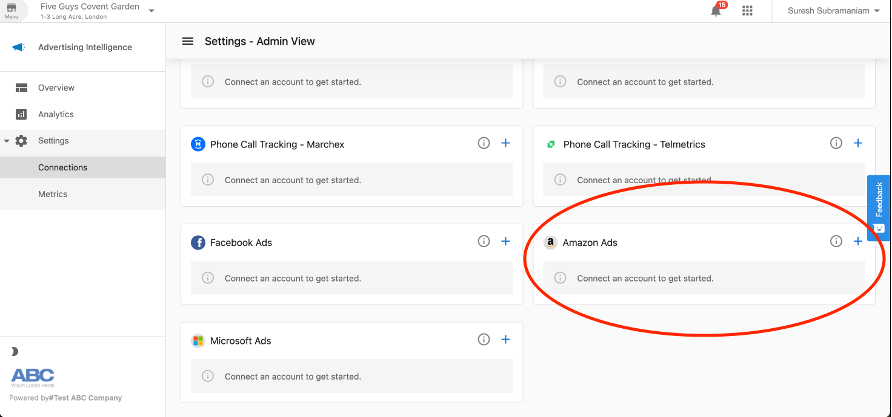
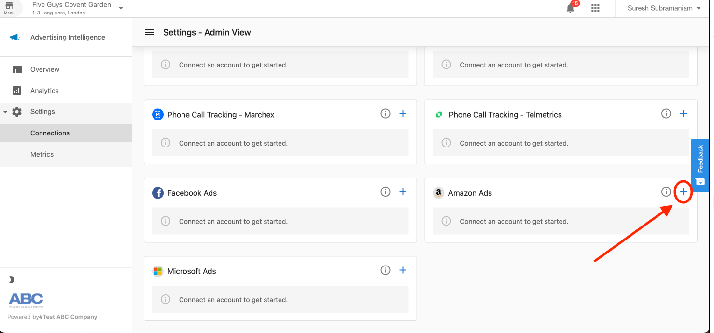
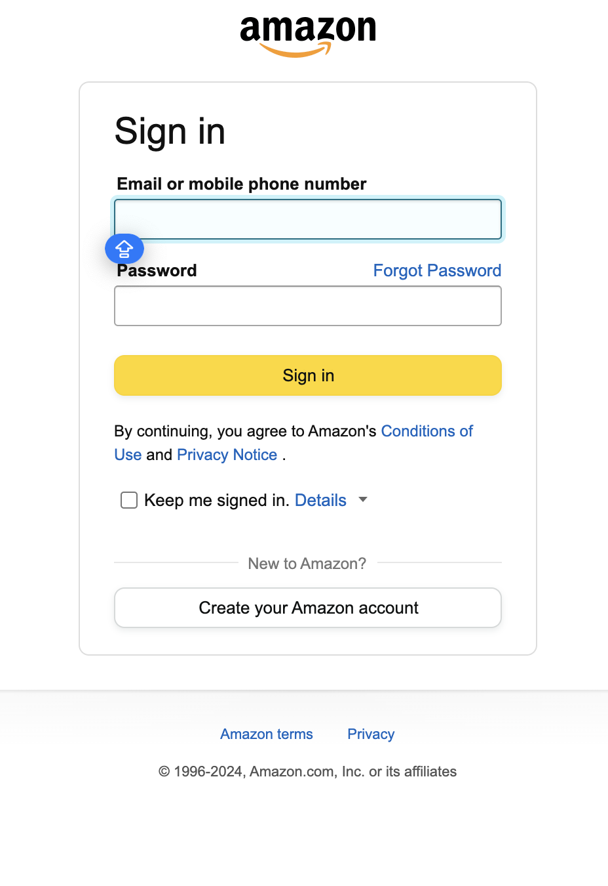
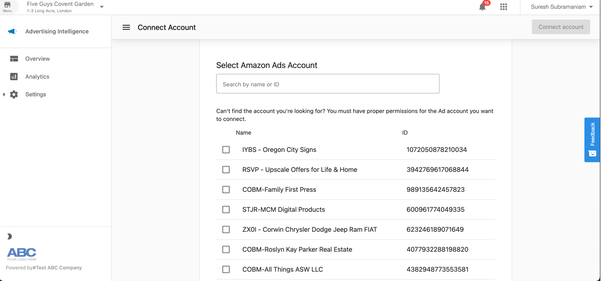
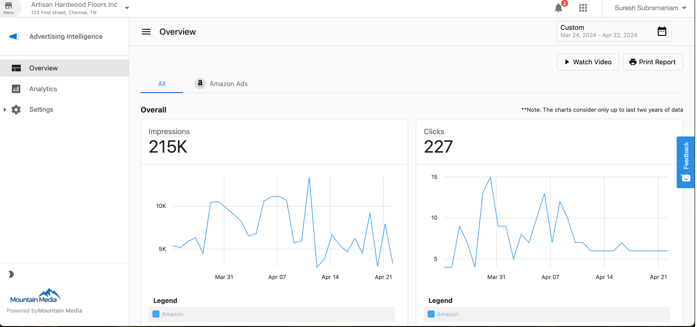

## Amazon Ads connector

Use Amazon Ads data to make data-driven decisions in your advertising strategy. Data updates automatically daily, similar to other data sources. Use the Amazon Ads Connector to track campaign-level performance, daily trends, and other metrics.

## Requirements

To use the Amazon Ads Connector, you need:

1. An Amazon Ad account to connect.
2. An active Advertising Intelligence subscription on your account.

## Connecting Amazon Ads

### Step 1: Select the Amazon Ads connector

Go to `Advertising Intelligence` → `Settings` → `Connections`:

The Connections page shows a card for each ad platform. Find the `Amazon Ads` card:

Click the `+` button on the `Amazon Ads` card:

### Step 2: Sign in to your Amazon Ads account

You are prompted to sign in to your Amazon account. Enter your Amazon Ads username and password:

After entering your credentials, a confirmation message appears requesting permission for Advertising Intelligence to access your account data. Select `Allow`.

### Step 3: Choose the account to connect

Once authenticated, select the Amazon Ads account you want to connect:

Select the account, then click `Connect account`.

### Success

After connecting successfully, Advertising Intelligence begins syncing your Amazon Ads data.

:::info Initial sync
This initial sync may take 24–48 hours to complete, after which data updates daily.
:::

## Viewing Amazon Ads data

After connecting your account, view and analyze your Amazon Ads performance data in Advertising Intelligence. Go to `Overview` and select the `Amazon Ads` tab.

:::tip Need help?
For persistent issues, contact your support team for assistance.
:::
