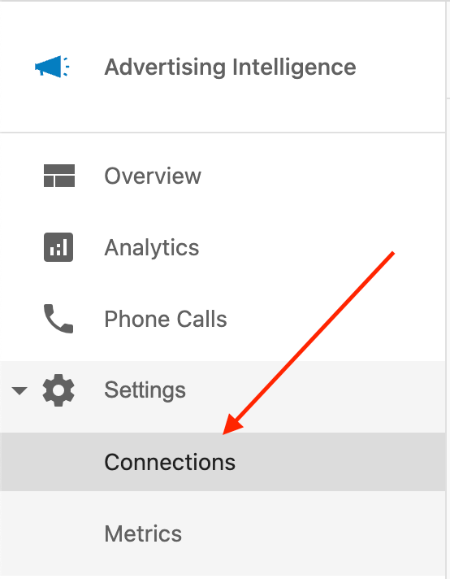
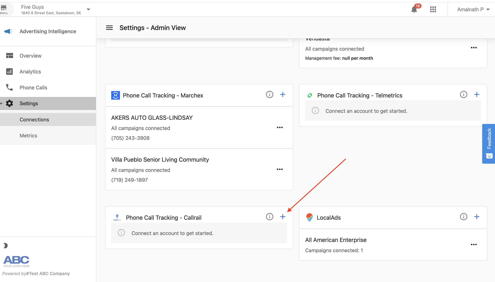
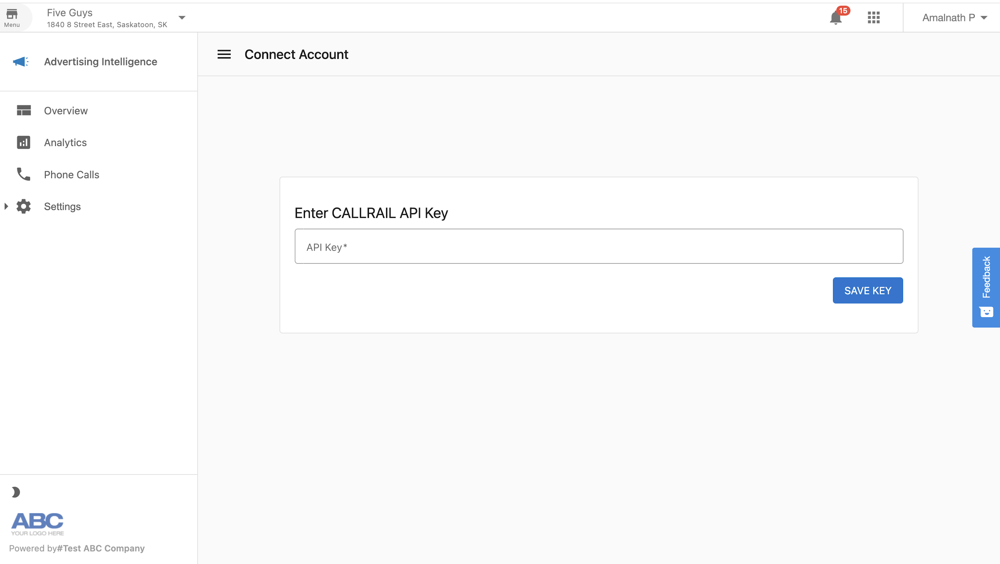
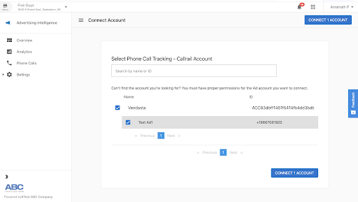
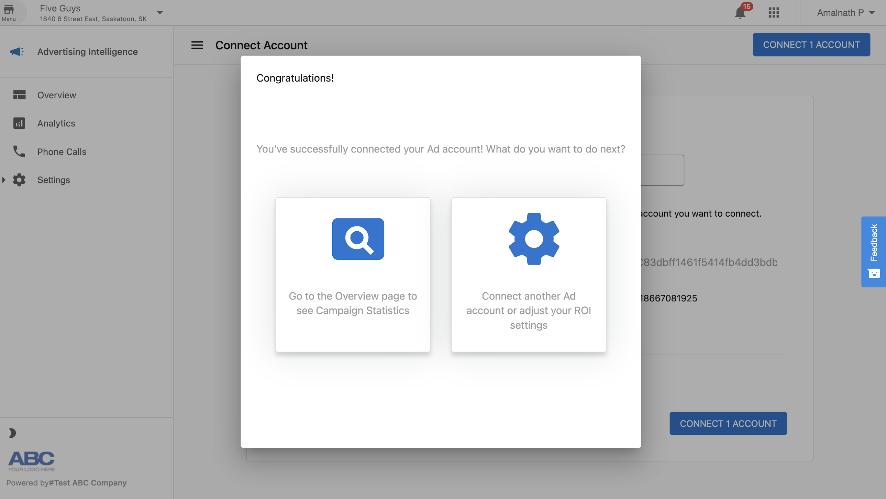
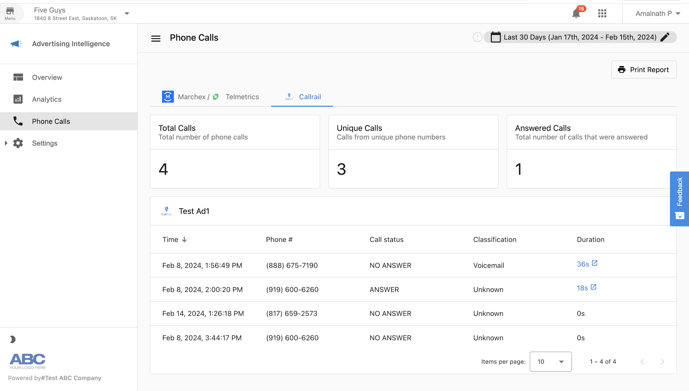

# Connecting CallRail to Advertising Intelligence

Connect CallRail to Advertising Intelligence to view call tracking data.

## Requirements

CallRail connection requires Advertising Intelligence Pro. You also need:

- A CallRail account with access to your API key

## How to connect CallRail

1. In Advertising Intelligence, go to `Settings` > `Connections`.

2. Select `CallRail` from the connection options.

3. Enter your CallRail API key in the field provided.

4. Select a campaign from the list that appears. Selecting a campaign is required to complete the connection.

5. Select `Connect Account`.

6. Advertising Intelligence confirms that CallRail is connected.

## Viewing CallRail data

After connecting CallRail, view your call data in the `Phone Calls` page of Advertising Intelligence.

## Troubleshooting

:::tip Connection stuck loading
If the connection is stuck loading after you enter your API key:

1. Confirm your account is on Advertising Intelligence Pro. The campaign selection step requires this plan.
2. Verify your API key is correct and has not been regenerated in CallRail.
3. Check that your CallRail account is active and you have the permissions needed to access the data.
:::