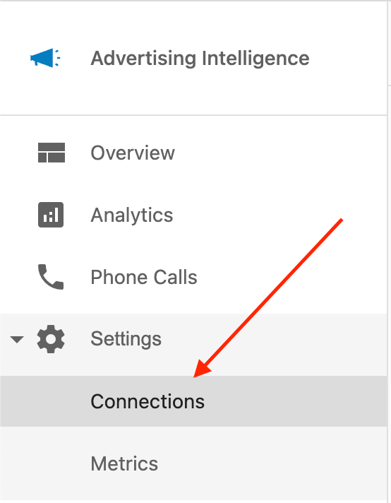

# CallRail Integration

Connect CallRail to Advertising Intelligence to view your call tracking data.

## Setting up CallRail with Advertising Intelligence

Follow these steps to connect CallRail to Advertising Intelligence and see your CallRail data in the Phone Calls reporting page.

1. Go to **Settings** → **Connections** in Advertising Intelligence

2. Select **CallRail**

3. Enter your CallRail API Key

4. Select which CallRail account and tracking numbers you want to connect

5. Submit to connect CallRail

## Viewing CallRail Data

After connecting CallRail, view your call data in the **Phone Calls** page of Advertising Intelligence. This data includes calls tracked by CallRail for the accounts and tracking numbers you selected during setup.

## Troubleshooting

If you encounter issues connecting CallRail:

1. Verify your API key is correct
2. Check that your CallRail account is active
3. Ensure you have permissions to access the CallRail data
4. If problems persist, contact your support team