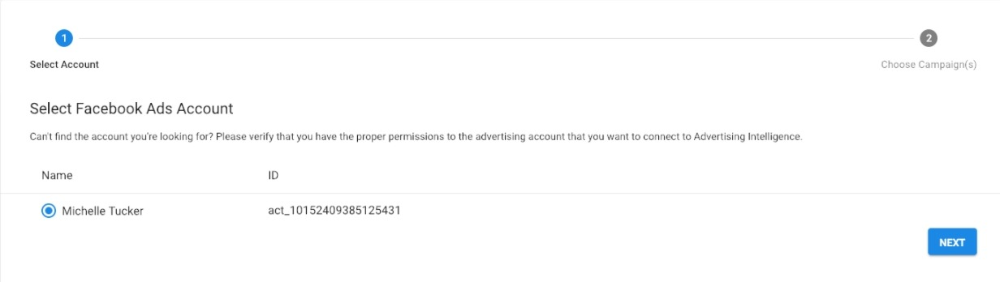

With the Advanced Reporting add-on, users can connect individual Ad Campaigns to their Advertising Intelligence account.

## Why is connecting individual ad campaigns important?

When connecting a Google Ads, Facebook Ads, or Microsoft Ads account, you can connect and display a specified list of individual campaigns in the reporting table. Users, such as advertisers of multi-location businesses, can display metrics relevant to the appropriate account, so clients can view proof of performance for only the campaigns that relate to their business or specific location.

## How does connecting individual ad campaigns work?

**With the Advanced Reporting add-on activated:**

1. Go to **Advertising Intelligence > Settings.**
2. On either Google Ads, Facebook Ads or Microsoft Ads, click **Connect**. 
3. In the pop-up window, choose the Ad account you want to connect to your Advertising Intelligence account.
4. Click **Next**.
5. To connect to individual campaigns, check the box next to **Connect to individual campaigns.**
6. A list of currently active campaigns appears below. Check the box next to each campaign you want to display for this Advertising Intelligence account. 
   
   *Only the campaigns you select display, and any future campaigns created won't display for this account. Disconnect and reconnect your account to display them.*

**If the business doesn't have Advanced Reporting activated, they can upgrade in the product dashboard:**

1. Go to **Advertising Intelligence > Settings.**
2. On either Google Ads or Facebook Ads, click **Connect**. 
3. In the pop-up window, choose the Ad account you want to connect to your Advertising Intelligence account.
4. Click **Next**.
5. To connect to individual campaigns, check the box next to **Connect to individual campaigns.**
6. Select **Purchase Advanced Reporting.**

## To connect an Ad account and all active campaigns:

1. Go to **Advertising Intelligence > Settings.**
2. On either Google Ads or Facebook Ads click **Connect**. 
3. In the pop-up window, choose the Ad account you would like to connect to your Advertising Intelligence account.
4. Click **Next**.
5. Select **Connect Account**

*All currently active campaigns will be connected, and any future campaigns that are created will automatically connect.*

## Who gets it?

All users of Advertising Intelligence with the Advanced Reporting add-on.