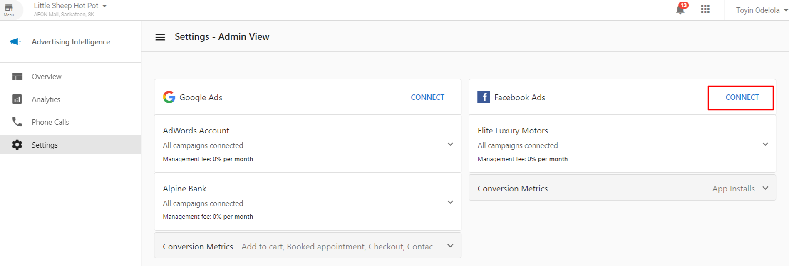
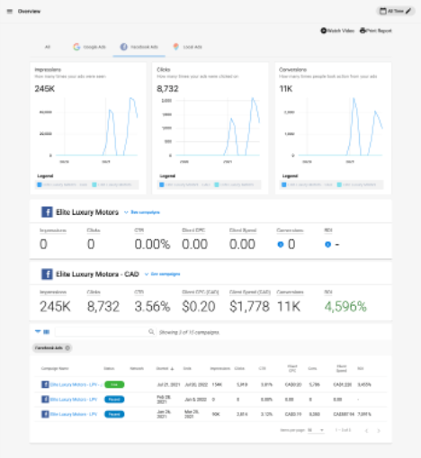

Businesses may have ad campaigns spread out across different Facebook Ad accounts. In Advertising Intelligence, monitor, manage, navigate, and keep track of all your client's ad campaigns and accounts. Total impressions, clicks, and conversions display in the Executive Report. Plus, with **Advanced Reporting** enabled, access metrics for all campaigns under each connected account, making it easier to prove performance and ROI to clients.

### **How does it work?**

**Adding Multiple Accounts**

1. To add new Facebook Ad accounts, go to the **Settings** page in Advertising Intelligence.
2. Click the **Connect** button under Facebook Ads.
3. Once you've connected an account, the **Connect** button for Facebook Ads remains available. Connect as many accounts as you want.

**Viewing Stats**

When multiple accounts are connected, stats for each account appear on the **Overview** page. Campaigns under each account are also included in the **Campaigns** list table.