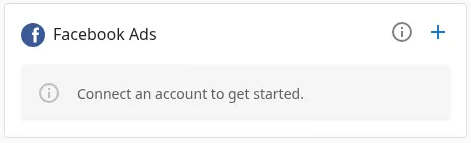
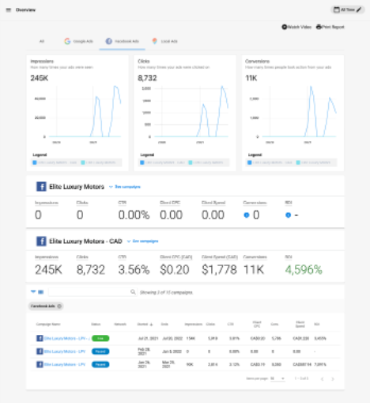

Businesses may have ad campaigns spread out across different Facebook Ad accounts. In Advertising Intelligence, you can monitor, manage, and keep track of all your ad campaigns and accounts. Total impressions, clicks, and conversions display in the Executive Report. You can access metrics for all campaigns under each connected account, making it easier to track your performance and ROI.

## How it works

### Adding multiple accounts

1. Go to `Settings` > `Connections`.
2. Click `+` on the `Facebook Ads` card.
3. Follow the prompts to connect your account. Once connected, you can click `+` again to add more accounts.

### Viewing stats

When multiple accounts are connected, stats for each account appear on the `Overview` page. Campaigns under each account are also included in the `Campaigns` list table.