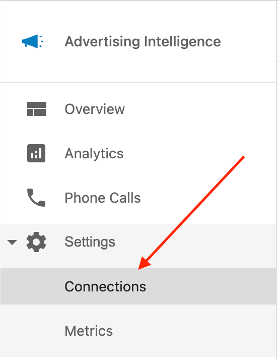
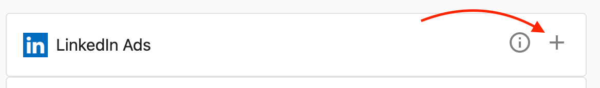
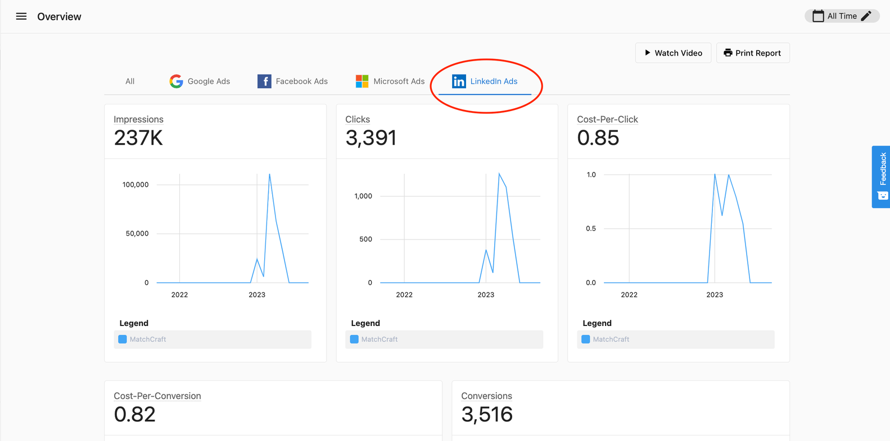
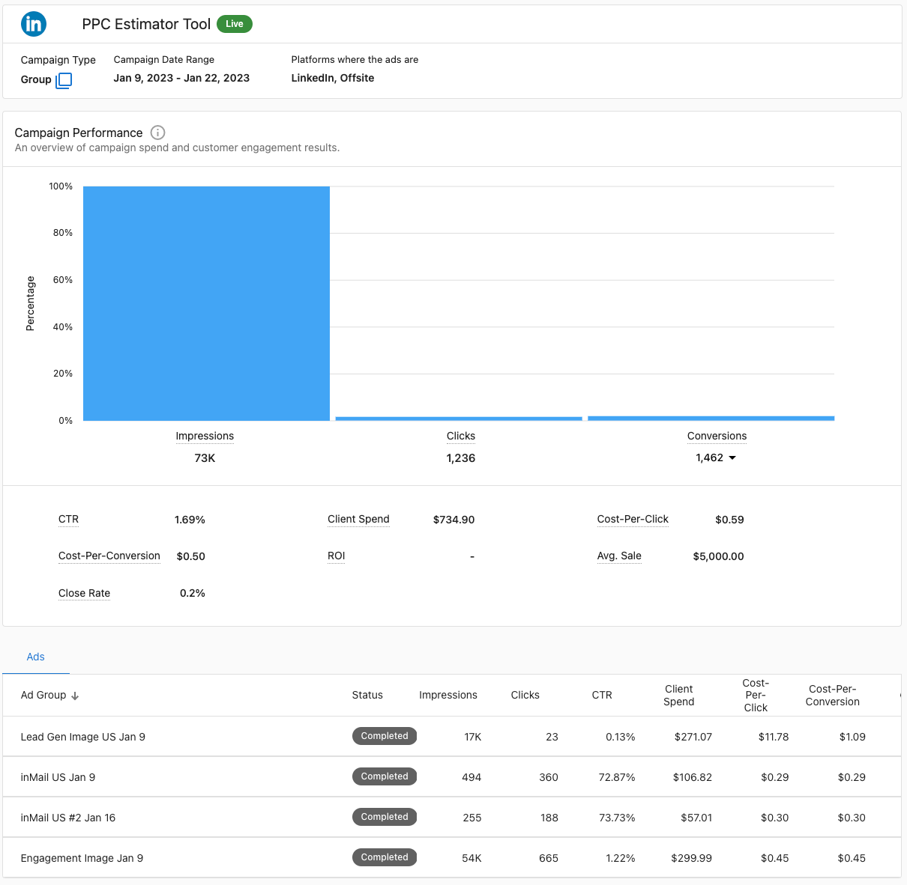
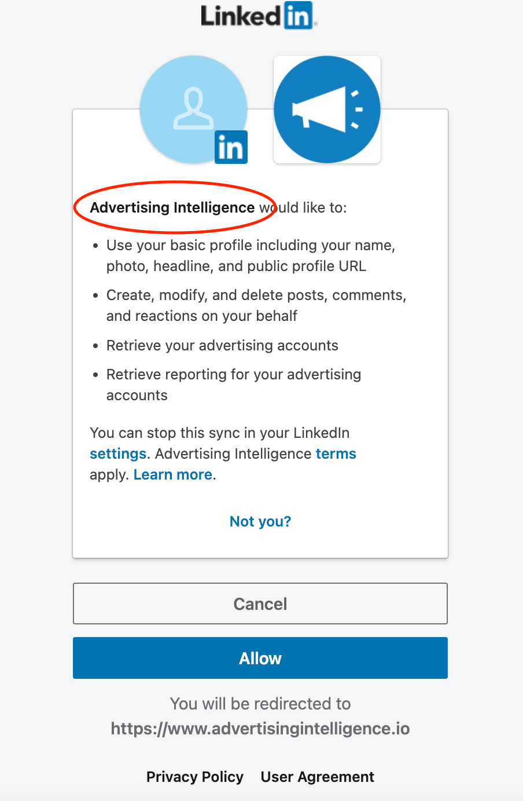

# Connecting LinkedIn Ads to Advertising Intelligence

Connect your LinkedIn Ads account to Advertising Intelligence to view insights into your LinkedIn Ads campaign performance.

## Prerequisites

Before connecting your accounts, ensure you have:

- An active Advertising Intelligence account.

**Note:** While connecting LinkedIn Ads without Advanced Reporting is possible, only account-level statistics will be reported.

## Connecting Your Accounts

1. **Access Advertising Intelligence:** Navigate to your account with Advertising Intelligence activated and open the product. 

2. **Locate Connections Settings:** On the left-hand navigation menu, select **Settings** followed by **Connections**.

   

3. **Connect to LinkedIn Ads:** Within the Connections settings, locate and select the option to connect to LinkedIn Ads.

   

4. **Review and Grant Permissions:** Follow the on-screen instructions to connect and grant Advertising Intelligence the necessary permissions to access your LinkedIn Ads data.

## Accessing Your LinkedIn Ads Data

Once the connection is established, your LinkedIn Ads campaign metrics are available within Advertising Intelligence. Here's where to find them:

- **All Tab:** Consolidated data for all your connected advertising platforms, including LinkedIn Ads, is accessible under the "All" tab.

- **Dedicated LinkedIn Ads Tab:** Advertising Intelligence also provides a separate tab specifically showcasing your LinkedIn Ads campaign statistics.

This consolidated and dedicated view of your LinkedIn Ads data helps you analyze campaign performance within Advertising Intelligence, alongside data from your other connected advertising platforms.

:::info Please Note
At this time, this feature does not fully support complete white labelling. While creating a connection for LinkedIn Ads, the permissions page will still display **Advertising Intelligence** even if this was customized to display different text.
:::

## Frequently Asked Questions

Can I connect multiple LinkedIn Ad accounts?

Yes. You can connect multiple LinkedIn Ads accounts by repeating the connection process for each unique account you wish to track.

Does this support personal LinkedIn profiles?

No, the integration is designed for LinkedIn Ads accounts (Campaign Manager). You must have a business ad account to use this feature.

Why don't I see advanced reporting data?

If you have not enabled "Advanced Reporting" for your Advertising Intelligence account, you will only see high-level account statistics rather than detailed campaign performance metrics.

