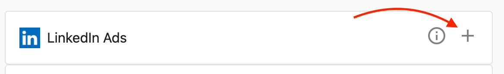
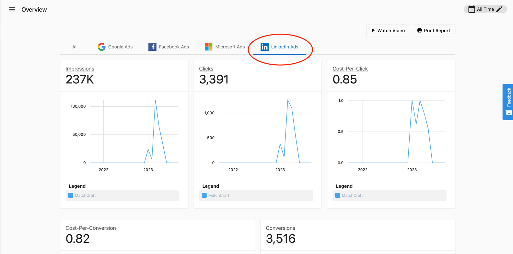
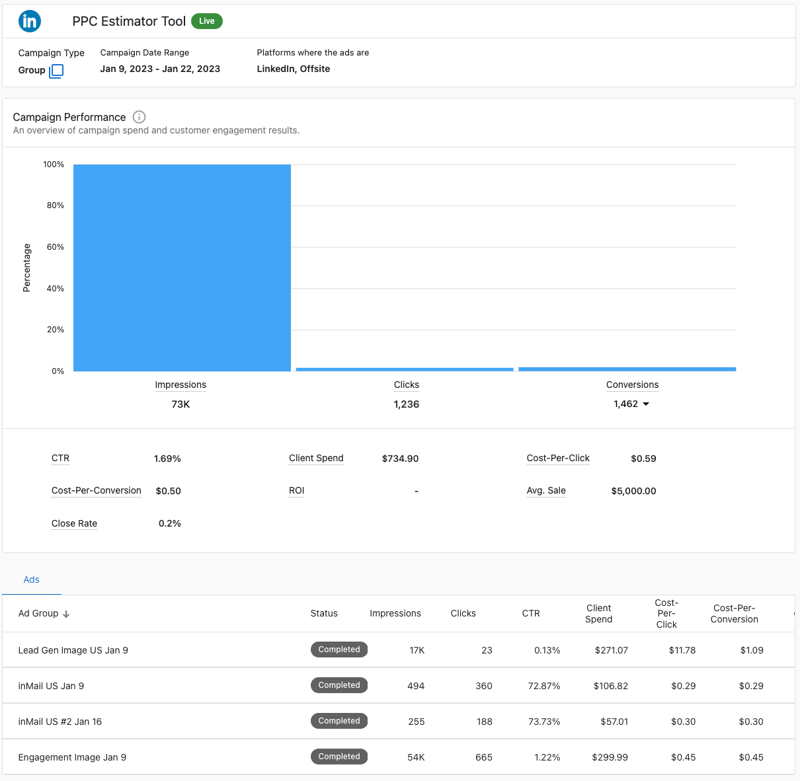

Connect your LinkedIn Ads account to Advertising Intelligence to view insights into your LinkedIn Ads campaign performance.

## Prerequisites

Before connecting your accounts, ensure you have:

- An active Advertising Intelligence account.

## Connecting your accounts

1. Open Advertising Intelligence and navigate to your account.
2. Go to `Settings` > `Connections`.

   

3. Click `+` on the `LinkedIn Ads` card.

   

4. Follow the on-screen instructions to connect and grant Advertising Intelligence the necessary permissions to access your LinkedIn Ads data.

## Accessing your LinkedIn Ads data

Once the connection is established, your LinkedIn Ads campaign metrics are available within Advertising Intelligence.

- `All` tab: Consolidated data for all your connected advertising platforms, including LinkedIn Ads.
- `LinkedIn Ads` tab: A dedicated view that showcases your LinkedIn Ads campaign statistics.

This consolidated and dedicated view of your LinkedIn Ads data helps you analyze campaign performance within Advertising Intelligence, alongside data from your other connected advertising platforms.

## Frequently asked questions

Can I connect multiple LinkedIn Ad accounts?

Yes. You can connect multiple LinkedIn Ads accounts by repeating the connection process for each unique account you wish to track.

Does this support personal LinkedIn profiles?

No, the integration is designed for LinkedIn Ads accounts (Campaign Manager). You must have a business ad account to use this feature.

