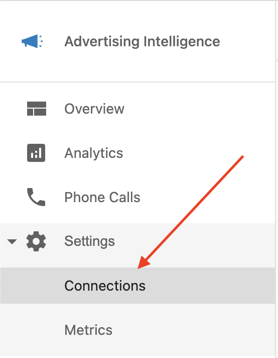
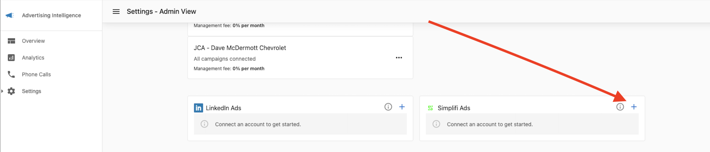
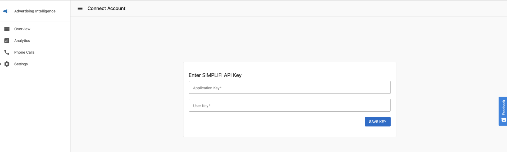
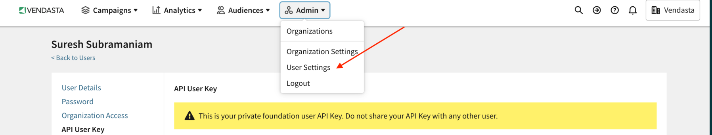
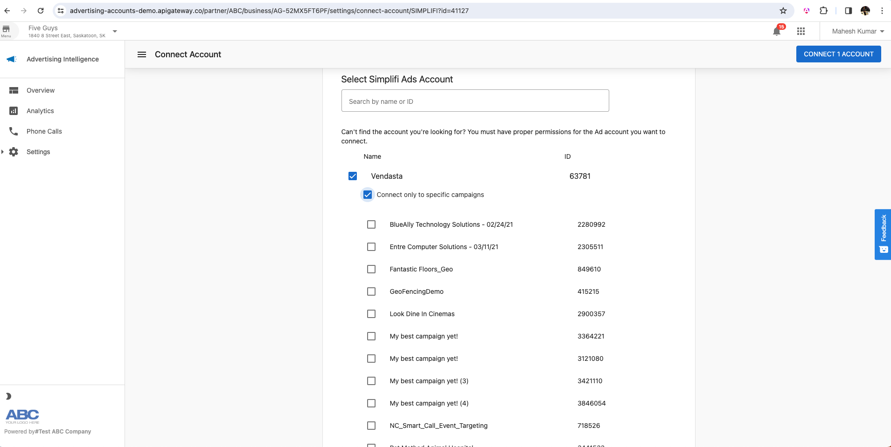
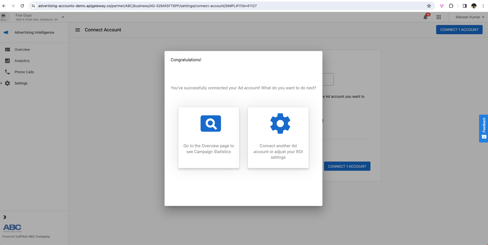

Connect your Simpli.fi Ads campaigns with Advertising Intelligence to track performance metrics and view comprehensive reporting.

## Prerequisites

Before connecting your Simpli.fi Ads account, ensure that:
- You have an active Simpli.fi Ads account
- You have administrator access to your Simpli.fi Ads account
- You have the `Organization Key` and `API User Key` from Simpli.fi

## Connecting your Simpli.fi Ads account

### 1. Navigate to connection settings

Open Advertising Intelligence and go to `Settings` > `Connections`.

### 2. Connect to Simpli.fi

Find and click on the `Simpli.fi` network tile in the list of available ad networks.

### 3. Enter your API keys

You'll need to enter two pieces of information to connect to Simpli.fi:
- `Organization Key`: This key identifies your Simpli.fi organization
- `API User Key`: This key authenticates your access to the Simpli.fi API

### 4. Confirm connection

After entering your keys, click `Connect` to complete the connection. You'll see a confirmation page when the connection is successful.

### 5. Select accounts and campaigns

After connecting, select which accounts and campaigns you want to import into Advertising Intelligence.

## Viewing your Simpli.fi campaign data

Once connected, your Simpli.fi campaign data is available in your Advertising Intelligence dashboard. You can view metrics such as:
- Impressions
- Clicks
- Click-through rates (CTR)
- Cost
- Conversions
- And more

## Troubleshooting

If you encounter issues connecting your Simpli.fi account:

1. Verify that your Organization Key and API User Key are correct
2. Ensure your Simpli.fi account has API access enabled
3. Check if your API keys have the necessary permissions
4. Contact Simpli.fi support if you need to obtain or reset your API keys

## Next steps

After connecting your Simpli.fi Ads account, you can:
- Create custom reports including Simpli.fi data
- Set up automated reporting
- Compare performance across different ad networks