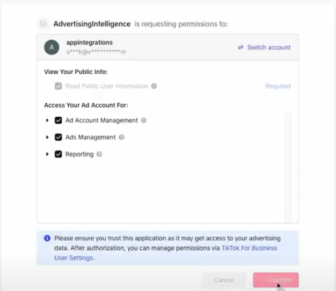
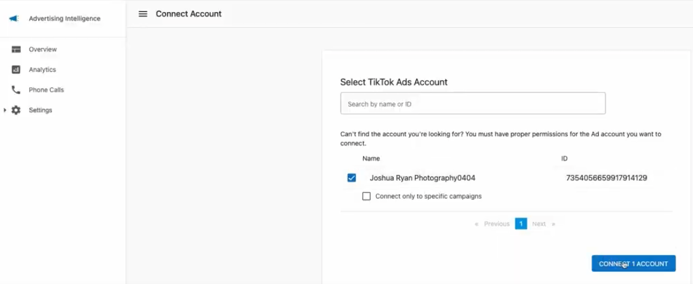
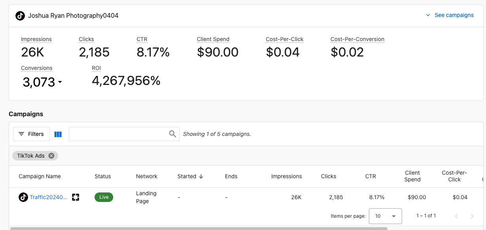

Connect your TikTok Business account to Advertising Intelligence to view insights into your TikTok Ads campaign performance. Analyze key metrics and understand your TikTok advertising efforts within Advertising Intelligence.

## Connecting Your TikTok Ads Account

1. **Access Advertising Intelligence:** Open Advertising Intelligence and navigate to your account.
2. **Connect TikTok Business Account:** Navigate to **Settings > Connections** within Advertising Intelligence and connect your TikTok Business account.

## Exploring Your TikTok Ads Data

Once connected, analyze your TikTok Ads performance with these features:

**Campaign Overview Metrics:** View key metrics like impressions, clicks, and click-through rates (CTR) from the Advertising Intelligence Overview section. Customize the displayed metrics based on your admin view settings.

**Detailed Campaign and Ad Group Analysis:** Explore granular details of your campaigns and ad groups for in-depth analysis of performance across different aspects of your TikTok advertising strategy.

**Conversion Tracking (For Admins):** Admin users can select and view conversion metrics to track how effectively TikTok Ads drive desired actions.

**Executive Report:** Your TikTok Ads data appears in the Executive Report under the "Advertising" section, providing a high-level view of your overall advertising performance, including TikTok Ads alongside your other connected advertising platforms.

Use Advertising Intelligence and the TikTok Ads connection to understand your TikTok advertising efforts, optimize campaigns for better results, and make data-driven decisions to maximize your return on investment (ROI).