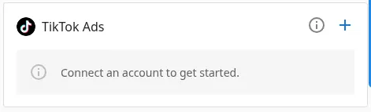
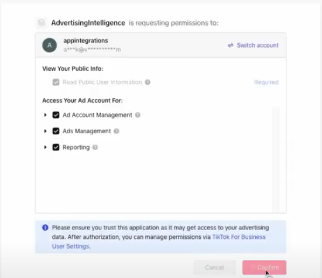
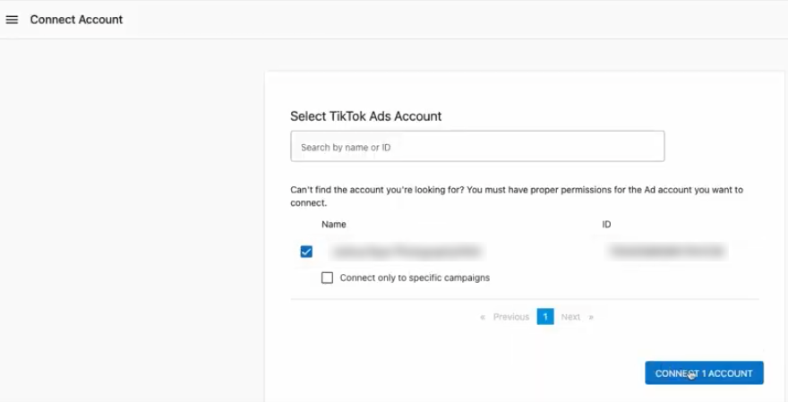
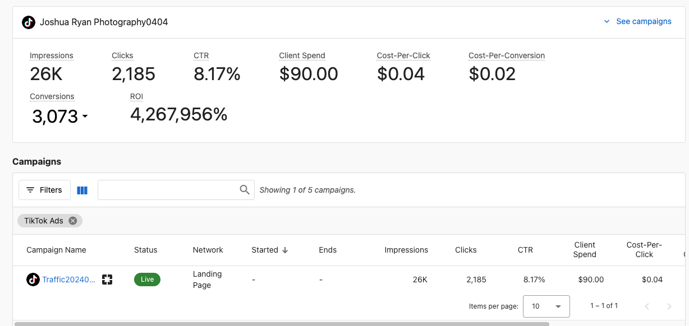

Connect your TikTok Business account to Advertising Intelligence to view insights into your TikTok Ads campaign performance.

## Connecting your TikTok Ads account

1. Open Advertising Intelligence and navigate to your account.
2. Go to `Settings` > `Connections`.
3. Click `+` on the `TikTok Ads` card.

4. Review the permissions TikTok requests and click `Confirm`.

5. Select the TikTok Ads account you want to connect and click `Connect 1 Account`.

## Exploring your TikTok Ads data

Once connected, you can analyze your TikTok Ads performance with these features:

### Campaign overview metrics

View key metrics like impressions, clicks, and click-through rates (CTR) from the Advertising Intelligence Overview section. Customize the displayed metrics based on your admin view settings.

### Detailed campaign and ad group analysis

Explore granular details of your campaigns and ad groups for in-depth analysis of performance across different aspects of your TikTok advertising strategy.

### Conversion tracking

As an admin, you can select and view conversion metrics to track how effectively TikTok Ads drive desired actions.

### Executive Report

Your TikTok Ads data appears in the Executive Report under the `Advertising` section, providing a high-level view of your overall advertising performance alongside your other connected advertising platforms.