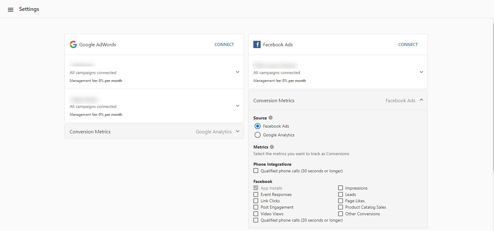

Users of Advertising Intelligence with the Advanced Reporting add-on can select specific conversion metrics for their Facebook advertising campaigns.

### How does it work?

With the Advanced Reporting add-on activated:

1. Select an **Account** in **Partner Center**
2. Go to **Advertising Intelligence > Settings.**
3. Below the connected Facebook Ads account, select **Conversion Metrics**.
4. In the drop-down menu, select the conversion metrics you want to display for this account. Website Conversions is selected as the default conversion to display.
5. Select as many conversions as you want to include in the campaign reporting. The selected conversions directly affect the conversion number reported in the product and in the Executive Report.

   If the account doesn't have Advanced Reporting activated, upgrade by selecting **Purchase Advanced Reporting** from the Overview or Settings page in the product. A Partner can also upgrade this product on behalf of their customer from Partner Center.

