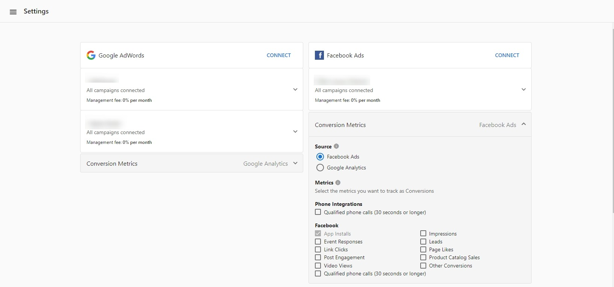

With the Advanced Reporting add-on, you can select specific conversion metrics for your Facebook advertising campaigns.

### How does it work?

With the Advanced Reporting add-on activated:

1. Go to `Settings` in Advertising Intelligence.
2. Below the connected Facebook Ads account, select `Conversion Metrics`.
3. In the drop-down menu, select the conversion metrics you want to display for this account. `Website Conversions` is selected as the default.
4. Select as many conversions as you want to include in the campaign reporting. The selected conversions directly affect the conversion number reported in the product and in the Executive Report.

If the account doesn't have Advanced Reporting activated, upgrade by selecting `Purchase Advanced Reporting` from the `Overview` or `Settings` page in Advertising Intelligence.

