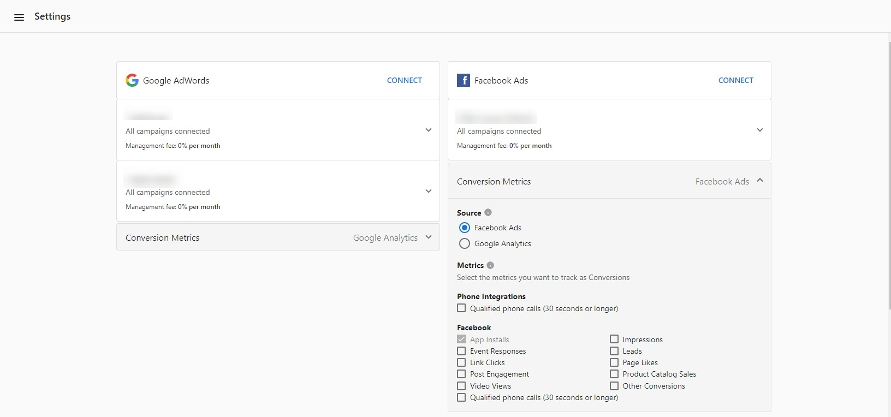

You can select specific conversion metrics for your Facebook advertising campaigns.

## How it works

1. Go to `Settings` > `Connections`.
2. On the `Facebook Ads` card, select `Conversion Metrics`.
3. In the drop-down menu, select the conversion metrics you want to display for this account. `Website Conversions` is selected as the default.
4. Select as many conversions as you want to include in the campaign reporting. The selected conversions directly affect the conversion number reported in the product and in the Executive Report.

