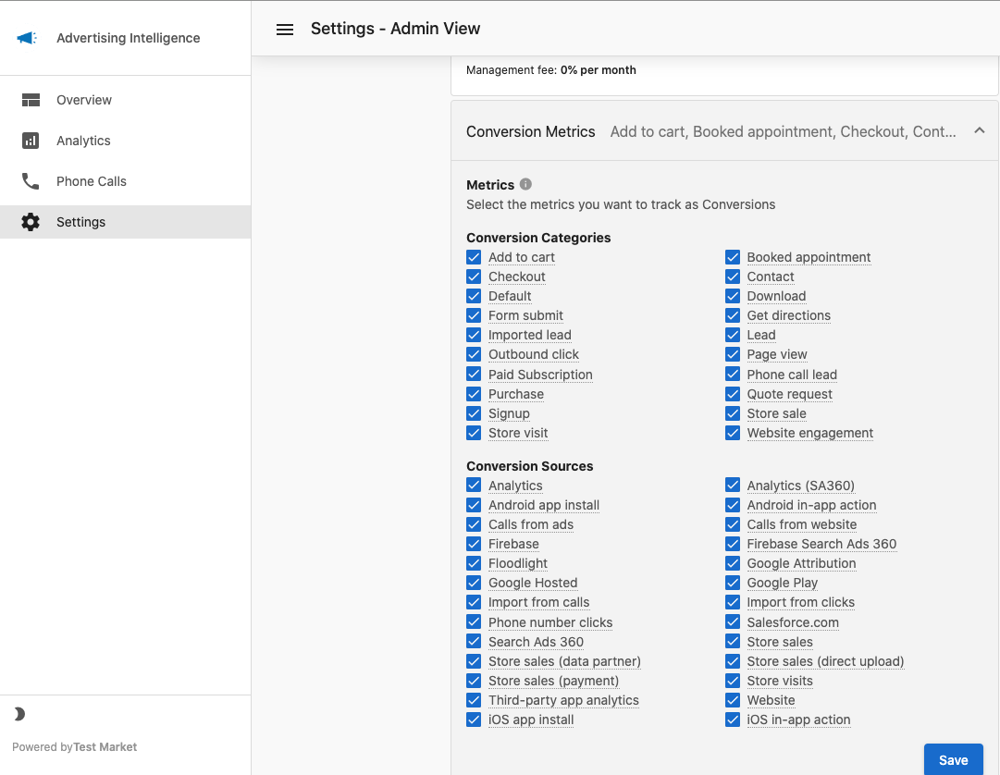
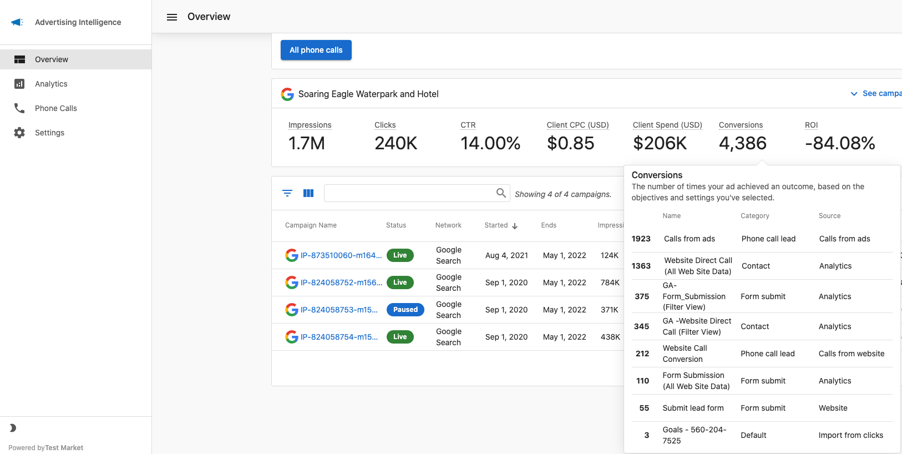

# Settings for Google Ads Conversion Sources and Categories

Conversion tracking in Advertising Intelligence is not automatic. You need to select which conversion events to track. If conversions are showing as zero, this setup is usually the reason.

## Before you start

Conversion tracking requires the Advanced Reporting add-on. If your account doesn't have it activated, you'll see a prompt to upgrade when you open `Conversion Metrics` in Settings.

## Select your conversion sources and categories

1. In Google Ads, confirm that the conversion events you want to track are defined in your account.
2. Open Advertising Intelligence and go to `Settings`.
3. Under your connected Google Ads account, select `Conversion Metrics`.
4. Choose a `Conversion Source` and `Conversion Category` to start tracking.

## Why Advertising Intelligence may show fewer conversions than Google Ads

Google Ads reports two conversion totals: `Conversions` and `All Conversions`. Advertising Intelligence uses the `Conversions` value only. If you see a higher number in Google Ads, you're likely comparing it against `All Conversions`, which includes additional tracked actions that Google Ads counts separately.

## Troubleshooting: Conversions still showing zero

1. Confirm the Advanced Reporting add-on is active for this account.
2. Verify that a `Conversion Source` and `Conversion Category` are selected under `Settings` > `Conversion Metrics`.
3. Clear your browser cache and reload the page.