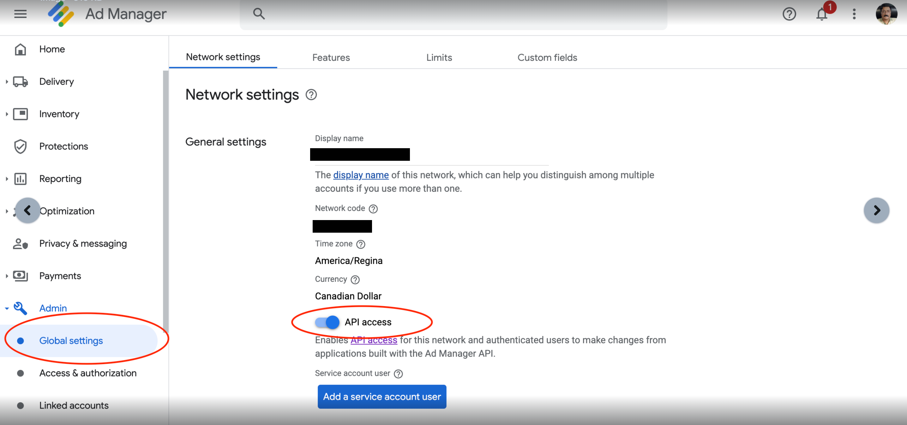
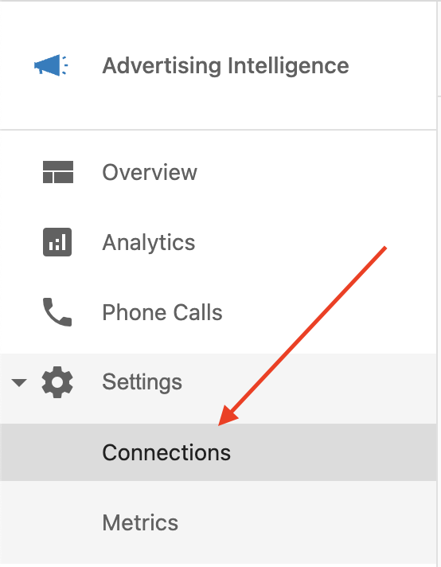
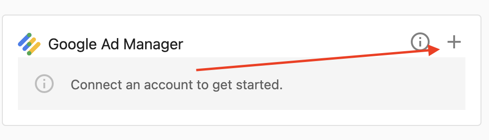
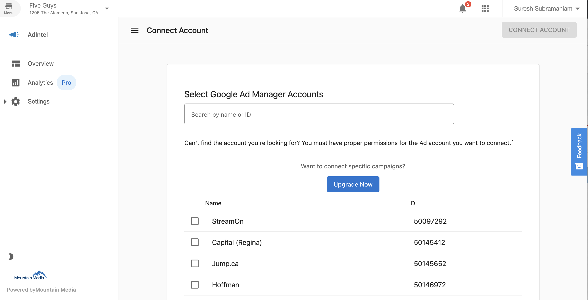
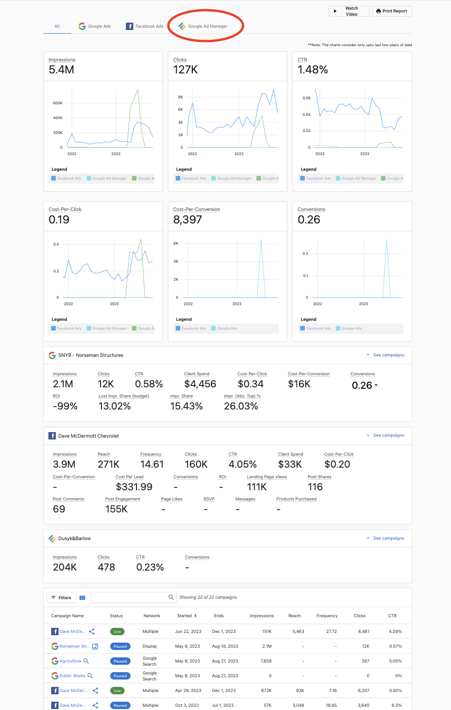
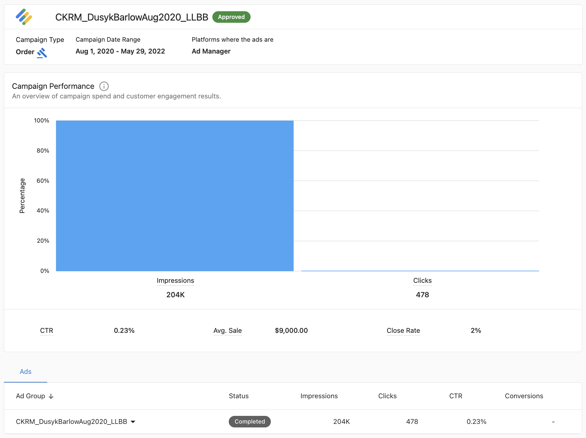
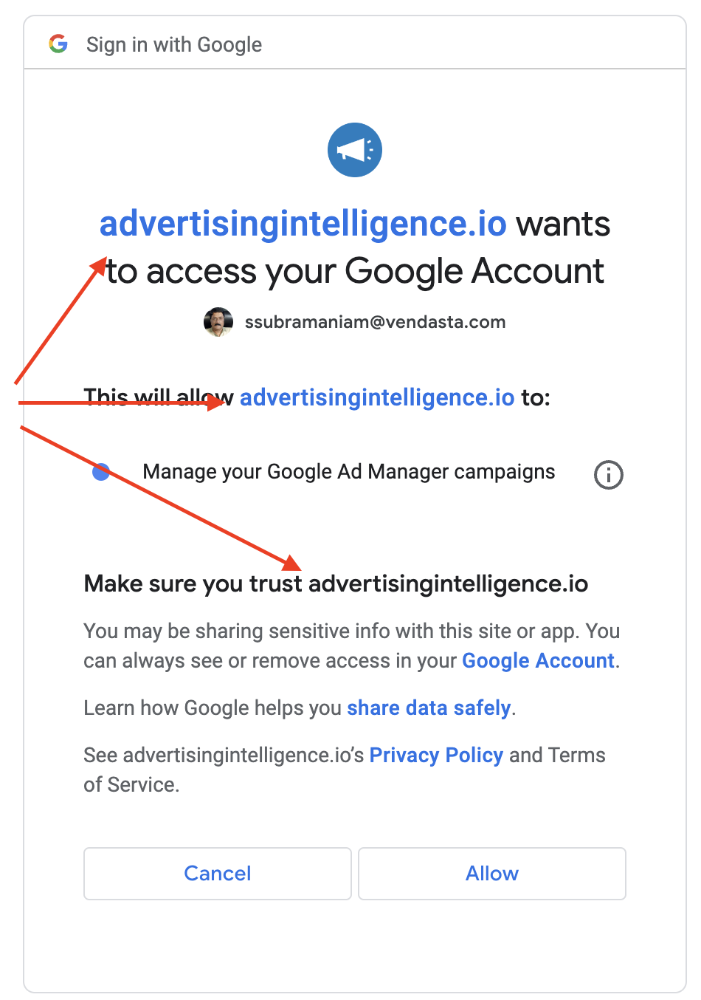

# Connect Google Ads Manager

Learn how to connect Google Ads Manager to Advertising Intelligence to view Google Ads Manager data in the Advertising Intelligence app.

## What is Google Ads Manager? 

Google Ads Manager helps businesses manage and monetize their digital ad inventory. It's a comprehensive platform for publishers looking to optimize ad delivery and maximize revenue through efficient ad management and data-driven insights.

## Setup

To connect Google Ads Manager to Advertising Intelligence, you need to have:

- Active Google Ads Manager account.
- Access to Partner Center/Accounts/Advertising Intelligence app.

### Steps to connect Google Ads Manager

1. Log in to Partner Center and navigate to the account where you want to connect Google Ads Manager.

2. Click the **Advertising Intelligence** app.

3. Click **Integrations** from the left-hand navigation menu.

4. Click the **Connect** button for Google Ads Manager.

    

5. You're redirected to the Google authorization screen. Click **Continue**.

    

6. Select your Google account.

    

7. Select your Network.

    

8. Click **Allow** to grant the required permissions.

    

9. After successful connection, you're redirected back to the Advertising Intelligence app, and Google Ads Manager shows as connected.

    

10. Access Google Ads Manager data within the Advertising Intelligence app.

    

## Disconnecting Google Ads Manager

If at any point you need to disconnect Google Ads Manager:

1. Navigate to Integrations from the Advertising Intelligence app.
2. Find Google Ads Manager in the list of integrations.
3. Click the Disconnect button.
4. Confirm the disconnection when prompted.

- If problems persist, contact your support team for assistance.

## Frequently Asked Questions

What is the difference between Google Ads and Google Ads Manager?

Google Ads is primarily for advertisers buying ad space, while Google Ads Manager is a platform for publishers to sell and manage their ad inventory. This integration is specifically for the latter.

Can I edit campaigns from Advertising Intelligence?

No. This integration is "read-only," allowing you to view performance data and reports across ad networks. 

To make changes to campaigns, you must do so directly within the Google Ads Manager platform.

How do I disconnect my account?

Go to **Settings > Integrations** in Advertising Intelligence, find Google Ads Manager, and click the **Disconnect** button.

