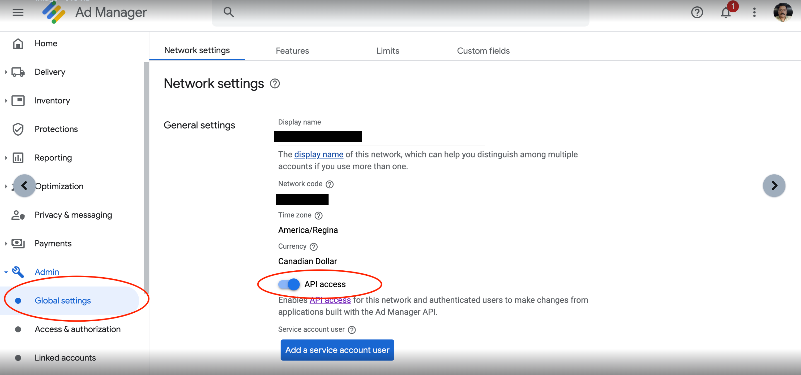
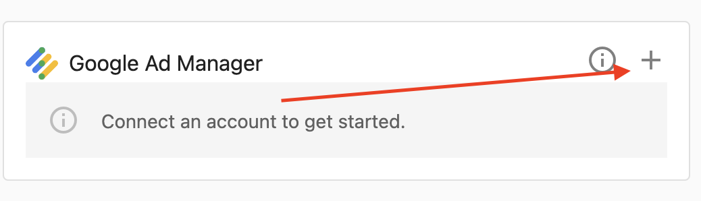
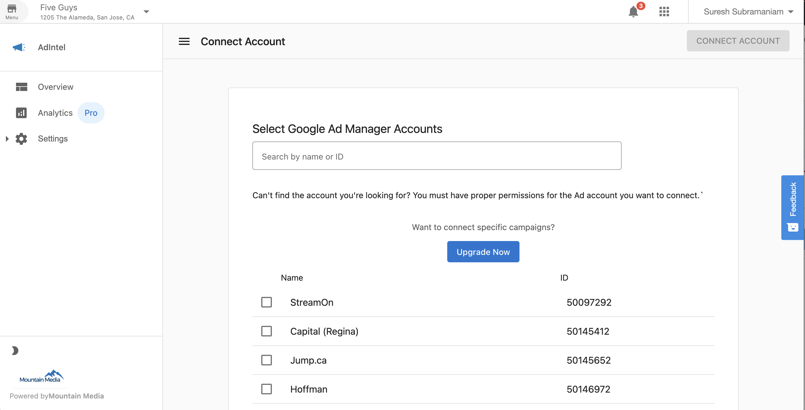
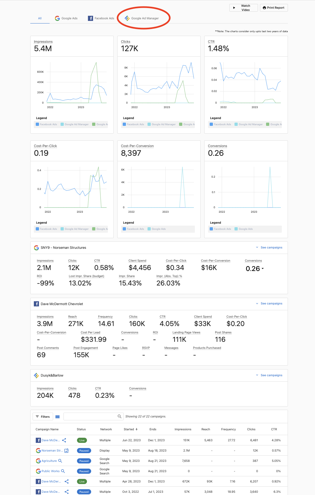
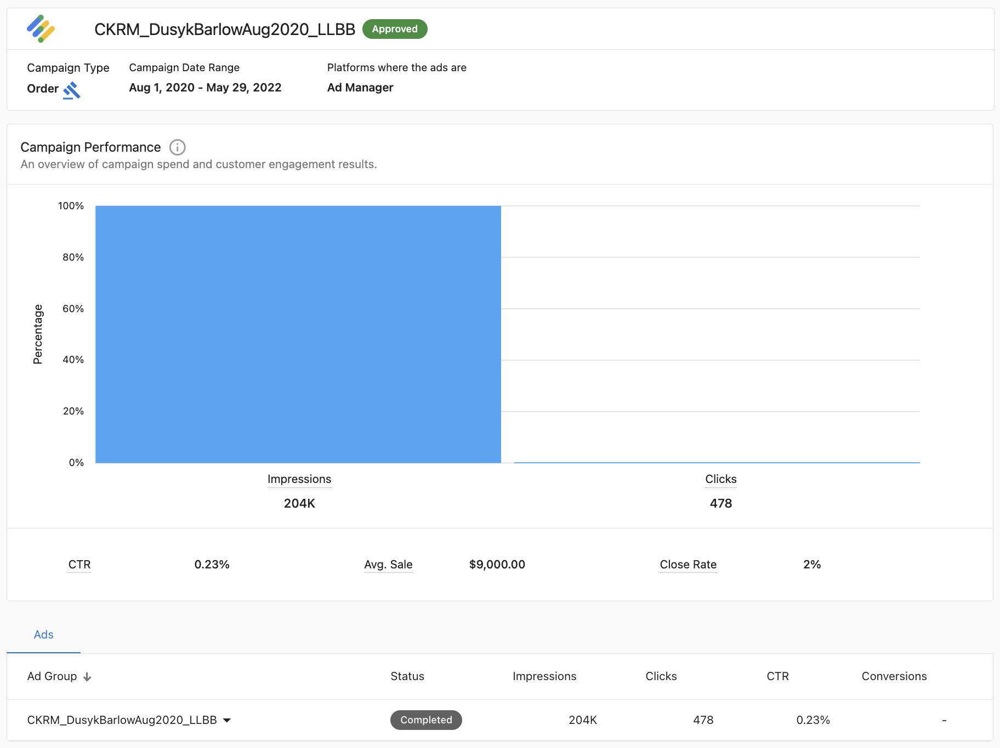
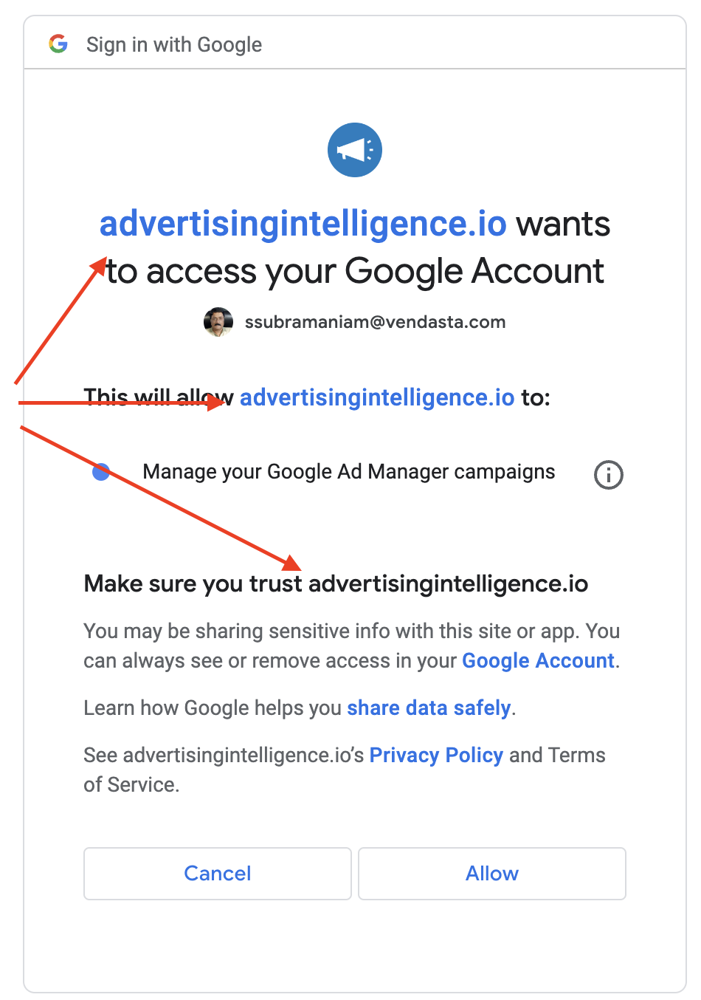

## What is Google Ads Manager?

Google Ads Manager helps businesses manage and monetize their digital ad inventory. It's a platform for managing ad delivery and tracking performance data across your campaigns.

## Connecting Google Ads Manager

To connect Google Ads Manager to Advertising Intelligence, you need:

- An active Google Ads Manager account

### Steps to connect

1. Open `Advertising Intelligence` in your Business App.

2. Click `Integrations` from the left-hand navigation menu.

3. Click the `Connect` button for Google Ads Manager.

4. You're redirected to the Google authorization screen. Click `Continue`.

5. Select your Google account.

6. Select your network.

7. Click `Allow` to grant the required permissions.

8. After successful connection, you're redirected back to `Advertising Intelligence`, and Google Ads Manager shows as connected.

## Viewing your Google Ads Manager data

Once connected, you can access Google Ads Manager data within `Advertising Intelligence`.

## Disconnecting Google Ads Manager

:::warning
Disconnecting will stop data from syncing. Reconnect later if you need to restore the integration.
:::

If at any point you need to disconnect Google Ads Manager:

1. Navigate to `Integrations` from `Advertising Intelligence`.
2. Find Google Ads Manager in the list of integrations.
3. Click the `Disconnect` button.
4. Confirm the disconnection when prompted.

## Troubleshooting

- Ensure you're logged into the correct Google account that has access to Google Ads Manager.
- Verify that your Google Ads Manager account is active and in good standing.
- Check that you're granting all the required permissions during the authorization process.
- Clear your browser cache and cookies, then try the connection process again.
- If problems persist, contact your support team for assistance.

## Additional resources

- [Google Ad Manager Help](https://support.google.com/admanager/)
