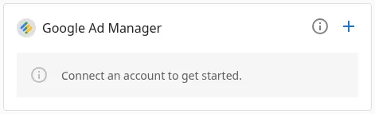
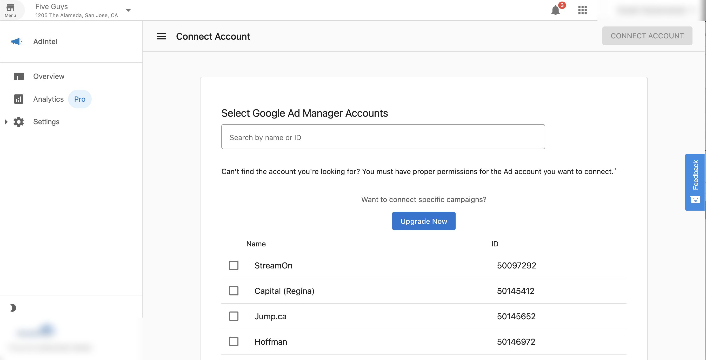
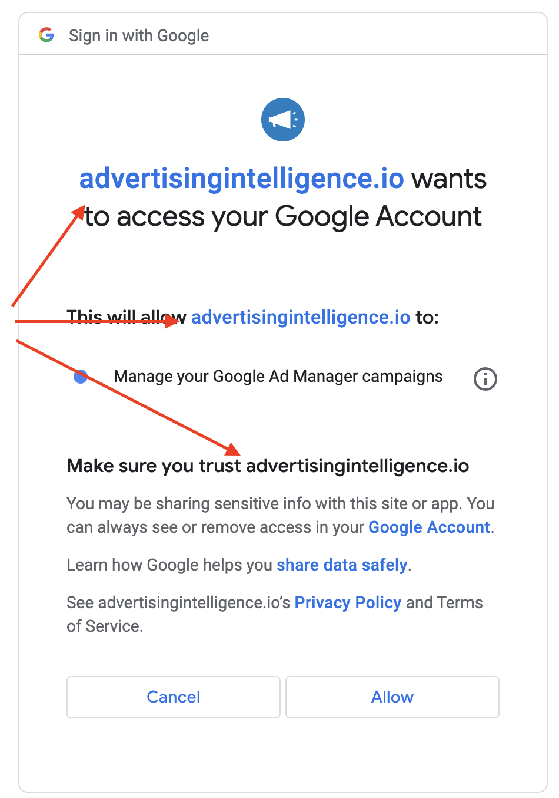
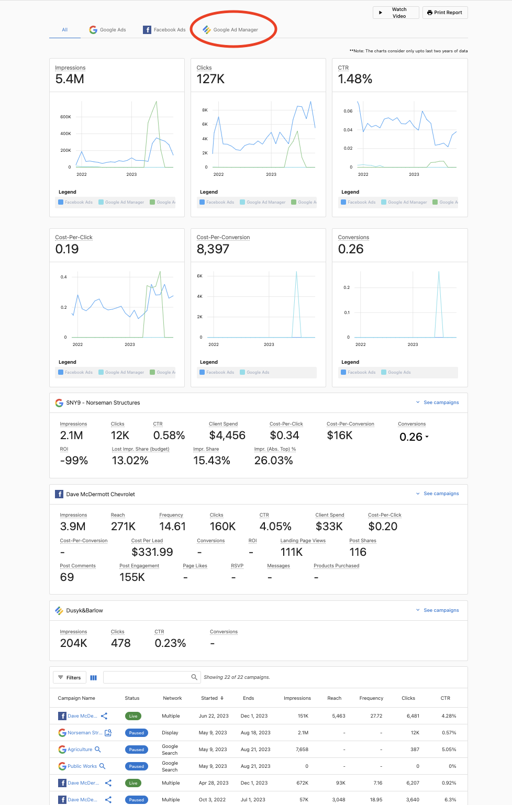

## What is Google Ad Manager?

Google Ad Manager helps businesses manage and monetize their digital ad inventory. It's a platform for managing ad delivery and tracking performance data across your campaigns.

## Connecting Google Ad Manager

To connect Google Ad Manager to Advertising Intelligence, you need:

- An active Google Ad Manager account

### Steps to connect

1. Open `Advertising Intelligence` in your Business App.

2. Go to `Settings` → `Connections` from the left navigation menu.

3. Click the `+` icon on the `Google Ad Manager` card.

4. You're redirected to the Google authorization screen. Click `Continue`.

5. Select your Google account.

6. Select your network.

7. Click `Allow` to grant the required permissions.

8. After successful connection, you're redirected back to `Advertising Intelligence`, and Google Ad Manager shows as connected.

## Viewing your Google Ad Manager data

Once connected, you can access Google Ad Manager data within `Advertising Intelligence`.

## Disconnecting Google Ad Manager

:::warning
Disconnecting will stop data from syncing. Reconnect later if you need to restore the integration.
:::

If at any point you need to disconnect Google Ad Manager:

1. Navigate to `Settings` → `Connections` in `Advertising Intelligence`.
2. Find `Google Ad Manager` in the list of connections.
3. Click the disconnect option.
4. Confirm the disconnection when prompted.

## Troubleshooting

- Ensure you're logged into the correct Google account that has access to Google Ad Manager.
- Verify that your Google Ad Manager account is active and in good standing.
- Check that you're granting all the required permissions during the authorization process.
- Clear your browser cache and cookies, then try the connection process again.
- If problems persist, contact your support team for assistance.

## Additional resources

- [Google Ad Manager Help](https://support.google.com/admanager/)
