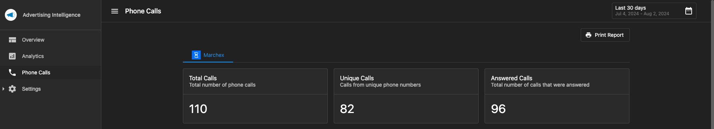
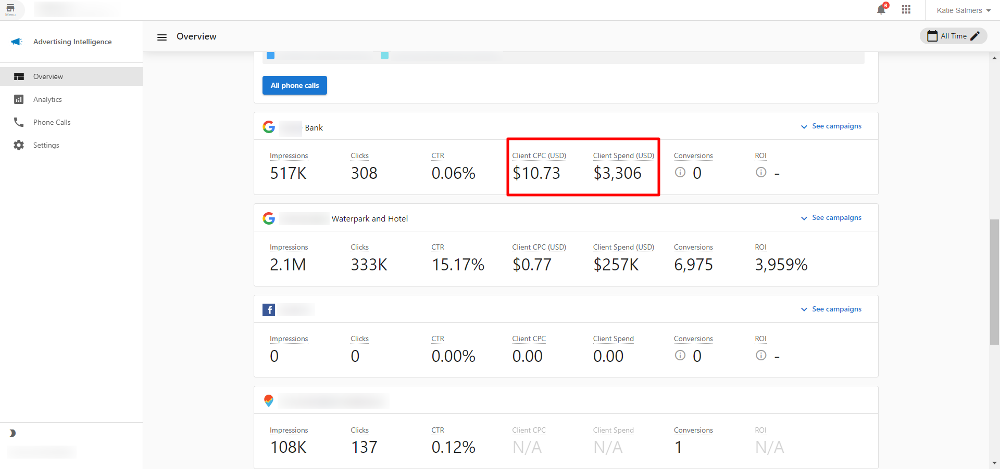

The Settings section covers configuration options and integrations for Advertising Intelligence, including how to connect ad platforms, call tracking systems, and conversion tracking.

## Why configure Settings?

- Connect multiple advertising platforms in one place
- Set up call tracking to measure phone conversions
- Configure conversion tracking for accurate ROI
- Manage admin and user-level settings
- Customize how data is displayed and calculated

## What's included

- **[Google Ads Manager](google-ads-manager.mdx)**: Connect Google Ads to Advertising Intelligence
- **[Microsoft/Bing Ads](microsoft-bing-ads.mdx)**: Connect Microsoft Advertising
- **[Facebook Ad Accounts](connect-multiple-facebook-ad-accounts.mdx)**: Connect multiple Facebook Ad accounts
- **[LinkedIn Ads](connecting-linkedin-ads.mdx)**: Connect LinkedIn advertising campaigns
- **[TikTok Ads](connecting-tiktok.mdx)**: Connect TikTok advertising
- **[Amazon Ads](amazon-ads-connector.mdx)**: Connect Amazon advertising
- **[Simpli.fi Ads](connecting-simplifi-ads.mdx)**: Connect Simpli.fi advertising
- **[Individual Campaigns](connect-individual-ad-campaigns.mdx)**: Connect individual ad campaigns
- **[CallRail Integration](callrail.mdx)**: Connect CallRail for call tracking
- **[Telmetrics Integration](telmetrics-call-tracking-integration.mdx)**: Set up Telmetrics call tracking
- **[Google Analytics Conversions](track-conversions-with-google-analytics.mdx)**: Track conversions with Google Analytics
- **[Facebook Custom Conversions](custom-conversion-selection-for-facebook-ads.mdx)**: Customize Facebook conversion tracking
- **[Google Ads Conversion Settings](google-ads-conversion-sources-categories.mdx)**: Configure Google Ads conversion sources
- **[Admin vs User Settings](vendasta-products-advertising-intelligence-settings.mdx)**: Understand setting levels

## Get started

1. Go to `Advertising Intelligence` > `Settings`.
2. Click `Connect` next to the ad platform you want to add.
3. Follow the authentication prompts to grant access.
4. Configure conversion tracking and call tracking as needed.
5. Set up management markup fees if applicable.

## Supported Platforms

### Advertising Platforms
- Google Ads
- Facebook Ads
- Microsoft (Bing) Ads
- LinkedIn Ads
- TikTok Ads
- Amazon Ads
- Simpli.fi Ads
- LocalAds

### Call Tracking
- CallRail
- Telmetrics
- Marchex

### Conversion Tracking
- Google Analytics
- Facebook Conversions API
- Platform-native conversion tracking

## Call tracking setup {#call-tracking}

In the **Settings** > **Connections** tab, you can connect your call tracking account. Phone call tracking data includes total calls, unique callers, answered calls, time, phone number, call status, call classification, duration, and recording.

**Supported call tracking providers:**

- [Marchex](../analytics/marchex-call-tracking.mdx)
- [CallRail](callrail.mdx)
- [Telmetrics](telmetrics-call-tracking-integration.mdx)

To view your call tracking data, navigate to the **Phone Calls** tab in Advertising Intelligence.

## Supported advertising platforms (details)

Advertising Intelligence supports multiple advertising platforms, allowing you to view and analyze campaign performance from various sources in one centralized dashboard.

### Google Ads
- Search Ads
- Display Ads
- YouTube Video Ads
- YouTube Search Ads
- Google Shopping Ads
- Gmail Ads

### Facebook Ads
- Facebook
- Instagram Ads
- Messenger Ads
- Audience Network Ads

### Microsoft (Bing) Ads
Connect Microsoft Bing Ads to track ad spend and performance data across Microsoft's search and display advertising network.

### TikTok Ads
Connect your TikTok Business account to view insights into your TikTok Ads campaign performance.

### Amazon Ads
Use Amazon Ads data to make data-driven decisions. Track campaign-level performance, daily trends, and other metrics for your Amazon advertising campaigns.

### Simpli.fi Ads
Connect Simpli.fi Ads campaigns to track performance metrics and provide comprehensive reporting. Simpli.fi specializes in programmatic advertising and local targeting.

### LocalAds
Connect LocalAds to track and analyze local advertising campaign performance and metrics.

### LinkedIn Ads
Connect your LinkedIn Ads account to view insights into your LinkedIn Ads campaign performance alongside other platforms.

### Additional features
In addition to advertising platform data, Advertising Intelligence includes a **Google Analytics** view that shows goal completions and top traffic sources.

## Currency display

The currency displayed in Advertising Intelligence is based on the currency configured on your connected advertising account. This ensures consistency between your ad platform and the dashboard.

**How currency is determined:** The currency shown matches the currency set up on your connected **Facebook** or **Google Ads** account. For example, if your Facebook ad account is configured in USD, then USD will be displayed throughout Advertising Intelligence for metrics like **Client CPC** and **Client Spend**.

**Where currency appears:** Currency is displayed for all monetary values, including **Client CPC** (Cost Per Click), **Client Spend** (total advertising spend), and other cost-related metrics.

## Frequently Asked Questions (FAQs)

Can I connect multiple accounts from the same platform?

Yes. You can connect multiple Facebook Ad accounts, Google Ads accounts, and other platforms to aggregate reporting across all your advertising.

What's the difference between Admin and User settings?

Admin settings apply to the entire account and include markup fees and default configurations. User settings are personal preferences that don't affect other users.

How do I set up call tracking?

Connect CallRail or Telmetrics in Settings. Once connected, phone call data will be included in your conversion metrics and ROI calculations.

Can I track conversions from Google Analytics?

Yes. Connect Google Analytics to pull conversion data into Advertising Intelligence alongside your ad platform data.

What currency is used in the dashboard?

The dashboard displays data in the currency configured for your connected advertising account. The currency matches your Facebook or Google Ads account settings. See the [Currency display](#currency-display) section above for details.

