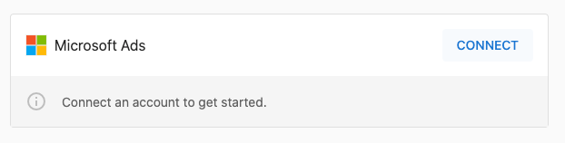
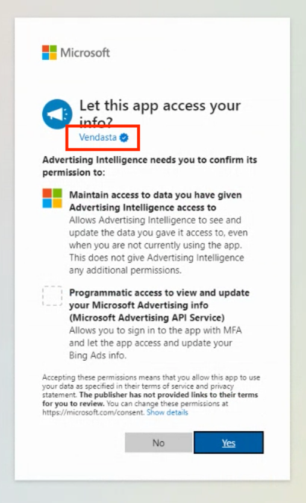
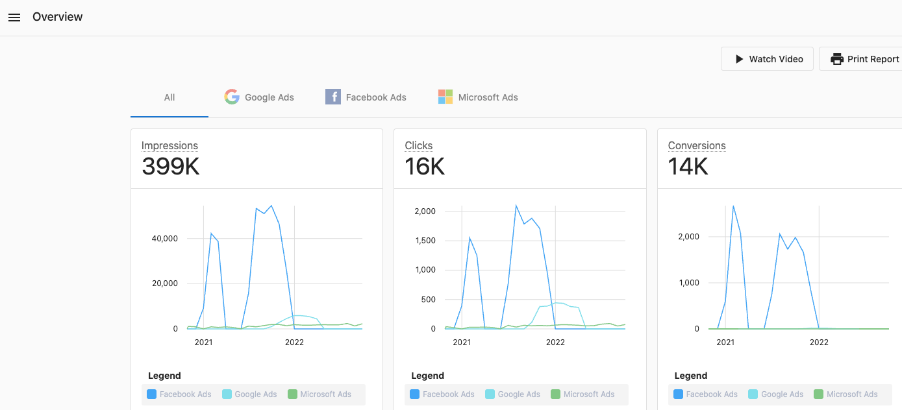
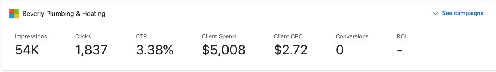

# Connecting Microsoft Bing Ads

Connect Microsoft Bing Ads with Advertising Intelligence to track ad spend and performance data. You need a Microsoft Bing Ads account to use this integration.

## Connect Microsoft Bing Ads

To connect Microsoft Bing Ads to Advertising Intelligence:

1. Navigate to **Settings** > **Connections** in your Advertising Intelligence account.

2. Look for the **Microsoft Advertising** option in the list.

3. Click **Connect** to go to Microsoft's authentication page. Follow the prompts to authenticate with your Microsoft Bing Ads account.

4. After a successful connection, campaign data appears in your Advertising Intelligence dashboard.

## Viewing Your Microsoft Bing Ads Data

Once connected, you can view your Microsoft Bing Ads data in various sections of Advertising Intelligence:

## Troubleshooting

If you encounter issues with your Microsoft Bing Ads connection:

1. Verify your Microsoft Bing Ads account has active campaigns and ads.
2. Check that you have the correct permissions in your Microsoft Advertising account.
3. Try disconnecting and reconnecting the account in Advertising Intelligence.
4. Contact support if problems persist.

- [Microsoft Advertising Help](https://help.ads.microsoft.com/)

## Frequently Asked Questions

Can I start a new campaign from here?

No, Advertising Intelligence is a reporting tool meant to show the performance of digital advertising campaigns across multiple platforms in a clean and easy-to-read format. 

