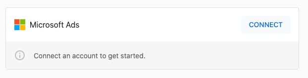
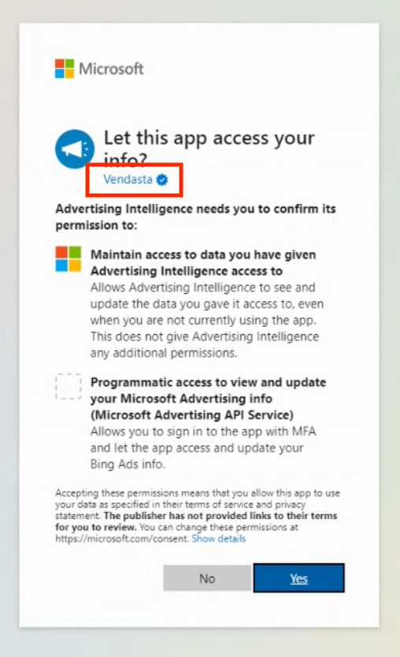
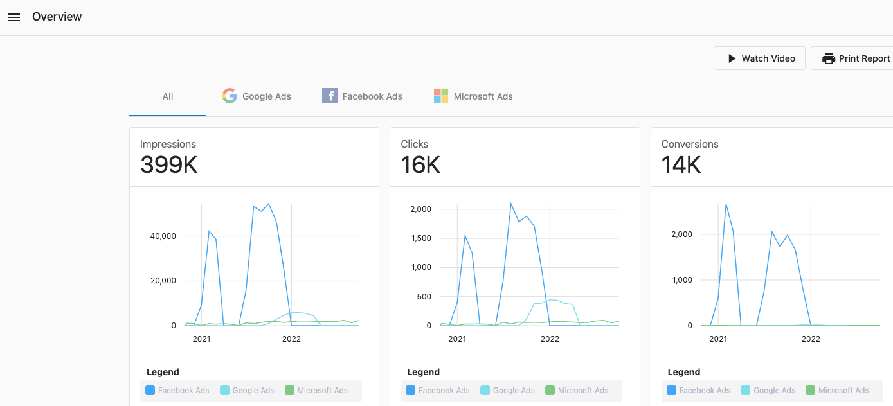
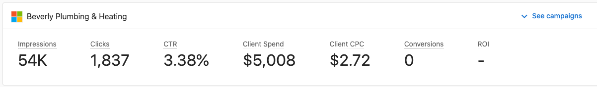

Connect Microsoft Bing Ads with Advertising Intelligence to track ad spend and performance data.

## Prerequisites

Before connecting, ensure you have:

- An active Advertising Intelligence account.
- A Microsoft Bing Ads (Microsoft Advertising) account.

:::info Advanced Reporting
While connecting Microsoft Bing Ads without Advanced Reporting is possible, only account-level statistics are reported.
:::

## Connecting Microsoft Bing Ads

1. **Access Advertising Intelligence:** Open Advertising Intelligence and navigate to your account.

2. **Locate Connections Settings:** Navigate to `Settings` → `Connections` in your Advertising Intelligence account.

3. **Connect to Microsoft Advertising:** Within the Connections settings, locate the `Microsoft Ads` option and click `Connect`. Follow the prompts on Microsoft's authentication page to sign in with your Microsoft Bing Ads account.

4. **Complete authentication:** After you grant the required permissions, the connection completes and campaign data begins syncing to your Advertising Intelligence dashboard.

## Viewing your Microsoft Bing Ads data

Once connected, your Microsoft Bing Ads (Microsoft Advertising) data is available in Advertising Intelligence:

- `All` tab: Consolidated data for all your connected advertising platforms, including Microsoft Bing Ads, appears under the `All` tab.
- `Microsoft Ads` tab: A dedicated tab shows your Microsoft Bing Ads campaign statistics.
- `Overview` and `Executive Report`: Your Microsoft Bing Ads data is included in the Overview section and in the Executive Report under the Advertising section.

## Disconnecting Microsoft Bing Ads

:::warning
Disconnecting will stop data from syncing. Reconnect later if you need to restore the integration.
:::

To disconnect Microsoft Bing Ads:

1. Navigate to `Settings` → `Connections` in Advertising Intelligence.
2. Find `Microsoft Ads` in the list of connections.
3. Click `Disconnect` (or the equivalent control).
4. Confirm the disconnection when prompted.

## Troubleshooting

If you encounter issues with your Microsoft Bing Ads connection:

- Verify your Microsoft Bing Ads (Microsoft Advertising) account has active campaigns and ads.
- Check that you have the correct permissions in your Microsoft Advertising account.
- Try disconnecting and reconnecting the account in Advertising Intelligence.
- Clear your browser cache and cookies, then try the connection process again.
- Contact support if problems persist.

- [Microsoft Advertising Help](https://help.ads.microsoft.com/)

## Frequently asked questions

Can I start a new campaign from here?

No, Advertising Intelligence is a reporting tool meant to show the performance of digital advertising campaigns across multiple platforms in a clean and easy-to-read format. 

