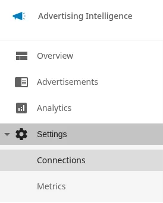
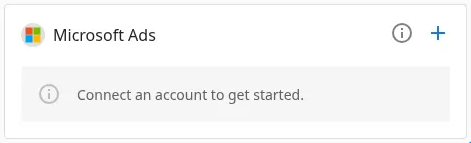
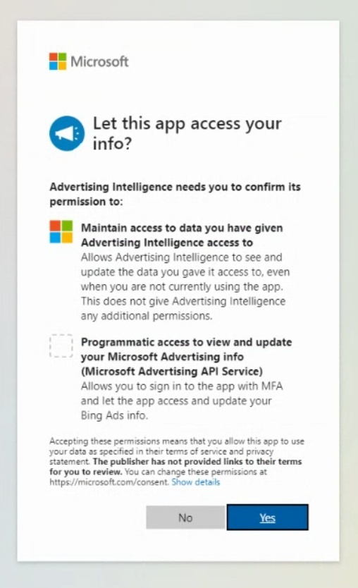
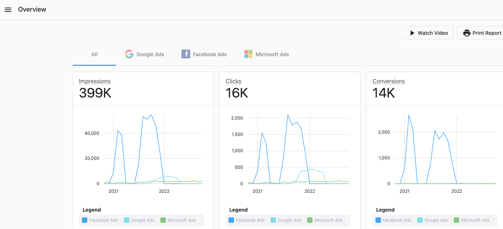
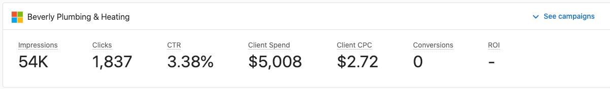

Connect Microsoft Ads with Advertising Intelligence to track ad spend and performance data.

## Prerequisites

Before connecting, ensure you have:

- An active Advertising Intelligence account.
- A Microsoft Advertising account.

## Connecting Microsoft Ads

1. **Access Advertising Intelligence:** Open Advertising Intelligence and navigate to your account.

2. **Locate Connections Settings:** Navigate to `Settings` → `Connections` in your Advertising Intelligence account.

3. **Connect to Microsoft Advertising:** Within the Connections settings, locate the `Microsoft Ads` card and click the `+` icon. Follow the prompts on Microsoft's authentication page to sign in with your Microsoft Advertising account.

4. **Complete authentication:** After you grant the required permissions, the connection completes and campaign data begins syncing to your Advertising Intelligence dashboard.

## Viewing your Microsoft Ads data

Once connected, your Microsoft Ads data is available in Advertising Intelligence:

- `All` tab: Consolidated data for all your connected advertising platforms, including Microsoft Ads, appears under the `All` tab.
- `Microsoft Ads` tab: A dedicated `Microsoft Ads` tab appears once connected, showing your campaign statistics.
- `Overview` and `Executive Report`: Your Microsoft Ads data is included in the Overview section and in the Executive Report under the Advertising section.

## Disconnecting Microsoft Ads

:::warning
Disconnecting will stop data from syncing. Reconnect later if you need to restore the integration.
:::

To disconnect Microsoft Ads:

1. Navigate to `Settings` → `Connections` in Advertising Intelligence.
2. Find `Microsoft Ads` in the list of connections.
3. Click the disconnect option.
4. Confirm the disconnection when prompted.

## Troubleshooting

If you encounter issues with your Microsoft Ads connection:

- Verify your Microsoft Advertising account has active campaigns and ads.
- Check that you have the correct permissions in your Microsoft Advertising account.
- Try disconnecting and reconnecting the account in Advertising Intelligence.
- Clear your browser cache and cookies, then try the connection process again.
- Contact support if problems persist.

For more help with Microsoft Advertising, see [Microsoft Advertising Help](https://help.ads.microsoft.com/).

## Frequently asked questions

Can I start a new campaign from here?

No, Advertising Intelligence is a reporting tool meant to show the performance of digital advertising campaigns across multiple platforms in a clean and easy-to-read format. 

