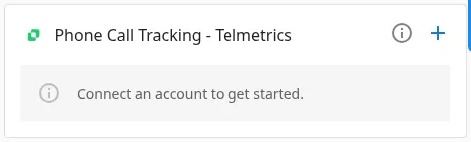

When using Telmetrics Call Tracking to monitor calls linked to advertising campaigns, view call tracking details directly within Advertising Intelligence. See both campaign details and call results in one place, streamlining your workflow.

## How to enable the Telmetrics call tracking integration

1. From the Telmetrics Manager, copy the API Key associated with the Telmetrics account.
2. In Advertising Intelligence, go to `Settings` → `Connections` and locate the `Phone Call Tracking - Telmetrics` card. Click the `+` icon.

3. Advertising Intelligence asks for the API Key for the Telmetrics account. Paste the API Key in the text box provided and click the `Save Key` button.
4. Select the numbers you want to see in Advertising Intelligence and click the `Connect account` button on the top right corner.
5. Once Telmetrics is connected, go to `Phone Calls` in the left menu to find the call summaries and details for the tracking numbers you chose.