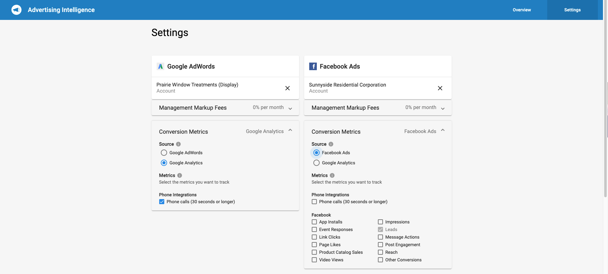
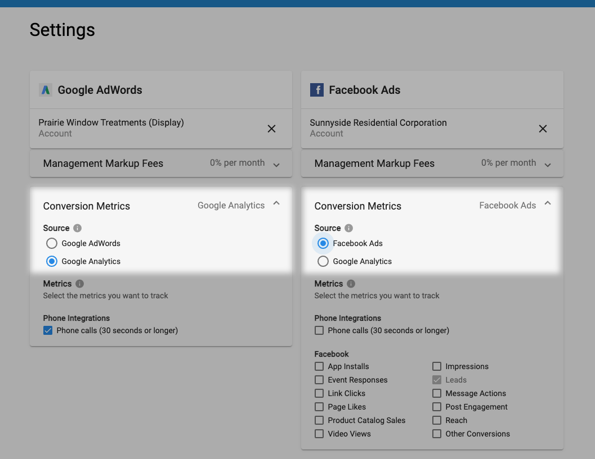

Select Google Analytics as the source for your Conversion metrics in Advertising Intelligence. Track conversions from objectives set on Google Analytics, instead of Google Ads or Facebook Ads.

### Why is Google Analytics conversion tracking important?

Previously, Conversion metrics could only be tracked from objectives set on Google Ads or Facebook Ads. However, it's common for Partners to set objectives in Google Analytics since it has broader access to the sales funnel and can track ads campaign performance in more detail. When objectives were set in Google Analytics, the Conversions metric showed as 0 since Advertising Intelligence wasn't tracking Google Analytics.

Select the platform you're using to set objectives, giving you complete transparency into the data as well as flexibility in selecting and analyzing the conversions.

### How does tracking conversions with Google Analytics work?

To configure your Conversion metric settings, open **Advertising Intelligence** and navigate to the **Settings** page. Then, click the **Conversion Metrics** section under Google AdWords or Facebook Ads to configure the settings for that platform. The option you select supplies the data for the Conversions metric in Advertising Intelligence.

Advertising Intelligence pulls in and stores this data once per day. The data comes from the **"sessions" column** (not users) in the Google Analytics dashboard. If there are small differences in the data (between GA dashboard and Advertising Intelligence), it's caused by how frequently we fetch Google Analytics data. New session data may get pulled into Google Analytics before we pull it and store it.

